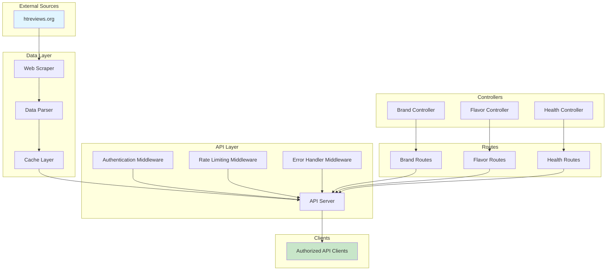

# Architecture

## System Architecture

The system follows a modular architecture with clear separation of concerns:



## Source Code Structure

```
hookah-db/
├── apps/                  # Application packages
│   ├── api/               # REST API server
│   │   ├── src/
│   │   │   ├── server.ts  # Express server setup
│   │   │   ├── routes/    # API route definitions
│   │   │   │   ├── index.ts
│   │   │   │   ├── brand-routes.ts
│   │   │   │   ├── flavor-routes.ts
│   │   │   │   └── health-routes.ts
│   │   │   ├── middleware/# Express middleware
│   │   │   │   ├── index.ts
│   │   │   │   ├── auth-middleware.ts
│   │   │   │   ├── rate-limit-middleware.ts
│   │   │   │   └── error-handler-middleware.ts
│   │   │   └── controllers/# Request handlers
│   │   │       ├── index.ts
│   │   │       ├── brand-controller.ts
│   │   │       ├── flavor-controller.ts
│   │   │       └── health-controller.ts
│   │   ├── package.json
│   │   └── tsconfig.json
│   └── cli/               # CLI application
│       ├── src/
│       │   └── index.ts   # CLI entry point
│       ├── package.json
│       └── tsconfig.json
├── packages/              # Shared packages
│   ├── types/             # TypeScript interfaces and types
│   │   ├── src/
│   │   │   ├── brand.ts   # Brand interface
│   │   │   ├── flavor.ts  # Flavor interface
│   │   │   ├── line.ts    # Line interface
│   │   │   ├── rating.ts  # RatingDistribution interface
│   │   │   └── index.ts   # Type exports
│   │   ├── package.json
│   │   └── tsconfig.json
│   ├── scraper/           # Web scraping module
│   │   ├── src/
│   │   │   ├── index.ts   # Main scraper entry point
│   │   │   ├── http-client.ts
│   │   │   ├── html-parser.ts
│   │   │   ├── scraper.ts
│   │   │   ├── brand-scraper.ts
│   │   │   ├── brand-details-scraper.ts
│   │   │   └── flavor-details-scraper.ts
│   │   ├── package.json
│   │   └── tsconfig.json
│   ├── parser/            # Data parsing and transformation
│   │   ├── src/
│   │   │   └── index.ts   # Data parser entry point
│   │   ├── package.json
│   │   └── tsconfig.json
│   ├── cache/             # Caching layer
│   │   ├── src/
│   │   │   ├── index.ts   # Cache interface and implementations
│   │   │   ├── types.ts
│   │   │   ├── in-memory-cache.ts
│   │   │   └── cache-factory.ts
│   │   ├── package.json
│   │   └── tsconfig.json
│   ├── services/          # Business logic
│   │   ├── src/
│   │   │   ├── index.ts   # Service orchestration
│   │   │   ├── brand-service.ts
│   │   │   ├── flavor-service.ts
│   │   │   └── data-service.ts
│   │   ├── package.json
│   │   └── tsconfig.json
│   ├── utils/             # Utility functions
│   │   ├── src/
│   │   │   └── index.ts   # Utility functions
│   │   ├── package.json
│   │   └── tsconfig.json
│   ├── config/            # Shared configuration
│   │   └── package.json
│   └── tsconfig/          # Shared TypeScript configurations
│       ├── base.json      # Base TypeScript config
│       ├── node.json      # Node.js TypeScript config
│       └── package.json
├── examples/              # Example HTML files for reference
│   ├── htreviews.org_tobaccos_brands.html
│   ├── htreviews.org_tobaccos_sarma.html
│   └── htreviews.org_tobaccos_sarma_klassicheskaya_zima.html
├── tests/                 # Test files
│   ├── unit/
│   │   ├── api/           # API tests (119 tests)
│   │   ├── cache/         # Cache tests (73 tests)
│   │   ├── scraper/       # Scraper tests (408 tests)
│   │   └── services/      # Service tests (198 tests)
│   └── integration/
│       └── scraper.test.ts
├── .kilocode/             # Kilo Code configuration
│   └── rules/
│       └── memory-bank/   # Memory bank files
├── pnpm-workspace.yaml    # pnpm workspace configuration
├── turbo.json             # Turborepo configuration
├── .npmrc                 # npm/pnpm configuration
├── package.json           # Root package.json
├── tsconfig.json          # Root TypeScript config
└── README.md
```

## Key Technical Decisions

### Data Models

Based on HTML structure analysis, the following data models are identified:

**Brand Model**:
- `slug`: Unique identifier (e.g., "sarma")
- `name`: Display name (e.g., "Сарма")
- `nameEn`: English name (e.g., "Sarma")
- `description`: Brand description
- `country`: Country of origin (e.g., "Россия")
- `website`: Official website URL
- `foundedYear`: Year of foundation
- `status`: Production status ("Выпускается", "Снят с производства")
- `imageUrl`: Brand logo URL
- `rating`: Average rating (1-5)
- `ratingsCount`: Number of ratings
- `reviewsCount`: Number of reviews
- `viewsCount`: Number of views
- `lines`: Array of Line objects
- `flavors`: Array of Flavor objects

**Line Model**:
- `slug`: Unique identifier (e.g., "klassicheskaya")
- `name`: Display name (e.g., "Классическая")
- `description`: Line description
- `strength`: Strength level (e.g., "Средняя", "Лёгкая", "Крепкая")
- `status`: Production status
- `flavorsCount`: Number of flavors in line
- `rating`: Average rating
- `brandSlug`: Parent brand slug

**Flavor Model**:
- `slug`: Unique identifier (e.g., "zima")
- `name`: Display name (e.g., "Зима")
- `nameAlt`: Alternative name (if any)
- `description`: Flavor description
- `brandSlug`: Parent brand slug
- `brandName`: Parent brand name
- `lineSlug`: Parent line slug
- `lineName`: Parent line name
- `country`: Country of origin
- `officialStrength`: Official strength level
- `userStrength`: User-rated strength level
- `status`: Production status
- `imageUrl`: Flavor image URL
- `tags`: Array of flavor tags (e.g., "Холодок")
- `rating`: Average rating (1-5)
- `ratingsCount`: Number of ratings
- `reviewsCount`: Number of reviews
- `viewsCount`: Number of views
- `ratingDistribution`: Distribution of ratings by score
- `smokeAgainPercentage`: Percentage who would smoke again
- `htreviewsId`: Internal HTReviews ID
- `dateAdded`: Date added to HTReviews
- `addedBy`: User who added the flavor

### Scraping Strategy

1. **Brand Discovery**: Scrape `/tobaccos/brands` page to discover all brands
2. **Brand Details**: For each brand, scrape brand detail page to get brand info and lines
3. **Flavor Discovery**: From brand pages, discover all flavors
4. **Flavor Details**: For each flavor, scrape flavor detail page to get complete data
5. **Incremental Updates**: Track last scrape timestamp to only update changed data

### Caching Strategy

- **In-Memory Cache**: Store frequently accessed data in memory for fast access
- **TTL**: Set appropriate time-to-live for cached data (e.g., 24 hours)
- **Cache Invalidation**: Invalidate cache when fresh data is scraped
- **Optional Redis**: For production, use Redis for distributed caching

### API Design

RESTful API with JSON responses:

```
GET /health
  Returns: Basic health check

GET /health/detailed
  Returns: Detailed health check with cache stats

GET /api/v1/brands
  Query params: page, limit, country, sort
  Returns: List of brands with pagination

GET /api/v1/brands/:slug
  Returns: Full brand details with lines and flavors

POST /api/v1/brands/refresh
  Returns: Refreshed brand data

GET /api/v1/brands/:brandSlug/flavors
  Query params: page, limit, lineSlug, sort
  Returns: Flavors for specific brand

GET /api/v1/flavors
  Query params: page, limit, brandSlug, lineSlug, strength, tags, sort
  Returns: List of flavors with filtering

GET /api/v1/flavors/:slug
  Returns: Full flavor details with reviews

POST /api/v1/flavors/refresh
  Returns: Refreshed flavor data
```

### API Layer Implementation

**Middleware**:
- **Authentication Middleware** ([`auth-middleware.ts`](apps/api/src/middleware/auth-middleware.ts:1)):
  - Validates API key from X-API-Key header
  - Supports multiple API keys via environment variables (API_KEY_*)
  - Returns 401 for missing or invalid API keys
  - Consistent JSON error responses

- **Rate Limiting Middleware** ([`rate-limit-middleware.ts`](apps/api/src/middleware/rate-limit-middleware.ts:1)):
  - Uses express-rate-limit package
  - Configurable window (default: 60 seconds) and max requests (default: 100)
  - IP-based rate limiting
  - Returns 429 with retry-after header on rate limit exceeded
  - Custom error responses with JSON format

- **Error Handler Middleware** ([`error-handler-middleware.ts`](apps/api/src/middleware/error-handler-middleware.ts:1)):
  - Centralized error handling for all routes
  - Consistent JSON error responses with message and status
  - Proper HTTP status codes (400, 401, 404, 429, 500)
  - Error logging for debugging
  - Handles both known error types and unexpected errors

**Controllers**:
- **Brand Controller** ([`brand-controller.ts`](apps/api/src/controllers/brand-controller.ts:1)):
  - `getBrands()`: List all brands with pagination support
  - `getBrandBySlug()`: Get detailed brand information by slug
  - `refreshBrands()`: Trigger brand data refresh from scraper

- **Flavor Controller** ([`flavor-controller.ts`](apps/api/src/controllers/flavor-controller.ts:1)):
  - `getFlavors()`: List all flavors with filtering and pagination
  - `getFlavorBySlug()`: Get detailed flavor information by slug
  - `getFlavorsByBrand()`: Get all flavors for a specific brand
  - `refreshFlavors()`: Trigger flavor data refresh from scraper

- **Health Controller** ([`health-controller.ts`](apps/api/src/controllers/health-controller.ts:1)):
  - `healthCheck()`: Basic health check endpoint
  - `healthCheckDetailed()`: Detailed health check with cache statistics

**Routes**:
- **Brand Routes** ([`brand-routes.ts`](apps/api/src/routes/brand-routes.ts:1)):
  - GET /api/v1/brands - List brands
  - GET /api/v1/brands/:slug - Get brand by slug
  - POST /api/v1/brands/refresh - Refresh brand data
  - GET /api/v1/brands/:brandSlug/flavors - Get brand flavors

- **Flavor Routes** ([`flavor-routes.ts`](apps/api/src/routes/flavor-routes.ts:1)):
  - GET /api/v1/flavors - List flavors
  - GET /api/v1/flavors/:slug - Get flavor by slug
  - POST /api/v1/flavors/refresh - Refresh flavor data

- **Health Routes** (defined in server.ts):
  - GET /health - Basic health check
  - GET /health/detailed - Detailed health check

**Server Setup** ([`server.ts`](apps/api/src/server.ts:1)):
- Express server with TypeScript
- Middleware order:
  1. CORS (optional, for cross-origin requests)
  2. JSON body parsing
  3. Rate limiting middleware
  4. Authentication middleware
  5. API routes
  6. Error handler middleware
- Health check endpoints (no auth required)
- API v1 routes (auth required)
- 404 handler for undefined routes

### Authentication

- **API Keys**: Simple API key-based authentication
- **Header**: `X-API-Key: <key>`
- **Environment**: Store API keys in environment variables (API_KEY_*)
- **Rate Limiting**: Per-key rate limits (e.g., 100 requests/minute)
- **Implementation**: Custom middleware validates X-API-Key header against environment variables

## Component Relationships

```mermaid
graph LR
    Scraper[@hookah-db/scraper] --> Parser[@hookah-db/parser]
    Parser --> Types[@hookah-db/types]
    Parser --> Cache[@hookah-db/cache]
    Cache --> Services[@hookah-db/services]
    Services --> Controllers[API Controllers]
    Controllers --> Routes[API Routes]
    Routes --> Server[@hookah-db/api]
    Auth[Auth Middleware] --> Server
    RateLimit[Rate Limit Middleware] --> Server
    ErrorHandler[Error Handler Middleware] --> Server
```

## Critical Implementation Paths

1. **Scraping Path**: Fetch HTML → Parse with Cheerio → Extract data → Validate → Store in cache
2. **API Request Path**: Auth check → Rate limit check → Cache lookup → Return data or 404
3. **Cache Update Path**: Scrape complete data → Validate → Update cache → Set TTL
4. **Error Handling Path**: Controller throws error → Error handler middleware catches → Log error → Return JSON error response

## Design Patterns

- **Repository Pattern**: Data access layer abstracts cache implementation
- **Factory Pattern**: Parser factory for different page types
- **Middleware Pattern**: Express middleware for cross-cutting concerns (auth, rate limiting, error handling)
- **Strategy Pattern**: Different caching strategies (in-memory vs Redis)
- **Monorepo Pattern**: Shared packages organized by dependency layer
- **Controller Pattern**: Request handlers separate from business logic
- **Route Handler Pattern**: Route definitions separate from controller logic

## Package Dependency Layers

```
Application Layer
├── @hookah-db/api (depends on: services, utils, config, express-rate-limit)
└── @hookah-db/cli (depends on: services, utils, config)

Business Layer
└── @hookah-db/services (depends on: scraper, parser, cache, types, utils)

Core Layer
├── @hookah-db/scraper (depends on: types, utils, config)
├── @hookah-db/parser (depends on: types, utils, config)
└── @hookah-db/cache (depends on: types, utils, config)

Utility Layer
├── @hookah-db/types (no dependencies)
├── @hookah-db/utils (depends on: types)
├── @hookah-db/config (no dependencies)
└── @hookah-db/tsconfig (no dependencies)
```

## API Test Coverage

The API layer has comprehensive test coverage with 119 tests:
- **Middleware Tests** (33 tests): Authentication, rate limiting, error handling
- **Brand Routes Tests** (27 tests): All brand endpoints with various scenarios
- **Flavor Routes Tests** (35 tests): All flavor endpoints with various scenarios
- **Health Endpoint Tests** (24 tests): Health check endpoints with cache stats

All tests pass (119/119) and cover:
- Successful requests
- Error conditions (401, 404, 429, 500)
- Edge cases
- Middleware behavior
- Controller logic
- Route handlers
