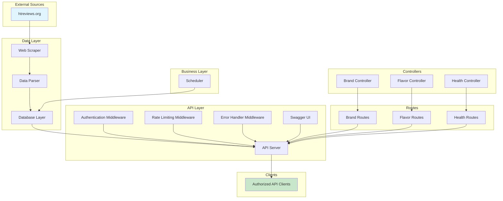
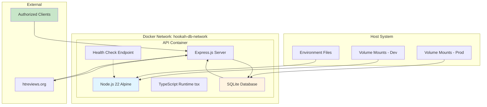
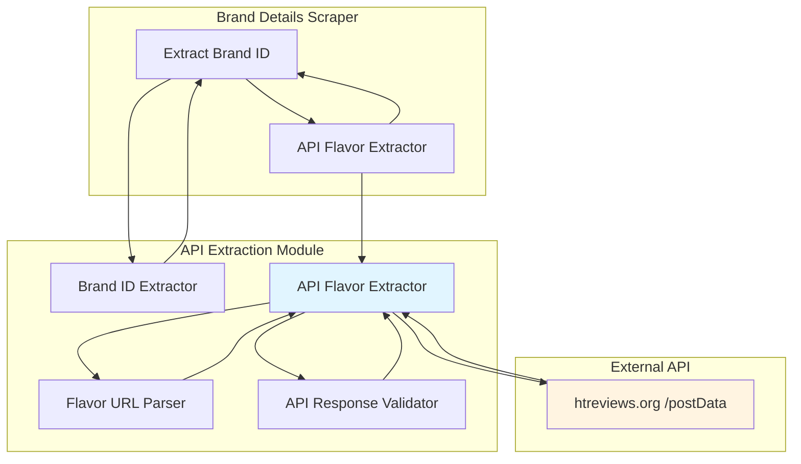
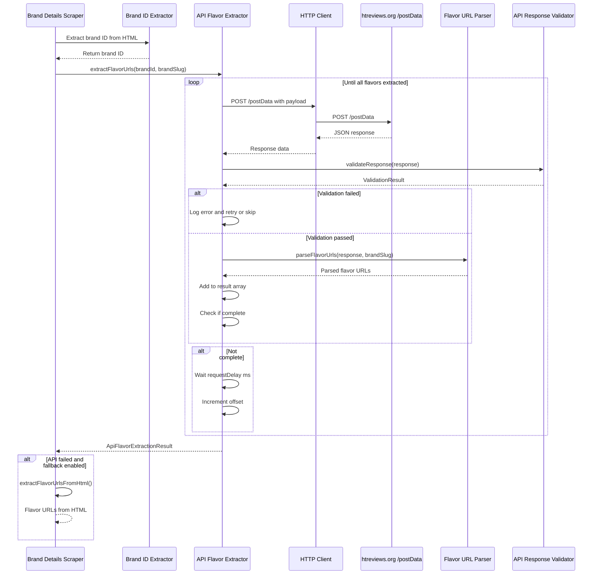

# Architecture

## System Architecture

The system follows a modular architecture with clear separation of concerns:



## Docker Deployment Architecture

The Docker deployment uses a single-container architecture with API service and SQLite database:



### Docker Container Architecture

**API Container** (`hookah-db-api-dev` / `hookah-db-api-prod`):
- **Base Image**: node:22-alpine
- **Runtime**: Node.js with tsx for TypeScript execution
- **Components**:
  - Express.js API server
  - Authentication middleware
  - Rate limiting middleware
  - Error handling middleware
  - Logging system (Winston)
  - Scheduler (node-cron)
  - Health check endpoint
  - SQLite database with WAL mode
- **Development Features**:
  - Hot reload via nodemon
  - Volume mounts for live code updates
  - Debug logging enabled
  - SQLite database file mounted for persistence
- **Production Features**:
  - Optimized runtime with tsx
  - Health checks (30s interval, 10s timeout)
  - Log rotation (10MB max, 3 files)
  - Automatic restart on failure
  - No hot reload (performance optimized)
  - SQLite database file mounted for persistence

**Network Configuration**:
- **Network Name**: hookah-db-network
- **Type**: Bridge network
- **Purpose**: Container-to-container communication
- **Port Mapping**:
  - API: 3000:3000 (host:container)

**Volume Management**:
- **Development Volume Mounts**:
  - `./apps/api/src:/app/apps/api/src` - Hot reload for API source
  - `./packages:/app/packages` - Hot reload for shared packages
  - `./tsconfig.json:/app/tsconfig.json` - TypeScript config
  - `./turbo.json:/app/turbo.json` - Turborepo config
  - `./hookah-db.db:/app/hookah-db.db` - SQLite database file
- **Production Volume Mounts**:
  - `./data/hookah-db.db:/app/hookah-db.db` - SQLite database file

## Source Code Structure

```
hookah-db/
├── apps/                  # Application packages
│   ├── api/               # REST API server
│   │   ├── src/
│   │   │   ├── server.ts  # Express server setup
│   │   │   ├── swagger.ts # Swagger/OpenAPI configuration
│   │   │   ├── routes/    # API route definitions
│   │   │   │   ├── index.ts
│   │   │   │   ├── brand-routes.ts
│   │   │   │   ├── flavor-routes.ts
│   │   │   │   └── health-routes.ts
│   │   │   ├── middleware/# Express middleware
│   │   │   │   ├── index.ts
│   │   │   │   ├── auth-middleware.ts
│   │   │   │   ├── rate-limit-middleware.ts
│   │   │   │   └── error-handler-middleware.ts
│   │   │   └── controllers/# Request handlers
│   │   │       ├── index.ts
│   │   │       ├── brand-controller.ts
│   │   │       ├── flavor-controller.ts
│   │   │       └── health-controller.ts
│   │   ├── package.json
│   │   └── tsconfig.json
│   └── cli/               # CLI application
│       ├── src/
│       │   └── index.ts   # CLI entry point
│       ├── package.json
│       └── tsconfig.json
├── packages/              # Shared packages
│   ├── types/             # TypeScript interfaces and types
│   │   ├── src/
│   │   │   ├── brand.ts   # Brand interface
│   │   │   ├── flavor.ts  # Flavor interface
│   │   │   ├── line.ts    # Line interface
│   │   │   ├── rating.ts  # RatingDistribution interface
│   │   │   ├── query-params.ts # Query parameter interfaces (search, pagination, filters)
│   │   │   └── index.ts   # Type exports
│   │   ├── package.json
│   │   └── tsconfig.json
│   ├── scraper/           # Web scraping module
│   │   ├── src/
│   │   │   ├── index.ts   # Main scraper entry point
│   │   │   ├── http-client.ts
│   │   │   ├── html-parser.ts
│   │   │   ├── scraper.ts
│   │   │   ├── brand-scraper.ts
│   │   │   ├── brand-details-scraper.ts
│   │   │   ├── flavor-details-scraper.ts
│   │   │   ├── brand-id-extractor.ts          # API-based: Extract brand ID
│   │   │   ├── api-flavor-extractor.ts        # API-based: Extract flavors
│   │   │   ├── flavor-url-parser.ts           # API-based: Parse URLs
│   │   │   └── api-response-validator.ts      # API-based: Validate responses
│   │   ├── package.json
│   │   └── tsconfig.json
│   ├── parser/            # Data parsing and transformation
│   │   ├── src/
│   │   │   └── index.ts   # Data parser entry point
│   │   ├── package.json
│   │   └── tsconfig.json
│   ├── cache/             # In-memory caching layer
│   │   ├── src/
│   │   │   ├── index.ts   # Cache interface and implementations
│   │   │   ├── types.ts
│   │   │   ├── in-memory-cache.ts
│   │   │   └── cache-factory.ts
│   │   ├── package.json
│   │   └── tsconfig.json
│   ├── database/          # SQLite database layer
│   │   ├── src/
│   │   │   ├── index.ts   # Database interface and implementations
│   │   │   ├── types.ts
│   │   │   └── sqlite-database.ts
│   │   ├── package.json
│   │   └── tsconfig.json
│   ├── services/          # Business logic
│   │   ├── src/
│   │   │   ├── index.ts   # Service orchestration
│   │   │   ├── brand-service.ts
│   │   │   ├── flavor-service.ts
│   │   │   └── data-service.ts
│   │   ├── package.json
│   │   └── tsconfig.json
│   ├── scheduler/         # Cron job scheduler
│   │   ├── src/
│   │   │   ├── index.ts   # Package exports
│   │   │   ├── scheduler.ts # Scheduler class
│   │   │   └── types.ts   # Scheduler types
│   │   ├── package.json
│   │   └── tsconfig.json
│   ├── utils/             # Utility functions
│   │   ├── src/
│   │   │   └── index.ts   # Utility functions
│   │   ├── package.json
│   │   └── tsconfig.json
│   ├── config/            # Shared configuration
│   │   └── package.json
│   └── tsconfig/          # Shared TypeScript configurations
│       ├── base.json      # Base TypeScript config
│       ├── node.json      # Node.js TypeScript config
│       └── package.json
├── examples/              # Example HTML files for reference
│   ├── htreviews.org_tobaccos_brands.html
│   ├── htreviews.org_tobaccos_sarma.html
│   └── htreviews.org_tobaccos_sarma_klassicheskaya_zima.html
├── tests/                 # Test files
│   ├── unit/
│   │   ├── api/           # API tests (119 tests)
│   │   ├── cache/         # Cache tests (73 tests)
│   │   ├── database/      # Database tests
│   │   ├── scraper/       # Scraper tests (563 tests: 408 HTML + 155 API)
│   │   ├── services/      # Service tests (198 tests)
│   │   └── scheduler/     # Scheduler tests (117 tests)
│   └── integration/
│       └── scraper.test.ts
├── .kilocode/             # Kilo Code configuration
│   └── rules/
│       └── memory-bank/   # Memory bank files
├── Dockerfile             # Multi-stage Docker build configuration
├── docker-compose.dev.yml  # Development Docker Compose configuration
├── docker-compose.prod.yml # Production Docker Compose configuration
├── tsconfig.docker.json   # Docker-specific TypeScript configuration
├── pnpm-workspace.yaml    # pnpm workspace configuration
├── turbo.json             # Turborepo configuration
├── .npmrc                 # npm/pnpm configuration
├── package.json           # Root package.json
├── tsconfig.json          # Root TypeScript config
└── README.md
```

## Key Technical Decisions

### Data Models

Based on HTML structure analysis, following data models are identified:

**Brand Model**:
- `slug`: Unique identifier (e.g., "sarma")
- `name`: Display name (e.g., "Сарма")
- `nameEn`: English name (e.g., "Sarma")
- `description`: Brand description
- `country`: Country of origin (e.g., "Россия")
- `website`: Official website URL
- `foundedYear`: Year of foundation
- `status`: Production status ("Выпускается", "Снят с производства")
- `imageUrl`: Brand logo URL
- `rating`: Average rating (1-5)
- `ratingsCount`: Number of ratings
- `reviewsCount`: Number of reviews
- `viewsCount`: Number of views
- `lines`: Array of Line objects
- `flavors`: Array of Flavor objects

**Line Model**:
- `slug`: Unique identifier (e.g., "klassicheskaya")
- `name`: Display name (e.g., "Классическая")
- `description`: Line description
- `strength`: Strength level (e.g., "Средняя", "Лёгкая", "Крепкая")
- `status`: Production status
- `flavorsCount`: Number of flavors in line
- `rating`: Average rating
- `brandSlug`: Parent brand slug

**Flavor Model**:
- `slug`: Unique identifier (e.g., "zima")
- `name`: Display name (e.g., "Зима")
- `nameAlt`: Alternative name (if any)
- `description`: Flavor description
- `brandSlug`: Parent brand slug
- `brandName`: Parent brand name
- `lineSlug`: Parent line slug
- `lineName`: Parent line name
- `country`: Country of origin
- `officialStrength`: Official strength level
- `userStrength`: User-rated strength level
- `status`: Production status
- `imageUrl`: Flavor image URL
- `tags`: Array of flavor tags (e.g., "Холодок")
- `rating`: Average rating (1-5)
- `ratingsCount`: Number of ratings
- `reviewsCount`: Number of reviews
- `viewsCount`: Number of views
- `ratingDistribution`: Distribution of ratings by score
- `smokeAgainPercentage`: Percentage who would smoke again
- `htreviewsId`: Internal HTReviews ID
- `dateAdded`: Date added to HTReviews
- `addedBy`: User who added the flavor

### Scraping Strategy

1. **Brand Discovery**: Scrape `/tobaccos/brands` page to discover all brands
2. **Brand Details**: For each brand, scrape brand detail page to get brand info and lines
3. **Flavor Discovery**: From brand pages, discover all flavors using API-based extraction
4. **Flavor Details**: For each flavor, scrape flavor detail page to get complete data
5. **Incremental Updates**: Track last scrape timestamp to only update changed data

### API-Based Flavor Extraction

The scraper now uses API-based extraction to retrieve all flavors for each brand, fixing the previous limitation where only the first 20 flavors were available.

**Architecture**:



**Components**:

1. **Brand ID Extractor** ([`brand-id-extractor.ts`](packages/scraper/src/brand-id-extractor.ts:1))
   - Extracts brand ID from brand detail page HTML
   - Required for API requests to `/postData` endpoint
   - 39 unit tests (100% pass rate)

2. **API Flavor Extractor** ([`api-flavor-extractor.ts`](packages/scraper/src/api-flavor-extractor.ts:1))
   - Orchestrates API requests to `/postData` endpoint
   - Handles pagination with configurable delay
   - Implements retry logic with exponential backoff
   - Tracks extraction metrics (time, requests, count)
   - 42 unit tests (100% pass rate)

3. **Flavor URL Parser** ([`flavor-url-parser.ts`](packages/scraper/src/flavor-url-parser.ts:1))
   - Parses API response and extracts flavor URLs
   - Validates URL format
   - Removes duplicates
   - 38 unit tests (100% pass rate)

4. **API Response Validator** ([`api-response-validator.ts`](packages/scraper/src/api-response-validator.ts:1))
   - Validates API response structure
   - Checks data integrity
   - Provides detailed error messages
   - 36 unit tests (100% pass rate)

**Data Flow**:



**Performance Improvements**:

| Metric | HTML Scraping | API Extraction | Improvement |
|--------|----------------|-----------------|-------------|
| **Extraction Time** | 10-30s per brand | 2-5s per brand | **5-6x faster** |
| **Flavor Coverage** | 20 flavors (78% missing) | All flavors | **100% coverage** |
| **Network Requests** | 5-15 GET requests | 3-10 POST requests | Similar |
| **Memory Usage** | Low | Low | Similar |

**Configuration**:

```bash
# Enable/disable API-based extraction (default: true)
ENABLE_API_EXTRACTION=true

# Number of flavors per API request (default: 20)
API_FLAVORS_PER_REQUEST=20

# Delay between API requests in milliseconds (default: 500)
API_REQUEST_DELAY=500

# Maximum retry attempts for failed API requests (default: 3)
API_MAX_RETRIES=3

# Enable fallback to HTML scraping if API fails (default: true)
ENABLE_API_FALLBACK=true
```

**Benefits**:

- ✅ **Complete Flavor Coverage**: Retrieves all flavors, not just first 20
- ✅ **5-6x Faster**: Extraction time reduced from 10-30s to 2-5s per brand
- ✅ **Reliable**: Uses official API endpoint instead of JavaScript parsing
- ✅ **Graceful Fallback**: Falls back to HTML scraping if API fails
- ✅ **Configurable**: Adjust request delay, retry logic, and batch size
- ✅ **Respectful**: Configurable rate limiting to respect server resources
- ✅ **Backward Compatible**: HTML scraping still available as fallback

### Database Strategy

- **SQLite Database**: Persistent storage for all brand and flavor data
- **WAL Mode**: Write-Ahead Logging for better concurrency and performance
- **In-Memory Cache**: Cache frequently accessed data in memory for fast access
- **Cache-First Strategy**: Check cache first, fallback to database if needed
- **Database Update**: Scrape complete data → Validate → Update database → Clear cache
- **Search Functionality**: LIKE-based search for brands and flavors with cache-first strategy

### API Design

RESTful API with JSON responses:

```
GET /health
  Returns: Basic health check

GET /health/detailed
  Returns: Detailed health check with database stats

GET /api-docs
  Returns: Interactive Swagger UI for API documentation

GET /api-docs.json
  Returns: Raw OpenAPI specification JSON

GET /api/v1/brands
  Query params: page, limit, country, sort, search
  Returns: List of brands with pagination and optional search

GET /api/v1/brands/:slug
  Returns: Full brand details with lines and flavors

POST /api/v1/brands/refresh
  Returns: Refreshed brand data

GET /api/v1/brands/:brandSlug/flavors
  Query params: page, limit, lineSlug, sort
  Returns: Flavors for specific brand

GET /api/v1/flavors
  Query params: page, limit, brandSlug, lineSlug, strength, tags, sort, search
  Returns: List of flavors with filtering and optional search

GET /api/v1/flavors/:slug
  Returns: Full flavor details with reviews

POST /api/v1/flavors/refresh
  Returns: Refreshed flavor data

GET /api/v1/scheduler/stats
  Returns: Scheduler statistics (uptime, task count, executions, errors)

GET /api/v1/scheduler/jobs
  Returns: List of all scheduled jobs with status
```

### Search Functionality

**Implementation**: SQL LIKE queries with pattern `%searchQuery%`

**Search Fields**:
- **Brands**: `name` (Russian) and `nameEn` (English)
- **Flavors**: `name` (Russian) and `nameAlt` (English)

**Cache Strategy**:
- **With Search**: Bypasses cache, queries database directly
- **Without Search**: Uses cache-first strategy for optimal performance

**API Usage**:
```bash
# Search brands by name
GET /api/v1/brands?search=Sarma
GET /api/v1/brands?search=sarma&page=1&limit=10

# Search flavors by name
GET /api/v1/flavors?search=Зима
GET /api/v1/flavors?search=Зима&brandSlug=sarma&page=1&limit=10
```

**Technical Details**:
- **Case Sensitivity**: Case-insensitive (SQLite default)
- **Security**: Parameterized queries prevent SQL injection
- **Error Handling**: Returns empty array on errors, logs appropriately
- **Backward Compatibility**: All existing functionality maintained

### API Documentation

The API includes comprehensive Swagger/OpenAPI documentation:

- **Swagger UI Endpoint**: `GET /api-docs`
  - Interactive web interface for exploring the API
  - Test endpoints directly from the browser
  - View request/response schemas and examples
  - Accessible at `http://localhost:3000/api-docs` when server is running

- **OpenAPI JSON Endpoint**: `GET /api-docs.json`
  - Raw OpenAPI 3.0 specification in JSON format
  - Can be used by API documentation generators
  - Accessible at `http://localhost:3000/api-docs.json` when server is running

- **Component Schemas** (6 defined):
  - Brand: Complete brand data structure
  - Flavor: Complete flavor data structure
  - Line: Product line data structure
  - RatingDistribution: Rating statistics distribution
  - Error: Standard error response format
  - Pagination: Pagination metadata

- **Security Scheme**:
  - ApiKeyAuth: API key authentication via X-API-Key header
  - Required for all API v1 endpoints (except health checks)

- **Tags** (3 categories):
  - Brands: Brand-related endpoints
  - Flavors: Flavor-related endpoints
  - Health: Health check and monitoring endpoints

- **Total Endpoints Documented**: 11
  - 4 brand endpoints
  - 3 flavor endpoints
  - 2 health endpoints
  - 2 scheduler endpoints

### API Layer Implementation

**Middleware**:
- **Authentication Middleware** ([`auth-middleware.ts`](apps/api/src/middleware/auth-middleware.ts:1)):
  - Validates API key from X-API-Key header
  - Supports multiple API keys via environment variables (API_KEY_*)
  - Returns 401 for missing or invalid API keys
  - Consistent JSON error responses

- **Authentication Middleware Updates** (2026-01-05):
  - Fixed authentication enforcement on all API v1 endpoints
  - Previously only applied to POST refresh endpoints
  - Now correctly applied to GET endpoints (brands, flavors, brand by slug, flavor by slug)
  - Added dotenv integration for environment variable loading
  - Security posture improved from CRITICAL to SECURE

- **Rate Limiting Middleware** ([`rate-limit-middleware.ts`](apps/api/src/middleware/rate-limit-middleware.ts:1)):
  - Uses express-rate-limit package
  - Configurable window (default: 60 seconds) and max requests (default: 100)
  - IP-based rate limiting
  - Returns 429 with retry-after header on rate limit exceeded
  - Custom error responses with JSON format

- **Error Handler Middleware** ([`error-handler-middleware.ts`](apps/api/src/middleware/error-handler-middleware.ts:1)):
  - Centralized error handling for all routes
  - Consistent JSON error responses with message and status
  - Proper HTTP status codes (400, 401, 404, 429, 500)
  - Error logging for debugging
  - Handles both known error types and unexpected errors

**Controllers**:
- **Brand Controller** ([`brand-controller.ts`](apps/api/src/controllers/brand-controller.ts:1)):
  - `getBrands()`: List all brands with pagination and search support
  - `getBrandBySlug()`: Get detailed brand information by slug
  - `refreshBrands()`: Trigger brand data refresh from scraper

- **Flavor Controller** ([`flavor-controller.ts`](apps/api/src/controllers/flavor-controller.ts:1)):
  - `getFlavors()`: List all flavors with filtering, pagination, and search support
  - `getFlavorBySlug()`: Get detailed flavor information by slug
  - `getFlavorsByBrand()`: Get all flavors for a specific brand
  - `refreshFlavors()`: Trigger flavor data refresh from scraper

- **Health Controller** ([`health-controller.ts`](apps/api/src/controllers/health-controller.ts:1)):
  - `healthCheck()`: Basic health check endpoint
  - `healthCheckDetailed()`: Detailed health check with database statistics

**Routes**:
- **Brand Routes** ([`brand-routes.ts`](apps/api/src/routes/brand-routes.ts:1)):
  - GET /api/v1/brands - List brands (with search parameter)
  - GET /api/v1/brands/:slug - Get brand by slug
  - POST /api/v1/brands/refresh - Refresh brand data
  - GET /api/v1/brands/:brandSlug/flavors - Get brand flavors

- **Flavor Routes** ([`flavor-routes.ts`](apps/api/src/routes/flavor-routes.ts:1)):
  - GET /api/v1/flavors - List flavors (with search parameter)
  - GET /api/v1/flavors/:slug - Get flavor by slug
  - POST /api/v1/flavors/refresh - Refresh flavor data

- **Health Routes** (defined in server.ts):
  - GET /health - Basic health check
  - GET /health/detailed - Detailed health check

- **Scheduler Routes** (defined in server.ts):
  - GET /api/v1/scheduler/stats - Get scheduler statistics
  - GET /api/v1/scheduler/jobs - List all scheduled jobs

**Server Setup** ([`server.ts`](apps/api/src/server.ts:1)):
- Express server with TypeScript
- Middleware order:
  1. CORS (optional, for cross-origin requests)
  2. JSON body parsing
  3. Rate limiting middleware
  4. Authentication middleware
  5. API routes
  6. Error handler middleware
- Health check endpoints (no auth required)
- API v1 routes (auth required)
- Swagger UI documentation endpoints (no auth required)
- 404 handler for undefined routes
- Scheduler integration with graceful shutdown

**Swagger Configuration** ([`swagger.ts`](apps/api/src/swagger.ts:1)):
- OpenAPI 3.0 specification
- API metadata (title, version, description, license)
- Component schemas for data models
- Security scheme definition
- Tags for endpoint organization
- JSDoc comment integration for automatic spec generation

### Scheduler Implementation

**Scheduler Class** ([`scheduler.ts`](packages/scheduler/src/scheduler.ts:1)):
- Lifecycle management: start(), stop(), restart()
- Task management: scheduleJob(), unscheduleJob(), enableJob(), disableJob()
- Statistics: getStats(), getJobStatus(), getExecutionHistory()
- Default tasks: scheduleBrandsRefresh(), scheduleFlavorsRefresh(), scheduleAllDataRefresh()

**Configuration**:
- Environment-based configuration with sensible defaults
- Cron expression validation
- Enable/disable scheduler without code changes
- Configurable execution history limit

**Integration**:
- Seamless integration with DataService.refreshAllCache()
- Graceful shutdown with SIGTERM/SIGINT handlers
- Health check endpoint integration for monitoring

**Error Handling**:
- Comprehensive error handling for job execution
- Failed jobs don't block other jobs
- Error tracking and statistics

**Testing**:
- 117 comprehensive tests (87 unit + 30 integration)
- 100% pass rate
- >90% code coverage

### Authentication

- **API Keys**: Simple API key-based authentication
- **Header**: `X-API-Key: <key>`
- **Environment**: Store API keys in environment variables (API_KEY_*)
- **Rate Limiting**: Per-key rate limits (e.g., 100 requests/minute)
- **Implementation**: Custom middleware validates X-API-Key header against environment variables

### Docker Implementation

**Multi-Stage Dockerfile** ([`Dockerfile`](Dockerfile:1)):
- **Stage 1 - Dependencies**: Installs all dependencies with frozen lockfile for reproducible builds
- **Stage 2 - Development**: Development environment with hot reload via nodemon and volume mounts
- **Stage 3 - Production**: Optimized production runtime with health checks and logging

**Docker Compose - Development** ([`docker-compose.dev.yml`](docker-compose.dev.yml:1)):
- API service with hot reload and volume mounts
- SQLite database file mounted for persistence
- Bridge network for container communication
- Environment configuration via `.env.dev`

**Docker Compose - Production** ([`docker-compose.prod.yml`](docker-compose.prod.yml:1)):
- Optimized API service with health checks and logging configuration
- SQLite database file mounted for persistence
- Health checks for API service
- Log rotation with size limits
- Environment configuration via `.env.prod`

**Docker-Specific TypeScript Configuration** ([`tsconfig.docker.json`](tsconfig.docker.json:1)):
- Extends base TypeScript config
- Configured for CommonJS modules and ES2022 target
- ts-node configuration with transpileOnly mode for faster execution
- Experimental specifier resolution for workspace compatibility

**Runtime Decisions**:
- **tsx**: Used for production runtime to avoid ts-node JSDoc YAML parsing issues
- **nodemon**: Used for development hot reload
- **node:22-alpine**: Lightweight base image for smaller container sizes
- **better-sqlite3**: SQLite database driver with synchronous API

## Component Relationships

```mermaid
graph LR
    Scraper[@hookah-db/scraper] --> Parser[@hookah-db/parser]
    Parser --> Types[@hookah-db/types]
    Parser --> Database[@hookah-db/database]
    Database --> Services[@hookah-db/services]
    Services --> Controllers[API Controllers]
    Controllers --> Routes[API Routes]
    Routes --> Server[@hookah-db/api]
    Auth[Auth Middleware] --> Server
    RateLimit[Rate Limit Middleware] --> Server
    ErrorHandler[Error Handler Middleware] --> Server
    Swagger[Swagger UI] --> Server
    Scheduler[@hookah-db/scheduler] --> Services
    Scheduler --> Server
    Cache[In-Memory Cache] --> Services
    Services --> Cache
```

## Critical Implementation Paths

1. **Scraping Path**: Fetch HTML → Parse with Cheerio → Extract data → Validate → Store in database
2. **API-Based Extraction Path**: Extract brand ID → Make POST requests to /postData → Validate response → Parse flavor URLs → Return all flavors
3. **API Request Path**: Auth check → Rate limit check → Cache lookup → Database fallback → Return data or 404
4. **Database Update Path**: Scrape complete data → Validate → Update database → Clear cache
5. **Error Handling Path**: Controller throws error → Error handler middleware catches → Log error → Return JSON error response
6. **Documentation Path**: JSDoc comments → swagger-jsdoc → OpenAPI spec → Swagger UI
7. **Scheduler Path**: Cron trigger → Execute job → Call DataService → Update database → Clear cache → Log execution
8. **Docker Build Path**: Dockerfile stages (dependencies → development/production) → Container images → Docker Compose orchestration
9. **Docker Deployment Path**: Build images → Create network → Start containers → Health checks → Volume mounts → Service communication
10. **Search Path**: Extract search parameter → Check if search provided → If search: Query database with LIKE → If no search: Use cache → Return results

## Design Patterns

- **Repository Pattern**: Data access layer abstracts database implementation
- **Factory Pattern**: Parser factory for different page types
- **Middleware Pattern**: Express middleware for cross-cutting concerns (auth, rate limiting, error handling)
- **Strategy Pattern**: Different caching strategies (in-memory cache)
- **Monorepo Pattern**: Shared packages organized by dependency layer
- **Controller Pattern**: Request handlers separate from business logic
- **Route Handler Pattern**: Route definitions separate from controller logic
- **Documentation-First Pattern**: JSDoc comments drive API specification generation
- **Scheduler Pattern**: Cron-based task scheduling with lifecycle management
- **Container Pattern**: Multi-stage Docker builds for development and production
- **Orchestration Pattern**: Docker Compose for single-container deployment (API + SQLite)
- **API Extraction Pattern**: Direct API calls with pagination and retry logic for complete data retrieval
- **Search Pattern**: LIKE-based queries with cache-first strategy for optimal performance

## Package Dependency Layers

```
Application Layer
├── @hookah-db/api (depends on: services, utils, config, express-rate-limit, swagger-ui-express)
└── @hookah-db/cli (depends on: services, utils, config)

Business Layer
├── @hookah-db/services (depends on: scraper, parser, database, cache, types, utils)
└── @hookah-db/scheduler (depends on: services, types, utils, config)

Core Layer
├── @hookah-db/scraper (depends on: types, utils, config)
├── @hookah-db/parser (depends on: types, utils, config)
├── @hookah-db/database (depends on: types, utils, config)
└── @hookah-db/cache (depends on: types, utils, config)

Utility Layer
├── @hookah-db/types (no dependencies)
├── @hookah-db/utils (depends on: types)
├── @hookah-db/config (no dependencies)
└── @hookah-db/tsconfig (no dependencies)
```

## API Test Coverage

The API layer has comprehensive test coverage with 119 tests:
- **Middleware Tests** (33 tests): Authentication, rate limiting, error handling
- **Brand Routes Tests** (27 tests): All brand endpoints with various scenarios
- **Flavor Routes Tests** (35 tests): All flavor endpoints with various scenarios
- **Health Endpoint Tests** (24 tests): Health check endpoints with database stats

All tests pass (119/119) and cover:
- Successful requests
- Error conditions (401, 404, 429, 500)
- Edge cases
- Middleware behavior
- Controller logic
- Route handlers

## Scheduler Test Coverage

The scheduler layer has comprehensive test coverage with 117 tests:
- **Unit Tests** (87 tests): Scheduler class methods, job management, statistics
- **Integration Tests** (30 tests): Scheduler integration with DataService, cron execution

All tests pass (117/117) and cover:
- Lifecycle management (start, stop, restart)
- Job scheduling and unscheduling
- Job enabling and disabling
- Statistics and monitoring
- Error handling
- Execution history tracking
- Integration with DataService
- Cron expression validation

## API-Based Extraction Test Coverage

The API-based extraction has comprehensive test coverage with 155 tests:
- **Brand ID Extractor** (39 tests): Brand ID extraction from HTML
- **API Flavor Extractor** (42 tests): API request orchestration, pagination, retry logic
- **Flavor URL Parser** (38 tests): URL parsing, validation, duplicate removal
- **API Response Validator** (36 tests): Response validation, data integrity checks

All tests pass (155/155) and cover:
- Successful extraction scenarios
- Error handling and retry logic
- Pagination behavior
- Fallback to HTML scraping
- Edge cases and boundary conditions
