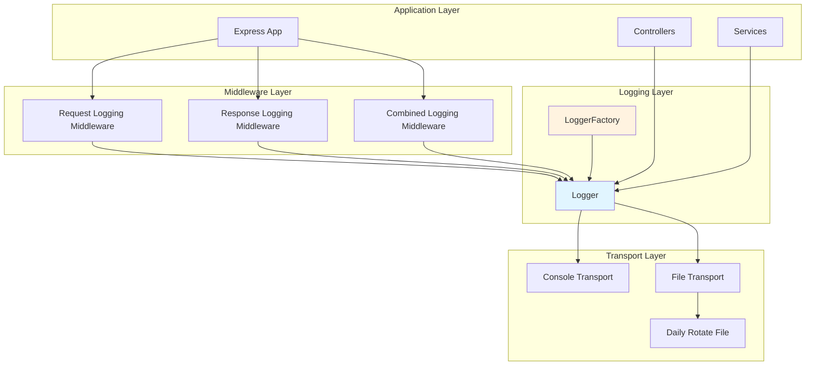

# Logging Documentation

Comprehensive guide to the logging system in the Hookah Tobacco Database API.

## Table of Contents

- [Introduction](#introduction)
- [Architecture Overview](#architecture-overview)
- [Quick Start](#quick-start)
- [Logger Usage](#logger-usage)
  - [Default Logger](#default-logger)
  - [Custom Loggers](#custom-loggers)
  - [Child Loggers](#child-loggers)
  - [Log Levels](#log-levels)
- [Middleware Usage](#middleware-usage)
  - [Request Logging](#request-logging)
  - [Response Logging](#response-logging)
  - [Combined Logging](#combined-logging)
  - [Error Handler Logging](#error-handler-logging)
- [Configuration](#configuration)
  - [Environment Variables](#environment-variables)
  - [Logger Presets](#logger-presets)
  - [Custom Configuration](#custom-configuration)
- [Log Levels Reference](#log-levels-reference)
- [Log Formats](#log-formats)
- [File Rotation](#file-rotation)
- [Best Practices](#best-practices)
- [Examples](#examples)
- [Troubleshooting](#troubleshooting)

## Introduction

The logging system is built on [Winston](https://github.com/winstonjs/winston), a versatile logging library for Node.js. It provides:

- **Structured logging**: JSON-formatted logs for easy parsing and analysis
- **Multiple transports**: Console, file, and combined logging options
- **Log rotation**: Daily rotation with configurable retention
- **Correlation ID tracking**: Request tracing across distributed systems
- **Sensitive data filtering**: Automatic redaction of passwords, tokens, etc.
- **Environment-aware configuration**: Automatic configuration based on NODE_ENV
- **Express middleware**: Automatic HTTP request/response logging

## Architecture Overview



### Key Components

1. **LoggerFactory**: Factory for creating configured logger instances with presets
2. **Logger**: Main logger class wrapping Winston with correlation ID support
3. **Middleware**: Express middleware for automatic request/response logging
4. **Transports**: Console and file transports with rotation support

## Quick Start

### Basic Usage

```typescript
import { LoggerFactory } from '@hookah-db/utils';

// Get logger configured for current environment
const logger = LoggerFactory.createEnvironmentLogger('my-service');

// Log messages at different levels
logger.info('Application started');
logger.error('An error occurred', { error: err });
logger.debug('Debug information', { data: someData });
```

### Express Middleware

```typescript
import express from 'express';
import { createLoggingMiddleware } from './middleware/logging-middleware';

const app = express();

// Add logging middleware (logs both requests and responses)
app.use(createLoggingMiddleware());

// Your routes here
app.get('/api/brands', (req, res) => {
  res.json({ brands: [] });
});
```

## Logger Usage

### Default Logger

The default logger is automatically configured based on the `NODE_ENV` environment variable:

```typescript
import { LoggerFactory } from '@hookah-db/utils';

// Automatically configured based on NODE_ENV
const logger = LoggerFactory.createEnvironmentLogger('my-service');
```

**Default configurations by environment:**

- **Development**: Console transport, pretty format, debug level
- **Production**: Console (warn+) + file (info+) transports, JSON format
- **Test**: Console transport, simple format, error level only
- **Staging**: Console + file transports, debug level

### Custom Loggers

Create a logger with custom configuration:

```typescript
import { LoggerFactory, LogLevel, TransportType, LogFormat } from '@hookah-db/utils';

const customLogger = LoggerFactory.createLogger({
  level: LogLevel.DEBUG,
  service: 'my-service',
  environment: 'development',
  handleExceptions: true,
  handleRejections: true,
  exitOnError: false,
  transports: [
    {
      type: TransportType.CONSOLE,
      level: LogLevel.DEBUG,
      format: LogFormat.PRETTY,
      colorize: true,
      enabled: true,
    },
    {
      type: TransportType.FILE,
      level: LogLevel.INFO,
      format: LogFormat.JSON,
      dirname: './logs',
      filename: 'custom-%DATE%.log',
      datePattern: 'YYYY-MM-DD',
      maxSize: 20 * 1024 * 1024, // 20MB
      maxFiles: 14,
      zippedArchive: true,
      createDir: true,
      enabled: true,
    },
  ],
  defaultMeta: {
    version: '1.0.0',
  },
});
```

### Child Loggers

Create child loggers with additional default metadata:

```typescript
import { LoggerFactory } from '@hookah-db/utils';

const parentLogger = LoggerFactory.createEnvironmentLogger('parent');

// Create child logger with additional metadata
const childLogger = parentLogger.child({
  module: 'user-service',
  version: '2.0.0',
});

// Child logger inherits parent's configuration and adds metadata
childLogger.info('User logged in', { userId: 123 });
```

### Log Levels

The logging system supports the following log levels (from most to least severe):

| Level | Description | Use Case |
|-------|-------------|----------|
| `error` | Error conditions | Something went wrong, application may continue |
| `warn` | Warning conditions | Potentially harmful situations |
| `info` | Informational messages | Normal operational messages |
| `http` | HTTP request/response | HTTP-specific logging |
| `verbose` | Verbose messages | More detailed than info |
| `debug` | Debug messages | Diagnostic information |
| `silly` | Silly messages | Very detailed debugging info |

**Setting log level:**

```typescript
import { LoggerFactory, LogLevel } from '@hookah-db/utils';

const logger = LoggerFactory.createEnvironmentLogger('my-service');

// Set log level dynamically
logger.setLevel(LogLevel.DEBUG);

// Get current log level
const currentLevel = logger.getLevel();
console.log('Current log level:', currentLevel);
```

**Logging at different levels:**

```typescript
logger.error('Database connection failed', { error: err, host: 'localhost' });
logger.warn('Cache miss', { key: 'user:123' });
logger.info('User logged in', { userId: 123, ip: '192.168.1.1' });
logger.http('GET /api/brands', { statusCode: 200, responseTime: 45 });
logger.verbose('Cache updated', { key: 'brands', size: 150 });
logger.debug('Query executed', { query: 'SELECT * FROM brands', duration: 12 });
logger.silly('Variable state', { var1: 'value1', var2: 'value2' });
```

### Error Logging

Log errors with stack traces:

```typescript
import { LoggerFactory } from '@hookah-db/utils';

const logger = LoggerFactory.createEnvironmentLogger('my-service');

try {
  // Some operation that might throw
  await someAsyncOperation();
} catch (error) {
  // Log error with stack trace
  logger.logError(error as Error, 'Failed to execute operation', {
    operation: 'someAsyncOperation',
    retryCount: 3,
  });
}
```

### Correlation ID Tracking

Track requests across distributed systems using correlation IDs:

```typescript
import { LoggerFactory } from '@hookah-db/utils';

const logger = LoggerFactory.createEnvironmentLogger('my-service');

// Set correlation ID for request tracing
logger.setCorrelationId('req-abc-123-def-456');

// All logs will include correlation ID
logger.info('Processing request', { action: 'getBrands' });

// Clear correlation ID when done
logger.clearCorrelationId();
```

### Adding Metadata

Add metadata to all log entries:

```typescript
import { LoggerFactory } from '@hookah-db/utils';

const logger = LoggerFactory.createEnvironmentLogger('my-service');

// Add metadata to all future log entries
logger.addMetadata({
  requestId: 'req-123',
  userId: 456,
  sessionId: 'sess-789',
});

// All logs will include the metadata
logger.info('User action', { action: 'viewProfile' });
```

## Middleware Usage

### Request Logging

Log incoming HTTP requests with metadata:

```typescript
import express from 'express';
import { createRequestLoggingMiddleware } from './middleware/request-logging-middleware';

const app = express();

// Add request logging middleware
app.use(createRequestLoggingMiddleware());

// Custom configuration
app.use(createRequestLoggingMiddleware({
  logLevel: 'debug',
  logBody: true,
  logHeaders: true,
  allowedHeaders: ['content-type', 'user-agent', 'accept'],
  excludedHeaders: ['authorization', 'cookie'],
  excludedBodyFields: ['password', 'token', 'apiKey'],
  generateCorrelationId: true,
  correlationIdHeader: 'X-Correlation-ID',
}));
```

**Request logging features:**
- Logs method, URL, IP address, User-Agent
- Configurable header logging with allowlist/blocklist
- Configurable body logging with sensitive data filtering
- Query parameters and route parameters
- API key masking (shows first 4 and last 4 characters)
- Correlation ID generation and tracking
- Request start time tracking for response time calculation

### Response Logging

Log HTTP responses with metadata:

```typescript
import express from 'express';
import { createResponseLoggingMiddleware } from './middleware/response-logging-middleware';

const app = express();

// Add response logging middleware
app.use(createResponseLoggingMiddleware());

// Custom configuration
app.use(createResponseLoggingMiddleware({
  logLevelByStatus: {
    success: 'debug',      // 2xx status codes
    redirect: 'info',       // 3xx status codes
    clientError: 'warn',    // 4xx status codes
    serverError: 'error',   // 5xx status codes
  },
  logBody: false,
  logHeaders: true,
  allowedHeaders: [],
  excludedHeaders: [],
  excludedBodyFields: ['password', 'token', 'apiKey'],
}));
```

**Response logging features:**
- Logs status code, response time, content length
- Configurable header logging with allowlist/blocklist
- Configurable body logging with sensitive data filtering
- Automatic log level selection based on status code
- Correlation ID tracking from request
- Response time calculation from request start time

### Combined Logging

Combine request and response logging in a single middleware:

```typescript
import express from 'express';
import { createLoggingMiddleware } from './middleware/logging-middleware';

const app = express();

// Add combined logging middleware
app.use(createLoggingMiddleware());

// Custom configuration
app.use(createLoggingMiddleware({
  enabled: true,
  request: {
    logLevel: 'debug',
    logBody: true,
    allowedHeaders: ['content-type', 'user-agent'],
  },
  response: {
    logBody: false,
    logLevelByStatus: {
      success: 'info',
      clientError: 'error',
    },
  },
}));

// Disable logging for specific routes
app.use('/health', createLoggingMiddleware({ enabled: false }));
```

### Error Handler Logging

The error handler middleware automatically logs errors:

```typescript
import express from 'express';
import { errorLoggingMiddleware } from './middleware/error-handler-middleware';

const app = express();

// Add error handler middleware (must be after all routes)
app.use(errorLoggingMiddleware);
```

**Error handler features:**
- Automatically logs all errors with stack traces
- Includes correlation ID if available
- Logs error details (name, message, stack)
- Returns consistent error responses

## Configuration

### Environment Variables

Configure logging using environment variables:

```bash
# Logging configuration
LOG_LEVEL=info                    # Minimum log level (error, warn, info, http, verbose, debug, silly)
LOG_DIR=./logs                    # Directory for log files
SERVICE_NAME=hookah-db           # Service name for log identification
NODE_ENV=production              # Environment (development, staging, production)

# Example .env file
NODE_ENV=production
LOG_LEVEL=info
LOG_DIR=./logs
SERVICE_NAME=hookah-db-api
PORT=3000
```

### Logger Presets

The LoggerFactory provides preset configurations for different environments:

#### Development Logger

```typescript
import { LoggerFactory } from '@hookah-db/utils';

const devLogger = LoggerFactory.createDevelopmentLogger('my-service');

// Configuration:
// - Level: debug
// - Transport: Console
// - Format: Pretty (with colors)
// - Handle exceptions: Yes
// - Handle rejections: Yes
```

#### Production Logger

```typescript
import { LoggerFactory } from '@hookah-db/utils';

const prodLogger = LoggerFactory.createProductionLogger('my-service', './logs');

// Configuration:
// - Level: info
// - Transports: Console (warn+) + File (info+) + Error file (error+)
// - Format: JSON
// - File rotation: Daily
// - Max file size: 20MB
// - Retention: 14 days (application), 30 days (errors)
// - Handle exceptions: Yes
// - Handle rejections: Yes
```

#### Test Logger

```typescript
import { LoggerFactory } from '@hookah-db/utils';

const testLogger = LoggerFactory.createTestLogger('my-service');

// Configuration:
// - Level: error
// - Transport: Console
// - Format: Simple
// - Handle exceptions: No
// - Handle rejections: No
```

#### Staging Logger

```typescript
import { LoggerFactory } from '@hookah-db/utils';

const stagingLogger = LoggerFactory.createStagingLogger('my-service', './logs');

// Configuration:
// - Level: debug
// - Transports: Console + File
// - Format: Pretty (console), JSON (file)
// - File rotation: Daily
// - Retention: 7 days
// - Handle exceptions: Yes
// - Handle rejections: Yes
```

### Custom Configuration

Create a logger with custom configuration:

```typescript
import { LoggerFactory, LogLevel, TransportType, LogFormat } from '@hookah-db/utils';

const customLogger = LoggerFactory.createLogger({
  level: LogLevel.DEBUG,
  service: 'custom-service',
  environment: 'development',
  handleExceptions: true,
  handleRejections: true,
  exitOnError: false,
  transports: [
    {
      type: TransportType.CONSOLE,
      level: LogLevel.DEBUG,
      format: LogFormat.PRETTY,
      colorize: true,
      enabled: true,
    },
    {
      type: TransportType.FILE,
      level: LogLevel.INFO,
      format: LogFormat.JSON,
      dirname: './logs',
      filename: 'custom-%DATE%.log',
      datePattern: 'YYYY-MM-DD',
      maxSize: 20 * 1024 * 1024, // 20MB
      maxFiles: 14,
      zippedArchive: true,
      createDir: true,
      enabled: true,
    },
  ],
  defaultMeta: {
    version: '1.0.0',
    environment: 'development',
  },
});
```

**Configuration options:**

| Option | Type | Default | Description |
|--------|------|---------|-------------|
| `level` | LogLevel | Required | Minimum log level |
| `service` | string | 'hookah-db' | Service name |
| `environment` | string | 'development' | Environment name |
| `handleExceptions` | boolean | false | Catch and log exceptions |
| `handleRejections` | boolean | false | Catch and log unhandled rejections |
| `exitOnError` | boolean | false | Exit process on error |
| `transports` | array | Required | Array of transport configurations |
| `defaultMeta` | object | {} | Default metadata for all logs |

## Log Levels Reference

### Error Level

Use for errors that prevent normal operation but don't necessarily stop the application:

```typescript
logger.error('Database connection failed', { error: err, host: 'localhost' });
logger.error('Failed to parse response', { response: data, statusCode: 500 });
```

### Warn Level

Use for potentially harmful situations that don't prevent normal operation:

```typescript
logger.warn('Cache miss', { key: 'user:123', cacheSize: 1000 });
logger.warn('Rate limit approaching', { requests: 95, limit: 100 });
logger.warn('Deprecated API endpoint used', { endpoint: '/api/v1/old' });
```

### Info Level

Use for informational messages about normal operation:

```typescript
logger.info('Application started', { port: 3000, environment: 'production' });
logger.info('User logged in', { userId: 123, ip: '192.168.1.1' });
logger.info('Cache refreshed', { itemCount: 150, duration: 1234 });
```

### HTTP Level

Use for HTTP-specific logging (requests/responses):

```typescript
logger.http('GET /api/brands', { statusCode: 200, responseTime: 45 });
logger.http('POST /api/brands/refresh', { statusCode: 200, responseTime: 1234 });
```

### Verbose Level

Use for more detailed informational messages:

```typescript
logger.verbose('Cache updated', { key: 'brands', size: 150, ttl: 86400 });
logger.verbose('Scheduler job started', { job: 'brands-refresh', cron: '0 2 * * *' });
```

### Debug Level

Use for diagnostic information during development:

```typescript
logger.debug('Query executed', { query: 'SELECT * FROM brands', duration: 12 });
logger.debug('Cache lookup', { key: 'brand:sarma', found: true });
logger.debug('Request received', { method: 'GET', url: '/api/brands', headers: {...} });
```

### Silly Level

Use for very detailed debugging information:

```typescript
logger.silly('Variable state', { var1: 'value1', var2: 'value2', var3: 'value3' });
logger.silly('Function entered', { function: 'processBrand', args: {...} });
logger.silly('Loop iteration', { index: 5, total: 100, current: {...} });
```

## Log Formats

### Pretty Format (Development)

Human-readable format with colors and indentation:

```
2026-01-05T20:00:00.000Z [info]: Application started
{
  "service": "hookah-db",
  "environment": "development",
  "port": 3000
}

2026-01-05T20:00:01.000Z [error]: Database connection failed
{
  "service": "hookah-db",
  "environment": "development",
  "error": "Connection refused",
  "host": "localhost",
  "port": 5432
}
```

### Simple Format

Simple text format without colors:

```
2026-01-05T20:00:00.000Z [info]: Application started {"service":"hookah-db","port":3000}
2026-01-05T20:00:01.000Z [error]: Database connection failed {"error":"Connection refused","host":"localhost"}
```

### JSON Format (Production)

Structured JSON format for easy parsing and analysis:

```json
{
  "timestamp": "2026-01-05T20:00:00.000Z",
  "level": "info",
  "message": "Application started",
  "service": "hookah-db",
  "environment": "production",
  "port": 3000
}

{
  "timestamp": "2026-01-05T20:00:01.000Z",
  "level": "error",
  "message": "Database connection failed",
  "service": "hookah-db",
  "environment": "production",
  "error": "Connection refused",
  "host": "localhost",
  "port": 5432,
  "stackTrace": "Error: Connection refused\n    at ..."
}
```

## File Rotation

The logging system uses `winston-daily-rotate-file` for automatic log rotation:

### Configuration

```typescript
{
  type: TransportType.FILE,
  level: LogLevel.INFO,
  format: LogFormat.JSON,
  dirname: './logs',
  filename: 'application-%DATE%.log',
  datePattern: 'YYYY-MM-DD',
  maxSize: 20 * 1024 * 1024, // 20MB
  maxFiles: 14,
  zippedArchive: true,
  createDir: true,
  enabled: true,
}
```

### Rotation Behavior

- **Daily rotation**: New log file created each day
- **Size-based rotation**: New file created when current file reaches max size
- **Compression**: Old files are automatically compressed (gzip)
- **Retention**: Old files are deleted after maxFiles days

### File Naming

```
./logs/
├── application-2026-01-01.log
├── application-2026-01-02.log.gz
├── application-2026-01-03.log.gz
├── error-2026-01-01.log
├── error-2026-01-02.log.gz
└── error-2026-01-03.log.gz
```

## Best Practices

### 1. Use Appropriate Log Levels

```typescript
// Good: Use appropriate levels
logger.error('Database connection failed', { error: err });
logger.warn('Cache miss', { key: 'user:123' });
logger.info('User logged in', { userId: 123 });
logger.debug('Query executed', { query: 'SELECT * FROM brands' });

// Bad: Using error for everything
logger.error('User logged in', { userId: 123 }); // Should be info
logger.error('Cache miss', { key: 'user:123' }); // Should be warn
```

### 2. Include Relevant Metadata

```typescript
// Good: Include relevant metadata
logger.error('Database connection failed', {
  error: err.message,
  host: 'localhost',
  port: 5432,
  database: 'hookah-db',
  retryCount: 3,
});

// Bad: Insufficient metadata
logger.error('Database connection failed');
```

### 3. Filter Sensitive Data

```typescript
// Good: Filter sensitive data
const sanitizedBody = {
  username: body.username,
  email: body.email,
  password: '[REDACTED]', // Never log passwords
  apiKey: '[REDACTED]',    // Never log API keys
};

logger.info('User registration', { body: sanitizedBody });

// Bad: Logging sensitive data
logger.info('User registration', { body: body }); // Includes password!
```

### 4. Use Correlation IDs

```typescript
// Good: Use correlation IDs for request tracing
logger.setCorrelationId(req.headers['x-correlation-id'] || generateId());
logger.info('Processing request', { action: 'getBrands' });
// ... processing ...
logger.clearCorrelationId();

// Bad: No correlation IDs
logger.info('Processing request'); // Can't trace across logs
```

### 5. Log Errors with Stack Traces

```typescript
// Good: Log errors with stack traces
try {
  await someAsyncOperation();
} catch (error) {
  logger.logError(error as Error, 'Failed to execute operation', {
    operation: 'someAsyncOperation',
  });
}

// Bad: Logging error message only
try {
  await someAsyncOperation();
} catch (error) {
  logger.error('Failed to execute operation', { error: error.message });
  // Missing stack trace!
}
```

### 6. Use Structured Logging

```typescript
// Good: Structured logging with metadata
logger.info('User logged in', {
  userId: 123,
  username: 'john.doe',
  ip: '192.168.1.1',
  userAgent: 'Mozilla/5.0...',
  timestamp: new Date().toISOString(),
});

// Bad: Unstructured logging
logger.info('User john.doe (123) logged in from 192.168.1.1 using Mozilla/5.0...');
```

### 7. Configure Log Levels Appropriately

```typescript
// Development: Debug level
const devLogger = LoggerFactory.createDevelopmentLogger('my-service');

// Production: Info level (less verbose)
const prodLogger = LoggerFactory.createProductionLogger('my-service');

// Test: Error level only
const testLogger = LoggerFactory.createTestLogger('my-service');
```

### 8. Use Child Loggers for Modules

```typescript
// Good: Use child loggers for modules
const parentLogger = LoggerFactory.createEnvironmentLogger('my-service');
const brandServiceLogger = parentLogger.child({ module: 'brand-service' });
const flavorServiceLogger = parentLogger.child({ module: 'flavor-service' });

brandServiceLogger.info('Fetching brands', { count: 10 });
flavorServiceLogger.info('Fetching flavors', { count: 100 });

// Bad: Using the same logger everywhere
const logger = LoggerFactory.createEnvironmentLogger('my-service');
logger.info('Fetching brands', { count: 10, module: 'brand-service' });
logger.info('Fetching flavors', { count: 100, module: 'flavor-service' });
```

## Examples

### Example 1: Basic API Server with Logging

```typescript
import express from 'express';
import { LoggerFactory } from '@hookah-db/utils';
import { createLoggingMiddleware } from './middleware/logging-middleware';

const app = express();
const logger = LoggerFactory.createEnvironmentLogger('api');

// Add logging middleware
app.use(createLoggingMiddleware());

// Add JSON body parser
app.use(express.json());

// Health check endpoint
app.get('/health', (req, res) => {
  logger.info('Health check requested');
  res.json({ status: 'healthy' });
});

// API routes
app.get('/api/brands', (req, res) => {
  logger.info('Fetching brands', { page: req.query.page });
  res.json({ brands: [] });
});

// Error handler
app.use((err: Error, req: express.Request, res: express.Response, next: express.NextFunction) => {
  logger.logError(err, 'Unhandled error', {
    method: req.method,
    url: req.url,
  });
  res.status(500).json({ error: 'Internal server error' });
});

app.listen(3000, () => {
  logger.info('Server started', { port: 3000 });
});
```

### Example 2: Service with Custom Logger

```typescript
import { LoggerFactory, LogLevel, TransportType, LogFormat } from '@hookah-db/utils';

class BrandService {
  private logger: ReturnType<typeof LoggerFactory.createLogger>;

  constructor() {
    this.logger = LoggerFactory.createLogger({
      level: LogLevel.DEBUG,
      service: 'brand-service',
      environment: 'development',
      transports: [
        {
          type: TransportType.CONSOLE,
          level: LogLevel.DEBUG,
          format: LogFormat.PRETTY,
          colorize: true,
          enabled: true,
        },
        {
          type: TransportType.FILE,
          level: LogLevel.INFO,
          format: LogFormat.JSON,
          dirname: './logs',
          filename: 'brand-service-%DATE%.log',
          datePattern: 'YYYY-MM-DD',
          maxSize: 20 * 1024 * 1024,
          maxFiles: 14,
          zippedArchive: true,
          createDir: true,
          enabled: true,
        },
      ],
    });
  }

  async getBrands(page: number = 1, limit: number = 10) {
    this.logger.info('Fetching brands', { page, limit });

    try {
      const brands = await this.fetchBrandsFromDatabase(page, limit);
      this.logger.info('Brands fetched successfully', { count: brands.length });
      return brands;
    } catch (error) {
      this.logger.logError(error as Error, 'Failed to fetch brands', { page, limit });
      throw error;
    }
  }

  private async fetchBrandsFromDatabase(page: number, limit: number) {
    // Database query logic
    return [];
  }
}
```

### Example 3: Request Tracing with Correlation IDs

```typescript
import express from 'express';
import { LoggerFactory } from '@hookah-db/utils';
import { createRequestLoggingMiddleware } from './middleware/request-logging-middleware';
import { createResponseLoggingMiddleware } from './middleware/response-logging-middleware';
import { v4 as uuidv4 } from 'uuid';

const app = express();
const logger = LoggerFactory.createEnvironmentLogger('api');

// Middleware to generate correlation ID
app.use((req, res, next) => {
  const correlationId = req.headers['x-correlation-id'] as string || uuidv4();
  req.headers['x-correlation-id'] = correlationId;
  res.setHeader('X-Correlation-ID', correlationId);
  logger.setCorrelationId(correlationId);
  next();
});

// Add request/response logging middleware
app.use(createRequestLoggingMiddleware());
app.use(createResponseLoggingMiddleware());

// API route
app.get('/api/brands/:slug', async (req, res) => {
  const { slug } = req.params;
  logger.info('Fetching brand', { slug });

  try {
    const brand = await fetchBrandBySlug(slug);
    logger.info('Brand fetched successfully', { slug, brandId: brand.id });
    res.json(brand);
  } catch (error) {
    logger.logError(error as Error, 'Failed to fetch brand', { slug });
    res.status(404).json({ error: 'Brand not found' });
  } finally {
    logger.clearCorrelationId();
  }
});
```

### Example 4: Conditional Logging

```typescript
import { LoggerFactory, LogLevel } from '@hookah-db/utils';

const logger = LoggerFactory.createEnvironmentLogger('my-service');

// Only log debug information in development
if (logger.getLevel() === LogLevel.DEBUG) {
  logger.debug('Detailed debug information', {
    variable1: 'value1',
    variable2: 'value2',
    variable3: 'value3',
  });
}

// Always log errors
logger.error('Critical error occurred', { error: err });
```

## Troubleshooting

### Issue: Logs Not Appearing

**Problem:** Logs are not being written to console or files.

**Solutions:**

1. Check log level configuration:
   ```typescript
   console.log('Current log level:', logger.getLevel());
   ```

2. Verify transport is enabled:
   ```typescript
   // Ensure transport configuration has enabled: true
   transports: [{
     type: TransportType.CONSOLE,
     enabled: true, // Make sure this is true
   }]
   ```

3. Check if logging is disabled:
   ```typescript
   // Ensure silent is not set to true
   const config: LoggerConfig = {
     silent: false, // Make sure this is false
     // ...
   };
   ```

### Issue: Log Files Not Being Created

**Problem:** Log files are not being created in the specified directory.

**Solutions:**

1. Check directory permissions:
   ```bash
   ls -la ./logs
   ```

2. Ensure `createDir` is set to true:
   ```typescript
   transports: [{
     type: TransportType.FILE,
     createDir: true, // Make sure this is true
     dirname: './logs',
   }]
   ```

3. Verify directory path is correct:
   ```typescript
   // Use absolute path if relative path doesn't work
   const logDir = path.join(__dirname, '../../logs');
   ```

### Issue: Log Rotation Not Working

**Problem:** Log files are not being rotated or old files are not being deleted.

**Solutions:**

1. Check `maxFiles` configuration:
   ```typescript
   transports: [{
     type: TransportType.FILE,
     maxFiles: 14, // Keep 14 days of logs
   }]
   ```

2. Verify `datePattern` is correct:
   ```typescript
   transports: [{
     type: TransportType.FILE,
     datePattern: 'YYYY-MM-DD', // Daily rotation
   }]
   ```

3. Check file size limit:
   ```typescript
   transports: [{
     type: TransportType.FILE,
     maxSize: 20 * 1024 * 1024, // 20MB
   }]
   ```

### Issue: Correlation IDs Not Appearing in Logs

**Problem:** Correlation IDs are not being included in log entries.

**Solutions:**

1. Ensure correlation ID is set:
   ```typescript
   logger.setCorrelationId('req-abc-123');
   logger.info('Message'); // Will include correlation ID
   ```

2. Check middleware configuration:
   ```typescript
   app.use(createRequestLoggingMiddleware({
     generateCorrelationId: true, // Make sure this is true
   }));
   ```

3. Verify correlation ID header name:
   ```typescript
   app.use(createRequestLoggingMiddleware({
     correlationIdHeader: 'X-Correlation-ID', // Check header name
   }));
   ```

### Issue: Sensitive Data Being Logged

**Problem:** Passwords, tokens, or other sensitive data are appearing in logs.

**Solutions:**

1. Configure excluded fields:
   ```typescript
   app.use(createRequestLoggingMiddleware({
     excludedBodyFields: ['password', 'token', 'apiKey', 'secret'],
   }));
   ```

2. Use excluded headers:
   ```typescript
   app.use(createRequestLoggingMiddleware({
     excludedHeaders: ['authorization', 'cookie', 'x-api-key'],
   }));
   ```

3. Manually sanitize sensitive data:
   ```typescript
   const sanitizedData = {
     username: data.username,
     password: '[REDACTED]',
   };
   logger.info('User data', { data: sanitizedData });
   ```

### Issue: Too Many Logs in Production

**Problem:** Excessive log output in production environment.

**Solutions:**

1. Adjust log level:
   ```typescript
   // Production should use info or warn level
   const prodLogger = LoggerFactory.createProductionLogger('my-service');
   // Default is info level
   ```

2. Disable verbose logging in production:
   ```typescript
   // Don't log debug/silly in production
   if (process.env.NODE_ENV !== 'production') {
     logger.debug('Debug information');
   }
   ```

3. Use environment-specific configuration:
   ```typescript
   const logLevel = process.env.NODE_ENV === 'production' 
     ? LogLevel.INFO 
     : LogLevel.DEBUG;
   ```

### Issue: Performance Impact from Logging

**Problem:** Logging is causing performance degradation.

**Solutions:**

1. Use appropriate log levels:
   ```typescript
   // Only log what's necessary
   logger.info('Request received'); // Good
   logger.debug('Request received with all details'); // Too verbose in production
   ```

2. Disable body logging in production:
   ```typescript
   app.use(createRequestLoggingMiddleware({
     logBody: false, // Disable in production
   }));
   ```

3. Use async logging (if needed):
   ```typescript
   // Winston is already async by default
   // No additional configuration needed
   ```

### Issue: Logs Not Being Written to Files

**Problem:** Logs appear in console but not in files.

**Solutions:**

1. Check if file transport is configured:
   ```typescript
   transports: [
     { type: TransportType.CONSOLE, ... }, // Console
     { type: TransportType.FILE, ... },    // File - ensure this exists
   ]
   ```

2. Verify file transport is enabled:
   ```typescript
   transports: [{
     type: TransportType.FILE,
     enabled: true, // Make sure this is true
   }]
   ```

3. Check file permissions:
   ```bash
   # Ensure the application has write permissions to log directory
   chmod 755 ./logs
   ```

For more information, refer to the [Winston documentation](https://github.com/winstonjs/winston) and [winston-daily-rotate-file documentation](https://github.com/winstonjs/winston-daily-rotate-file).
