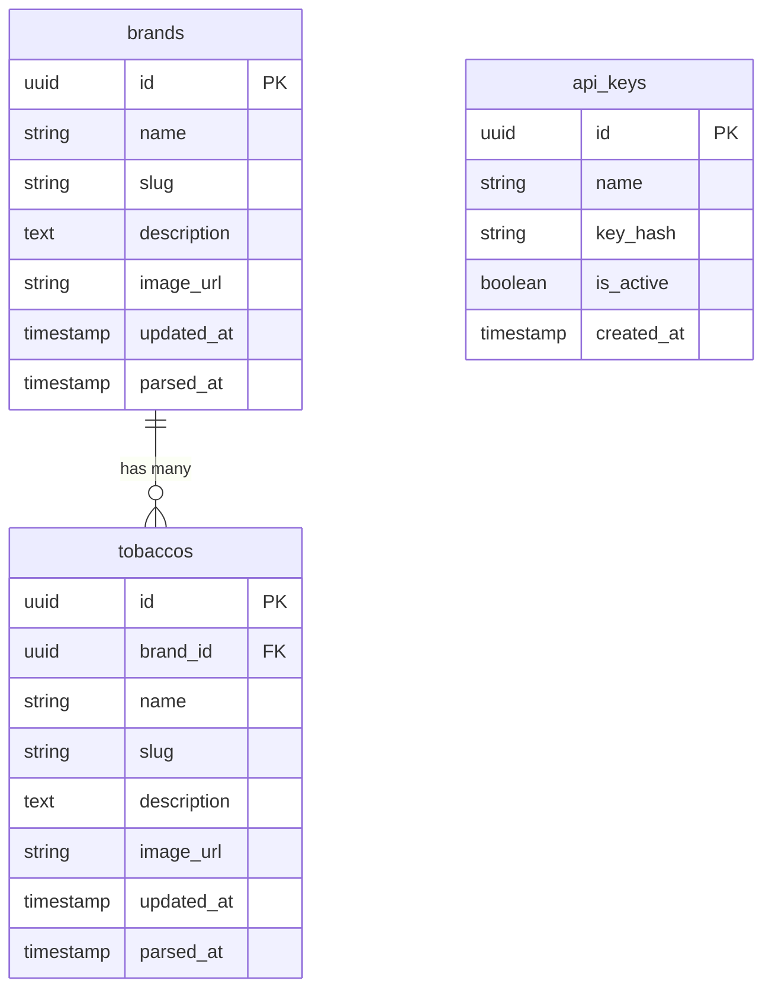

# Database Schema Documentation

## Overview

This document describes the database schema for Hookah Tobacco Database. The schema is designed to store tobacco brands and individual tobacco flavors with basic information.

## Database Technology

- **Production**: PostgreSQL 18+
- **Development**: SQLite (for local testing)
- **ORM**: Drizzle ORM (type-safe SQL)
- **Migration Tool**: Drizzle Kit

---

## Entity Relationship Diagram



---

## Tables

### 1. `brands`

Stores basic information about tobacco brands.

#### Columns

| Column | Type | Description | Example |
|--------|------|-------------|---------|
| `id` | UUID | Primary key | `550e8400-e29b-41d4-a716-446655440000` |
| `name` | VARCHAR(255) | Brand name in Russian | `Сарма` |
| `slug` | VARCHAR(255) | URL-friendly identifier | `sarma` |
| `description` | TEXT | Brand description | `Наши ароматы — это воспоминания...` |
| `image_url` | VARCHAR(500) | URL to brand logo/image | `https://htreviews.org/uploads/...` |
| `updated_at` | TIMESTAMP | Last update timestamp | `2026-01-02 23:00:00` |
| `parsed_at` | TIMESTAMP | Last parse timestamp | `2026-01-02 23:00:00` |

#### Relationships

- **One-to-Many** with `tobaccos`: A brand has multiple tobaccos

#### Indexes

- `brands_name_idx` on `name`
- `brands_slug_idx` on `slug` (UNIQUE)

---

### 2. `tobaccos`

Stores basic information about individual tobacco flavors.

#### Columns

| Column | Type | Description | Example |
|--------|------|-------------|---------|
| `id` | UUID | Primary key | `660e8400-e29b-41d4-a716-446655440001` |
| `brand_id` | UUID | Foreign key to brands | `550e8400-e29b-41d4-a716-446655440000` |
| `name` | VARCHAR(255) | Tobacco name | `Зима` |
| `slug` | VARCHAR(255) | URL-friendly identifier | `zima` |
| `description` | TEXT | Tobacco description | `Бодрящий мороз с сибирским характером.` |
| `image_url` | VARCHAR(500) | URL to tobacco image | `https://htreviews.org/uploads/...` |
| `updated_at` | TIMESTAMP | Last update timestamp | `2026-01-02 23:00:00` |
| `parsed_at` | TIMESTAMP | Last parse timestamp | `2026-01-02 23:00:00` |

#### Relationships

- **Many-to-One** with `brands`: A tobacco belongs to one brand
- **Cascade Delete**: When a brand is deleted, all its tobaccos are also deleted

#### Indexes

- `tobaccos_brand_id_idx` on `brand_id`
- `tobaccos_name_idx` on `name`
- `tobaccos_slug_idx` on `slug` (UNIQUE)

---

### 3. `api_keys`

Stores API keys for client authentication. Keys are manually activated/deactivated by administrators.

#### Columns

| Column | Type | Description | Example |
|--------|------|-------------|---------|
| `id` | UUID | Primary key | `770e8400-e29b-41d4-a716-446655440002` |
| `name` | VARCHAR(255) | Key name/description | `Client App - Production` |
| `key_hash` | TEXT | SHA-256 hash of API key | `a1b2c3d4...` |
| `is_active` | BOOLEAN | Whether key is active | `true` |
| `created_at` | TIMESTAMP | Key creation timestamp | `2026-01-01 00:00:00` |

#### Indexes

- `api_keys_key_hash_idx` on `key_hash` (UNIQUE)
- `api_keys_is_active_idx` on `is_active`

---

## Data Relationships Explained

### Brand → Tobaccos Hierarchy

```
Brand (Сарма)
├── Tobacco (Зима)
├── Tobacco (Кола)
├── Tobacco (Елка)
├── Tobacco (Чабрец Байкальский)
├── Tobacco (Ореховое молочко)
└── ... (94 total)
```

### Why This Simple Design?

1. **Direct Access**: Clients can query tobaccos directly by brand
2. **Minimal Data**: Only essential information stored
3. **Simple API**: Fewer endpoints and simpler queries
4. **Fast Queries**: One JOIN instead of multiple
5. **Easy Maintenance**: No unnecessary fields to track

---

## Data Normalization

### Normalization Level: 3NF (Third Normal Form)

The schema follows 3NF principles:

1. **1NF**: All columns are atomic (no repeating groups)
2. **2NF**: All non-key attributes are fully dependent on the primary key
3. **3NF**: No transitive dependencies (all non-key attributes depend only on the primary key)

### Benefits of This Design

- **Data Integrity**: Foreign key constraints ensure referential integrity
- **Efficient Queries**: Proper indexes on frequently queried columns
- **Flexibility**: Easy to add new attributes without restructuring
- **Scalability**: Can handle ~100 brands with ~10,000 tobaccos efficiently
- **Simplicity**: Minimal data, no unnecessary complexity

---

## Data Types and Constraints

### Common Patterns

1. **UUIDs**: Used for all primary keys (distributed system friendly)
2. **Timestamps**: All tables have `updated_at` and `parsed_at`
3. **Slugs**: URL-friendly identifiers for API endpoints
4. **Text**: Description fields use TEXT for flexibility

### Constraints

- **NOT NULL**: Required fields (id, name, slug, etc.)
- **UNIQUE**: Slugs and key_hash
- **FOREIGN KEY**: All relationships have referential integrity
- **CASCADE DELETE**: tobaccos.brand_id references brands.id with cascade delete

---

## Schema Structure

**Schema Structure**:
- PostgreSQL schemas are in `packages/database/src/schema/` directory
- SQLite schemas are in `packages/database/src/schema/sqlite/` directory
- `brands.ts` - brands table definition with indexes
- `tobaccos.ts` - tobaccos table definition with foreign key and indexes
- `api-keys.ts` - api_keys table definition with indexes
- `index.ts` - exports all schema definitions

---

## Migration Strategy

The project uses Drizzle Kit for database migrations:

- **Development**: SQLite database with file-based storage
- **Production**: PostgreSQL database with network connection
- **Migration Tool**: Drizzle Kit v0.31.8
- **Migration Directory**: `packages/database/migrations/`

**Available Scripts**:
- `db:generate` - Generate migrations from schema changes
- `db:migrate` - Apply migrations to database
- `db:push` - Push schema directly (development only)
- `db:studio` - Open Drizzle Studio for database inspection

### Development

```bash
# Generate migration
pnpm --filter @hookah-db/database db:generate

# Apply migration
pnpm --filter @hookah-db/database db:push
```

### Production

```bash
# Generate migration SQL
pnpm --filter @hookah-db/database db:generate

# Review and apply manually
pnpm --filter @hookah-db/database db:migrate
```

### Rollback Strategy

- Keep migration files numbered sequentially
- Each migration should have a corresponding rollback
- Use transactions for atomic changes

---

## Performance Considerations

### Indexing Strategy

1. **Foreign Keys**: All foreign keys are indexed
2. **Unique Constraints**: Slugs are unique for fast lookups
3. **Query Patterns**: Indexes optimized for common queries
4. **Name Indexes**: Additional indexes on name columns for search functionality

### Query Optimization

- Use JOINs instead of multiple queries
- Implement pagination for large result sets
- Cache frequently accessed data (optional, for future)
- Use connection pooling in production

---

## Security Considerations

1. **API Keys**: Stored as SHA-256 hashes, never plain text
2. **SQL Injection**: Prevented by using parameterized queries (Drizzle ORM)
3. **Access Control**: API key authentication required for all endpoints
4. **Data Privacy**: No personal data stored (public information only)

---

## Future Enhancements

### Possible Future Tables

1. **tobacco_tags**: Store flavor tags (e.g., "Холодок", "Фруктовый")
2. **tobacco_reviews**: Store individual reviews (if needed)
3. **parse_logs**: Track parsing history and errors

### Possible Future Columns

1. **brands**: `website_url`, `social_media_links`
2. **tobaccos**: `flavor_profile`, `mixing_suggestions`

---

## Summary

This database schema provides a solid foundation for storing and querying hookah tobacco data. The design is:

- **Normalized**: Follows 3NF principles
- **Indexed**: Optimized for common query patterns
- **Scalable**: Can handle expected data volume
- **Maintainable**: Clear relationships and constraints
- **Extensible**: Easy to add new features
- **Simple**: Minimal data, only essential information stored
- **Dual-Database**: Supports both SQLite (development) and PostgreSQL (production)

For implementation details, see [`docs/modules/database.md`](docs/modules/database.md).
