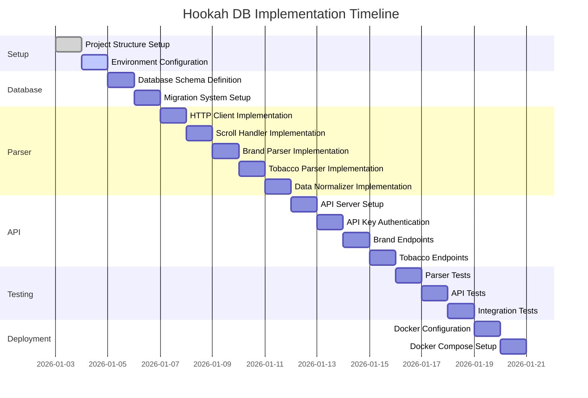

# Implementation Plan

## Overview

This document provides a step-by-step implementation plan for the Hookah Tobacco Database API project. Each step is designed to be simple and straightforward, avoiding complexity.

## Implementation Phases



---

## Phase 1: Project Setup

### Step 1.1: Initialize Monorepo Structure ✅

**Objective**: Set up pnpm workspace with package structure.

**Tasks**:
1. Create root `package.json` with workspace configuration
2. Create `pnpm-workspace.yaml` file
3. Create package directories:
   - `packages/api`
   - `packages/parser`
   - `packages/database`
   - `packages/shared`
4. Initialize each package with its own `package.json`

**Expected Outcome**: Working monorepo with 4 packages.

**Verification**: Run `pnpm install` successfully.

---

### Step 1.2: Configure Environment Variables

**Objective**: Set up centralized environment variable management.

**Tasks**:
1. Create `.env.example` file with all required variables
2. Create `.env` file for local development
3. Create shared config module in `packages/shared/src/config.ts`
4. Add environment variable validation

**Expected Outcome**: Centralized configuration system.

**Verification**: Environment variables load correctly in all packages.

---

## Phase 2: Database Implementation

### Step 2.1: Define Database Schema

**Objective**: Create Drizzle schema definitions.

**Tasks**:
1. Create `packages/database/src/schema.ts` with table definitions:
   - `brands` table
   - `tobaccos` table
   - `api_keys` table
2. Define TypeScript interfaces for each table
3. Add foreign key relationships
4. Add indexes for performance

**Expected Outcome**: Complete database schema with Drizzle.

**Verification**: TypeScript types compile without errors.

---

### Step 2.2: Set Up Migration System

**Objective**: Configure Drizzle Kit for migrations.

**Tasks**:
1. Install Drizzle Kit
2. Configure `drizzle.config.ts`
3. Create initial migration
4. Set up SQLite for development
5. Set up PostgreSQL connection string template

**Expected Outcome**: Working migration system.

**Verification**: Can generate and apply migrations.

---

### Step 2.3: Create Database Client

**Objective**: Build database access layer.

**Tasks**:
1. Create `packages/database/src/client.ts`
2. Export database instance
3. Create query helper functions
4. Add connection pooling configuration

**Expected Outcome**: Database client ready for use.

**Verification**: Can connect to database and run queries.

---

## Phase 3: Parser Implementation

### Step 3.1: Implement HTTP Client

**Objective**: Create HTTP client for fetching HTML.

**Tasks**:
1. Install `got` library
2. Create `packages/parser/src/http/client.ts`
3. Implement retry logic with exponential backoff
4. Add rate limiting
5. Configure timeout handling

**Expected Outcome**: Robust HTTP client for fetching pages.

**Verification**: Can fetch HTML from htreviews.org.

---

### Step 3.2: Implement Scroll Handler

**Objective**: Handle infinite scroll on htreviews.org pages.

**Tasks**:
1. Create `packages/parser/src/scroll/handler.ts`
2. Implement scroll detection logic
3. Add scroll simulation (incremental requests)
4. Aggregate content from multiple scroll loads
5. Add delay between scroll requests

**Expected Outcome**: Can fetch all items from scrollable pages.

**Verification**: Fetches all brands from brands listing page.

---

### Step 3.3: Implement Brand Parser

**Objective**: Parse brand listing and detail pages.

**Tasks**:
1. Create `packages/parser/src/parsers/brands.ts`
2. Implement brand listing parser
3. Implement brand detail parser
4. Extract: name, slug, description, image_url
5. Add data validation

**Expected Outcome**: Can parse brand data from HTML.

**Verification**: Parses example HTML files correctly.

---

### Step 3.4: Implement Tobacco Parser

**Objective**: Parse tobacco listing and detail pages.

**Tasks**:
1. Create `packages/parser/src/parsers/tobaccos.ts`
2. Implement tobacco listing parser
3. Implement tobacco detail parser
4. Extract: name, slug, description, image_url, brand_id
5. Add data validation

**Expected Outcome**: Can parse tobacco data from HTML.

**Verification**: Parses example HTML files correctly.

---

### Step 3.5: Implement Data Normalizer

**Objective**: Normalize parsed data to database format.

**Tasks**:
1. Create `packages/parser/src/normalizer/index.ts`
2. Create normalization functions for brands
3. Create normalization functions for tobaccos
4. Add type guards and validation
5. Handle edge cases and missing data

**Expected Outcome**: Parsed data converted to database format.

**Verification**: Normalized data matches database schema.

---

### Step 3.6: Implement Database Writer

**Objective**: Write normalized data to database.

**Tasks**:
1. Create `packages/parser/src/database/writer.ts`
2. Implement upsert functions for brands
3. Implement upsert functions for tobaccos
4. Add error handling and logging
5. Implement batch insert for efficiency

**Expected Outcome**: Can save parsed data to database.

**Verification**: Data persists in database correctly.

---

### Step 3.7: Implement Parser Service

**Objective**: Create main parser service that orchestrates parsing.

**Tasks**:
1. Create `packages/parser/src/index.ts`
2. Implement full parsing workflow:
   - Fetch all brands
   - For each brand, fetch details
   - For each brand, fetch all tobaccos
   - For each tobacco, fetch details
   - Save all data to database
3. Add progress logging
4. Add error recovery

**Expected Outcome**: Complete parser service ready to run.

**Verification**: Can parse all data from htreviews.org.

---

## Phase 4: API Implementation

### Step 4.1: Set Up Fastify Server

**Objective**: Create basic API server.

**Tasks**:
1. Install Fastify in `packages/api`
2. Create `packages/api/src/server.ts`
3. Configure server with CORS, logging
4. Set up health check endpoint
5. Configure error handling

**Expected Outcome**: Running API server.

**Verification**: Server starts and responds to health check.

---

### Step 4.2: Implement API Key Authentication

**Objective**: Add API key authentication middleware.

**Tasks**:
1. Create `packages/api/src/middleware/auth.ts`
2. Implement API key validation
3. Check against database for active keys
4. Add error responses for invalid keys
5. Add key generation utility

**Expected Outcome**: API protected by API key authentication.

**Verification**: Requests without valid key are rejected.

---

### Step 4.3: Implement Brand Endpoints

**Objective**: Create endpoints for brand data.

**Tasks**:
1. Create `packages/api/src/routes/brands.ts`
2. Implement `GET /api/brands` - list all brands
3. Implement `GET /api/brands/:slug` - get single brand
4. Implement `GET /api/brands/:slug/tobaccos` - get brand's tobaccos
5. Add pagination support
6. Add query parameters (search, sort)

**Expected Outcome**: Brand endpoints working with database.

**Verification**: Can fetch brands and their tobaccos via API.

---

### Step 4.4: Implement Tobacco Endpoints

**Objective**: Create endpoints for tobacco data.

**Tasks**:
1. Create `packages/api/src/routes/tobaccos.ts`
2. Implement `GET /api/tobaccos` - list all tobaccos
3. Implement `GET /api/tobaccos/:slug` - get single tobacco
4. Add pagination support
5. Add query parameters (search, sort, filter by brand)
6. Implement `GET /api/brands/:brandSlug/tobaccos/:tobaccoSlug`

**Expected Outcome**: Tobacco endpoints working with database.

**Verification**: Can fetch tobaccos via API.

---

### Step 4.5: Implement API Key Management

**Objective**: Create endpoints for API key management.

**Tasks**:
1. Create `packages/api/src/routes/keys.ts`
2. Implement `POST /api/keys` - generate new key
3. Implement `GET /api/keys` - list all keys
4. Implement `PATCH /api/keys/:id` - activate/deactivate key
5. Implement `DELETE /api/keys/:id` - delete key
6. Add admin-only protection (optional)

**Expected Outcome**: Can manage API keys via API.

**Verification**: Can generate and manage API keys.

---

## Phase 5: Testing

### Step 5.1: Write Parser Tests

**Objective**: Test parser logic with example HTML files.

**Tasks**:
1. Create `packages/parser/src/__tests__/brands.test.ts`
2. Test brand listing parser with example HTML
3. Test brand detail parser with example HTML
4. Create `packages/parser/src/__tests__/tobaccos.test.ts`
5. Test tobacco parser with example HTML
6. Test scroll handler
7. Test data normalizer

**Expected Outcome**: Parser tests passing.

**Verification**: Run `pnpm test` and all tests pass.

---

### Step 5.2: Write API Tests

**Objective**: Test API endpoints.

**Tasks**:
1. Create `packages/api/src/__tests__/brands.test.ts`
2. Test brand endpoints with valid API key
3. Test brand endpoints without API key (should fail)
4. Create `packages/api/src/__tests__/tobaccos.test.ts`
5. Test tobacco endpoints
6. Test pagination
7. Test query parameters

**Expected Outcome**: API tests passing.

**Verification**: Run `pnpm test` and all tests pass.

---

### Step 5.3: Write Integration Tests

**Objective**: Test full workflows.

**Tasks**:
1. Create `packages/parser/src/__tests__/integration.test.ts`
2. Test full parsing workflow with database
3. Create `packages/api/src/__tests__/integration.test.ts`
4. Test API with real database data
5. Test authentication flow

**Expected Outcome**: Integration tests passing.

**Verification**: Run `pnpm test` and all tests pass.

---

## Phase 6: Docker Setup

### Step 6.1: Create Dockerfile for API

**Objective**: Containerize API service.

**Tasks**:
1. Create `packages/api/Dockerfile`
2. Use Node.js 20 Alpine image
3. Copy package files
4. Install dependencies
5. Expose port 3000
6. Set start command

**Expected Outcome**: Docker image builds successfully.

**Verification**: Can run API in Docker container.

---

### Step 6.2: Create Dockerfile for Parser

**Objective**: Containerize parser service.

**Tasks**:
1. Create `packages/parser/Dockerfile`
2. Use Node.js 20 Alpine image
3. Copy package files
4. Install dependencies
5. Set start command

**Expected Outcome**: Docker image builds successfully.

**Verification**: Can run parser in Docker container.

---

### Step 6.3: Create Docker Compose Files

**Objective**: Set up multi-container deployment.

**Tasks**:
1. Create `docker-compose.yml` for production
2. Create `docker-compose.dev.yml` for development
3. Define services:
   - PostgreSQL database
   - API service
   - Parser service (optional)
4. Configure volumes and networks
5. Set environment variables

**Expected Outcome**: Can run all services with `docker-compose up`.

**Verification**: All services start and communicate correctly.

---

## Phase 7: Documentation

### Step 7.1: Complete API Documentation

**Objective**: Document all API endpoints.

**Tasks**:
1. Create `docs/api.md` with endpoint documentation
2. Include request/response examples
3. Document authentication requirements
4. Document query parameters
5. Document error responses

**Expected Outcome**: Complete API documentation.

**Verification**: Documentation matches implementation.

---

### Step 7.2: Complete Module Documentation

**Objective**: Document each module's implementation.

**Tasks**:
1. Complete `docs/modules/parser.md`
2. Create `docs/modules/api.md`
3. Create `docs/modules/database.md`
4. Document architecture and key functions

**Expected Outcome**: Complete module documentation.

**Verification**: Documentation is accurate and helpful.

---

## Phase 8: Final Polish

### Step 8.1: Add Error Handling

**Objective**: Improve error handling throughout the application.

**Tasks**:
1. Add try-catch blocks in parser
2. Add proper HTTP error responses in API
3. Add logging for errors
4. Add graceful degradation

**Expected Outcome**: Robust error handling.

**Verification**: Application handles errors gracefully.

---

### Step 8.2: Add Logging

**Objective**: Implement comprehensive logging.

**Tasks**:
1. Install and configure pino logger
2. Add logging to parser service
3. Add logging to API service
4. Add request/response logging
5. Configure log levels

**Expected Outcome**: Comprehensive logging in place.

**Verification**: Logs are generated appropriately.

---

### Step 8.3: Performance Optimization

**Objective**: Optimize for expected data volume.

**Tasks**:
1. Add database query optimizations
2. Add pagination to all list endpoints
3. Add response caching (optional)
4. Optimize parser for concurrent requests

**Expected Outcome**: Efficient performance.

**Verification**: API responds quickly under load.

---

## Testing Checklist

Before considering the project complete:

- [ ] All parser tests pass
- [ ] All API tests pass
- [ ] All integration tests pass
- [ ] Can parse all brands from htreviews.org
- [ ] Can parse all tobaccos from htreviews.org
- [ ] API returns correct data for all endpoints
- [ ] API key authentication works correctly
- [ ] Docker containers build and run successfully
- [ ] Documentation is complete and accurate

---

## Deployment Steps

### Production Deployment

1. **Prepare Environment**:
   ```bash
   cp .env.example .env
   # Edit .env with production values
   ```

2. **Build Docker Images**:
   ```bash
   docker-compose build
   ```

3. **Start Services**:
   ```bash
   docker-compose up -d
   ```

4. **Generate API Key**:
   ```bash
   docker-compose exec api pnpm run generate-key
   ```

5. **Verify Deployment**:
   ```bash
   curl -H "X-API-Key: your-key" http://localhost:3000/api/brands
   ```

### Local Development

1. **Start Services**:
   ```bash
   docker-compose -f docker-compose.dev.yml up
   ```

2. **Run Parser**:
   ```bash
   pnpm --filter @hookah-db/parser run parse
   ```

3. **Run Tests**:
   ```bash
   pnpm test
   ```

---

## Maintenance Tasks

### Regular Maintenance

1. **Update Parsed Data**: Run parser periodically to update database
2. **Monitor API Usage**: Check for unusual patterns
3. **Review Logs**: Check for errors or warnings
4. **Update Dependencies**: Keep packages up to date

### When to Update Documentation

Update documentation when:

1. **Architecture Changes**: New components or data flow changes
2. **API Changes**: New endpoints or modified responses
3. **Database Changes**: Schema modifications or new tables
4. **Configuration Changes**: New environment variables
5. **Bug Fixes**: Documentation errors or unclear sections

---

## Success Criteria

The project is considered complete when:

1. **Functional**: All features work as specified
2. **Tested**: Core functionality has test coverage
3. **Documented**: All components are documented
4. **Deployable**: Can run with Docker Compose
5. **Maintainable**: Code is clean and well-organized

---

## Next Steps After Implementation

1. **Monitor**: Set up monitoring for production
2. **Backup**: Implement database backups (if needed)
3. **Scale**: Consider scaling if needed
4. **Enhance**: Add features based on user feedback

---

## Summary

This implementation plan provides a clear, step-by-step approach to building the Hookah Tobacco Database API. Each phase builds on the previous one, ensuring a solid foundation before moving forward.

The plan is designed to be:
- **Simple**: Each step is straightforward
- **Sequential**: Clear order of implementation
- **Testable**: Each phase can be tested independently
- **Documented**: All steps are well-documented
- **Flexible**: Can adapt to changes as needed

For detailed module documentation, see [`docs/modules/`](docs/modules/).
