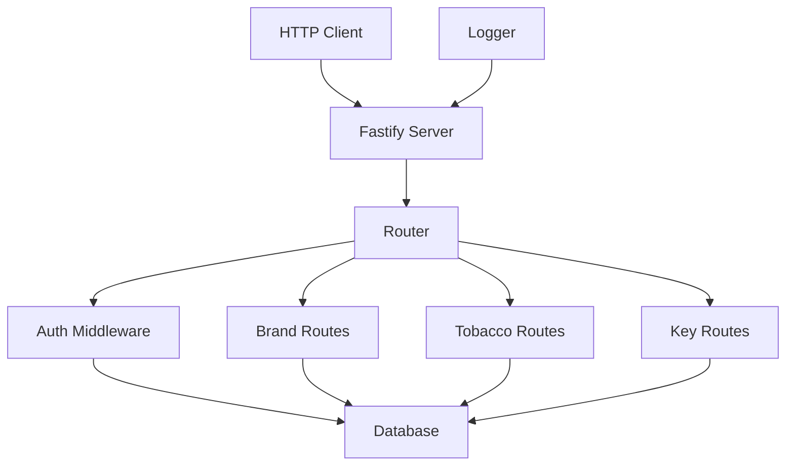

# API Module Documentation

## Overview

The API module (`packages/api`) provides a RESTful API server for accessing tobacco data. It handles HTTP requests, authentication, and returns JSON responses.

## Architecture



## Components

### 1. Server Setup (`src/server.ts`)

Configures and starts the Fastify server.

**Configuration**:
```typescript
import Fastify from 'fastify';
import { apiConfig } from '@hookah-db/shared/config';

const server = Fastify({
  logger: {
    level: process.env.LOG_LEVEL || 'info',
    transport: {
      target: 'pino-pretty'
    }
  },
  trustProxy: true,
});

// Register CORS
server.register(cors, {
  origin: true,
  credentials: true,
});

// Register JSON schema validation
server.register(fastifyJsonSchemaValidator);
```

**Health Check Endpoint**:
```typescript
server.get('/health', async (request, reply) => {
  return { status: 'ok', timestamp: new Date().toISOString() };
});
```

---

### 2. Authentication Middleware (`src/middleware/auth.ts`)

Validates API keys and protects routes.

**Authentication Logic**:
```typescript
import { db } from '@hookah-db/database/client';
import { apiKeys } from '@hookah-db/database/schema';

export async function authMiddleware(request: FastifyRequest, reply: FastifyReply) {
  const apiKey = request.headers['x-api-key'] as string;
  
  if (!apiKey) {
    return reply.status(401).send({
      error: 'Unauthorized',
      message: 'Missing API key'
    });
  }
  
  // Check if API key exists and is active
  const keyRecord = await db.select()
    .from(apiKeys)
    .where(eq(apiKeys.keyHash, hashApiKey(apiKey)))
    .limit(1);
  
  if (!keyRecord.length || !keyRecord[0].isActive) {
    return reply.status(403).send({
      error: 'Forbidden',
      message: 'API key is inactive'
    });
  }
  
  // Attach API key info to request
  request.apiKeyId = keyRecord[0].id;
}
```

**API Key Hashing**:
```typescript
import { createHash } from 'crypto';

function hashApiKey(apiKey: string): string {
  return createHash('sha256').update(apiKey).digest('hex');
}
```

**Rate Limiting**:
```typescript
import { rateLimit } from '@fastify/rate-limit';

server.register(rateLimit, {
  max: parseInt(process.env.RATE_LIMIT_MAX_REQUESTS || '100'),
  timeWindow: parseInt(process.env.RATE_LIMIT_WINDOW_MS || '60000'),
  keyGenerator: (request) => request.apiKeyId,
  addHeaders: {
    'x-ratelimit-limit': true,
    'x-ratelimit-remaining': true,
    'x-ratelimit-reset': true,
  },
});
```

---

### 3. Brand Routes (`src/routes/brands.ts`)

Handles brand-related API endpoints.

**List Brands**:
```typescript
import { db } from '@hookah-db/database/client';
import { brands } from '@hookah-db/database/schema';
import { eq, desc, sql } from 'drizzle-orm';

export async function listBrandsRoute(
  request: FastifyRequest<{
    Querystring: {
      page?: string;
      limit?: string;
      search?: string;
      sort?: string;
      order?: string;
    }
  }>,
  reply: FastifyReply
) {
  const page = parseInt(request.query.page || '1');
  const limit = Math.min(parseInt(request.query.limit || '20'), 100);
  const offset = (page - 1) * limit;
  
  // Build query
  let query = db.select().from(brands);
  
  // Add search filter
  if (request.query.search) {
    query = query.where(
      sql`LOWER(${brands.name}) LIKE ${`%${request.query.search.toLowerCase()}%`}`
    );
  }
  
  // Add sorting
  const sortColumn = request.query.sort === 'name' ? brands.name : brands.parsedAt;
  const sortOrder = request.query.order === 'asc' ? undefined : desc(sortColumn);
  
  query = query.orderBy(sortOrder);
  
  // Get total count
  const [{ count }] = await db
    .select({ count: sql<number>`count(*)` })
    .from(brands);
  
  // Get paginated results
  const results = await query.limit(limit).offset(offset);
  
  return {
    data: results,
    pagination: {
      page,
      limit,
      total: count,
      totalPages: Math.ceil(count / limit)
    }
  };
}
```

**Get Single Brand**:
```typescript
export async function getBrandRoute(
  request: FastifyRequest<{
    Params: {
      slug: string;
    }
  }>,
  reply: FastifyReply
) {
  const { slug } = request.params;
  
  const [brand] = await db.select()
    .from(brands)
    .where(eq(brands.slug, slug))
    .limit(1);
  
  if (!brand) {
    return reply.status(404).send({
      error: 'Not Found',
      message: `Brand with slug '${slug}' not found`
    });
  }
  
  return { data: brand };
}
```

**Get Brand's Tobaccos**:
```typescript
import { tobaccos } from '@hookah-db/database/schema';

export async function getBrandTobaccosRoute(
  request: FastifyRequest<{
    Params: {
      slug: string;
    }
    Querystring: {
      page?: string;
      limit?: string;
      search?: string;
    }
  }>,
  reply: FastifyReply
) {
  const { slug } = request.params;
  const page = parseInt(request.query.page || '1');
  const limit = Math.min(parseInt(request.query.limit || '20'), 100);
  const offset = (page - 1) * limit;
  
  // First, get the brand
  const [brand] = await db.select()
    .from(brands)
    .where(eq(brands.slug, slug))
    .limit(1);
  
  if (!brand) {
    return reply.status(404).send({
      error: 'Not Found',
      message: `Brand with slug '${slug}' not found`
    });
  }
  
  // Build query for tobaccos
  let query = db.select().from(tobaccos)
    .where(eq(tobaccos.brandId, brand.id));
  
  // Add search filter
  if (request.query.search) {
    query = query.where(
      sql`LOWER(${tobaccos.name}) LIKE ${`%${request.query.search.toLowerCase()}%`}`
    );
  }
  
  // Get total count
  const [{ count }] = await db
    .select({ count: sql<number>`count(*)` })
    .from(tobaccos)
    .where(eq(tobaccos.brandId, brand.id));
  
  // Get paginated results
  const results = await query
    .orderBy(desc(tobaccos.parsedAt))
    .limit(limit)
    .offset(offset);
  
  return {
    data: results,
    pagination: {
      page,
      limit,
      total: count,
      totalPages: Math.ceil(count / limit)
    }
  };
}
```

---

### 4. Tobacco Routes (`src/routes/tobaccos.ts`)

Handles tobacco-related API endpoints.

**List All Tobaccos**:
```typescript
export async function listTobaccosRoute(
  request: FastifyRequest<{
    Querystring: {
      page?: string;
      limit?: string;
      search?: string;
      brand_slug?: string;
      sort?: string;
      order?: string;
    }
  }>,
  reply: FastifyReply
) {
  const page = parseInt(request.query.page || '1');
  const limit = Math.min(parseInt(request.query.limit || '20'), 100);
  const offset = (page - 1) * limit;
  
  // Build query
  let query = db.select().from(tobaccos);
  
  // Add brand filter
  if (request.query.brand_slug) {
    const brand = await db.select()
      .from(brands)
      .where(eq(brands.slug, request.query.brand_slug))
      .limit(1);
    
    if (!brand) {
      return reply.status(404).send({
        error: 'Not Found',
        message: `Brand with slug '${request.query.brand_slug}' not found`
      });
    }
    
    query = query.where(eq(tobaccos.brandId, brand[0].id));
  }
  
  // Add search filter
  if (request.query.search) {
    query = query.where(
      sql`LOWER(${tobaccos.name}) LIKE ${`%${request.query.search.toLowerCase()}%`}`
    );
  }
  
  // Add sorting
  const sortColumn = request.query.sort === 'name' ? tobaccos.name : tobaccos.parsedAt;
  const sortOrder = request.query.order === 'asc' ? undefined : desc(sortColumn);
  
  query = query.orderBy(sortOrder);
  
  // Get total count
  const [{ count }] = await db
    .select({ count: sql<number>`count(*)` })
    .from(tobaccos);
  
  // Get paginated results
  const results = await query.limit(limit).offset(offset);
  
  return {
    data: results,
    pagination: {
      page,
      limit,
      total: count,
      totalPages: Math.ceil(count / limit)
    }
  };
}
```

**Get Single Tobacco**:
```typescript
export async function getTobaccoRoute(
  request: FastifyRequest<{
    Params: {
      slug: string;
    }
  }>,
  reply: FastifyReply
) {
  const { slug } = request.params;
  
  const [tobacco] = await db.select()
    .from(tobaccos)
    .where(eq(tobaccos.slug, slug))
    .limit(1);
  
  if (!tobacco) {
    return reply.status(404).send({
      error: 'Not Found',
      message: `Tobacco with slug '${slug}' not found`
    });
  }
  
  return { data: tobacco };
}
```

---

### 5. Key Management Routes (`src/routes/keys.ts`)

Handles API key management endpoints.

**Generate API Key**:
```typescript
import { randomBytes } from 'crypto';

export async function generateKeyRoute(
  request: FastifyRequest<{
    Body: {
      name: string;
    }
  }>,
  reply: FastifyReply
) {
  const { name } = request.body;
  
  // Generate random API key
  const apiKey = `hk_live_${randomBytes(16).toString('hex')}`;
  const keyHash = hashApiKey(apiKey);
  
  // Save to database
  const [newKey] = await db.insert(apiKeys)
    .values({
      name,
      keyHash,
      isActive: true,
      createdAt: new Date(),
    })
    .returning();
  
  return reply.status(201).send({
    data: {
      id: newKey.id,
      name: newKey.name,
      key: apiKey,
      isActive: newKey.isActive,
      createdAt: newKey.createdAt
    }
  });
}
```

**List API Keys**:
```typescript
export async function listKeysRoute(
  request: FastifyRequest,
  reply: FastifyReply
) {
  const keys = await db.select().from(apiKeys);
  
  return {
    data: keys
  };
}
```

**Toggle API Key**:
```typescript
export async function toggleKeyRoute(
  request: FastifyRequest<{
    Params: {
      id: string;
    }
    Body: {
      is_active: boolean;
    }
  }>,
  reply: FastifyReply
) {
  const { id } = request.params;
  const { is_active } = request.body;
  
  // Update API key
  await db.update(apiKeys)
    .set({ isActive: is_active })
    .where(eq(apiKeys.id, id));
  
  const [updatedKey] = await db.select()
    .from(apiKeys)
    .where(eq(apiKeys.id, id))
    .limit(1);
  
  return {
    data: updatedKey
  };
}
```

**Delete API Key**:
```typescript
export async function deleteKeyRoute(
  request: FastifyRequest<{
    Params: {
      id: string;
    }
  }>,
  reply: FastifyReply
) {
  const { id } = request.params;
  
  // Delete API key
  await db.delete(apiKeys)
    .where(eq(apiKeys.id, id));
  
  return reply.status(204).send();
}
```

---

## Error Handling

### Error Response Format

All errors follow consistent format:

```typescript
interface ErrorResponse {
  error: string;
  message: string;
  details?: any;
}
```

**Error Handler**:
```typescript
server.setErrorHandler((error, request, reply) => {
  server.log.error(error);
  
  // Handle known errors
  if (error.statusCode) {
    return reply.status(error.statusCode).send({
      error: error.name,
      message: error.message
    });
  }
  
  // Handle unknown errors
  return reply.status(500).send({
    error: 'Internal Server Error',
    message: 'An unexpected error occurred'
  });
});
```

---

## Validation

### Request Validation

Use JSON Schema for request validation:

```typescript
import { JSONSchemaType } from '@fastify/schema-validator';

const generateKeySchema: JSONSchemaType<{
  name: string;
}> = {
  type: 'object',
  required: ['name'],
  properties: {
    name: { type: 'string', minLength: 1, maxLength: 255 }
  }
};

const toggleKeySchema: JSONSchemaType<{
  is_active: boolean;
}> = {
  type: 'object',
  required: ['is_active'],
  properties: {
    is_active: { type: 'boolean' }
  }
};
```

---

## Configuration

### Environment Variables

```env
API_PORT=3000
API_HOST=0.0.0.0
LOG_LEVEL=info
RATE_LIMIT_WINDOW_MS=60000
RATE_LIMIT_MAX_REQUESTS=100
```

### Config File

```typescript
// packages/api/src/config.ts
export const apiConfig = {
  port: parseInt(process.env.API_PORT || '3000'),
  host: process.env.API_HOST || '0.0.0.0',
  logLevel: process.env.LOG_LEVEL || 'info',
  rateLimit: {
    window: parseInt(process.env.RATE_LIMIT_WINDOW_MS || '60000'),
    max: parseInt(process.env.RATE_LIMIT_MAX_REQUESTS || '100'),
  },
};
```

---

## Testing

### Unit Tests

Test individual route handlers:

```typescript
import { build } from '@hookah-db/api/server';
import { describe, it, expect, beforeAll, afterAll } from 'vitest';

describe('Brand Routes', () => {
  let app;
  
  beforeAll(async () => {
    app = await build();
  });
  
  afterAll(async () => {
    await app.close();
  });
  
  it('should list brands', async () => {
    const response = await app.inject({
      method: 'GET',
      url: '/api/brands',
      headers: {
        'x-api-key': 'test-key'
      }
    });
    
    expect(response.statusCode).toBe(200);
    expect(response.json()).toHaveProperty('data');
    expect(Array.isArray(response.json().data)).toBe(true);
  });
  
  it('should get single brand', async () => {
    const response = await app.inject({
      method: 'GET',
      url: '/api/brands/sarma',
      headers: {
        'x-api-key': 'test-key'
      }
    });
    
    expect(response.statusCode).toBe(200);
    expect(response.json().data.name).toBe('Сарма');
  });
});
```

### Integration Tests

Test API with real database:

```typescript
describe('API Integration Tests', () => {
  it('should handle pagination correctly', async () => {
    const response1 = await app.inject({
      method: 'GET',
      url: '/api/brands?page=1&limit=10',
      headers: {
        'x-api-key': 'test-key'
      }
    });
    
    const response2 = await app.inject({
      method: 'GET',
      url: '/api/brands?page=2&limit=10',
      headers: {
        'x-api-key': 'test-key'
      }
    });
    
    expect(response1.json().data).not.toEqual(response2.json().data);
  });
});
```

---

## Performance Considerations

### Query Optimization

1. **Use Indexes**: All WHERE clauses use indexed columns
2. **Limit Results**: Always use LIMIT to prevent large result sets
3. **Select Only Needed Columns**: Don't use SELECT *
4. **Use Connection Pooling**: Reuse database connections

### Response Optimization

1. **Compress Responses**: Enable gzip compression
2. **Cache Static Data**: Consider caching frequently accessed data
3. **Use Pagination**: Always paginate list endpoints

---

## Security Considerations

1. **API Key Hashing**: Store SHA-256 hashes, never plain text
2. **SQL Injection**: Use parameterized queries (Drizzle ORM)
3. **CORS**: Configure appropriately for production
4. **Rate Limiting**: Prevent abuse and protect resources
5. **Input Validation**: Validate all input data

---

## Monitoring

### Metrics to Track

1. **Request Count**: Total requests per endpoint
2. **Response Time**: Average response time
3. **Error Rate**: Percentage of failed requests
4. **API Key Usage**: Most active API keys

### Logging

```typescript
server.log.info({
  method: request.method,
  url: request.url,
  statusCode: reply.statusCode,
  responseTime: reply.getResponseTime(),
  apiKeyId: request.apiKeyId,
});
```

---

## Summary

The API module provides:

- **RESTful Design**: Standard HTTP methods and status codes
- **Authentication**: API key-based access control
- **Pagination**: Efficient data retrieval
- **Validation**: Request validation and error handling
- **Performance**: Optimized queries and responses
- **Security**: Proper authentication and input validation

For main documentation, see [`../README.md`](../README.md).
For database schema, see [`../database.md`](../database.md).
