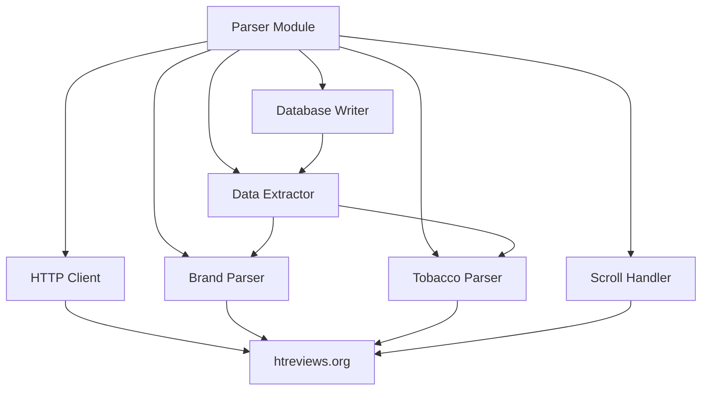

# Parser Module Documentation

## Overview

The parser module (`packages/parser`) is responsible for fetching and parsing tobacco data from htreviews.org. It handles HTML parsing, infinite scroll, data extraction, and database storage.

## Architecture



## Components

### 1. HTTP Client

The HTTP client module provides a robust interface for fetching HTML content from htreviews.org with built-in resilience features.

**Implementation**: [`packages/parser/src/http/client.ts`](packages/parser/src/http/client.ts:1)

**Key Components**:

- **[`HttpClient`](packages/parser/src/http/client.ts:118)**: Main HTTP client class wrapping `got` library
- **[`RateLimiter`](packages/parser/src/http/client.ts:85)**: Sliding window rate limiter for request throttling
- **[`calculateRetryDelay()`](packages/parser/src/http/client.ts:251)**: Exponential backoff calculation for retries

**Features**:

1. **Retry Logic with Exponential Backoff**
   - Automatic retry mechanism for failed requests
   - Exponential backoff: 1s, 2s, 4s, 8s, etc. (capped at 30s max)
   - Configurable maximum retry attempts (default: 3, from `PARSER_MAX_RETRIES`)
   - Handles retryable HTTP status codes: 429, 500, 502, 503, 504
   - Handles network errors: ETIMEDOUT, ECONNRESET, EADDRINUSE, ECONNREFUSED, EPIPE, ENOTFOUND, ENETUNREACH, EAI_AGAIN

2. **Rate Limiting**
   - Sliding window algorithm for request throttling
   - Configurable delay between requests (default: 1000ms, from `PARSER_SCROLL_DELAY_MS`)
   - Respects HTTP 429 (Too Many Requests) responses
   - Automatic delay calculation before each request

3. **Timeout Handling**
   - Connection timeout: 10 seconds
   - Request timeout: 30 seconds (from `PARSER_TIMEOUT_MS`)
   - Response timeout: 30 seconds (from `PARSER_TIMEOUT_MS`)
   - Graceful timeout error handling with proper error classification

4. **Error Handling**
   - Custom [`HttpClientError`](packages/parser/src/http/client.ts:20) class with error type classification
   - Distinguishes between network, HTTP, timeout, parse, and rate limit errors
   - Comprehensive error logging based on log level configuration

**Usage Example**:

```typescript
import { httpClient } from '@hookah-db/parser';

// Fetch a page
const response = await httpClient.get('/tobaccos/brands');
const html = response.body;

// Fetch with custom options
const response = await httpClient.get('/tobaccos/sarma', {
  searchParams: { page: 1 }
});
```

**Configuration**:

All configuration is read from environment variables via shared config module:

- `PARSER_BASE_URL` - htreviews.org URL (default: https://htreviews.org)
- `PARSER_CONCURRENT_REQUESTS` - Concurrent requests limit (default: 3)
- `PARSER_SCROLL_DELAY_MS` - Delay between requests (default: 1000ms)
- `PARSER_MAX_RETRIES` - Retry attempts (default: 3)
- `PARSER_TIMEOUT_MS` - Request timeout (default: 30000ms)
- `LOG_LEVEL` - Controls logging verbosity (error, warn, info, debug)

---

### 2. Brand Parser

The brand parser module provides specialized parsing functionality for extracting brand data from htreviews.org. It handles both brand listing pages and individual brand detail pages with comprehensive validation.

**Implementation**: [`packages/parser/src/parsers/brands.ts`](packages/parser/src/parsers/brands.ts:1)

**Key Components**:

- **[`parseBrandListing()`](packages/parser/src/parsers/brands.ts:258)**: Parse brand listing page HTML
- **[`parseBrandDetail()`](packages/parser/src/parsers/brands.ts:340)**: Parse brand detail page HTML
- **[`parseMultipleBrandListings()`](packages/parser/src/parsers/brands.ts:404)**: Parse multiple brand listing pages (for scroll handler integration)
- **[`validateBrand()`](packages/parser/src/parsers/brands.ts:120)**: Validate brand data structure

**TypeScript Interfaces**:

```typescript
/**
 * Brand data extracted from htreviews.org
 */
export interface Brand {
  name: string;           // Brand name (e.g., "Догма", "Bonche")
  slug: string;           // URL-friendly identifier (e.g., "dogma", "bonche")
  description: string;    // Brand description text
  image_url: string;      // URL to brand image
}

/**
 * Parsed brand listing result
 */
export interface BrandListingResult {
  brands: Brand[];        // Array of parsed brands
  totalCount: number;     // Total number of brands found
  parsedCount: number;    // Number of brands successfully parsed
  skippedCount: number;   // Number of brands that failed validation
}

/**
 * Options for brand listing parser
 */
export interface BrandListingParserOptions {
  skipValidation?: boolean;        // Skip validation for testing purposes
  includeIncomplete?: boolean;    // Include brands with missing optional fields
}

/**
 * Validation result
 */
export interface ValidationResult {
  isValid: boolean;        // Whether brand data is valid
  errors: ValidationError[]; // Array of validation errors
}
```

**Features**:

1. **Brand Listing Parser**
   - Extracts brand data from `.tobacco_list_item` elements
   - Parses brand name, slug, description, and image URL
   - Handles lazy-loaded images via `data-src` attribute
   - Supports both relative and absolute URL paths
   - Provides detailed parsing statistics

2. **Brand Detail Parser**
   - Parses individual brand detail pages
   - Uses same parsing structure as listing pages
   - Returns validated brand data or null on failure
   - Designed for future enhancement with detail-specific patterns

3. **Multi-page Listing Parser**
   - Designed for integration with scroll handler
   - Processes multiple HTML chunks from paginated listings
   - Aggregates results across all pages
   - Maintains parsing statistics across all chunks

4. **Comprehensive Validation**
   - Validates all required fields: name, slug, description, image_url
   - Checks for non-empty strings with proper trimming
   - Validates slug format (lowercase letters, numbers, hyphens only)
   - Validates URL format for image_url (HTTP/HTTPS only)
   - Provides detailed error messages for each validation failure
   - Configurable validation skipping for testing

5. **Logging Integration**
   - Uses shared logging configuration
   - Provides debug, info, and warn level logging
   - Logs parsing progress and statistics
   - Logs validation failures with detailed error messages

**Usage Examples**:

```typescript
import { parseBrandListing, parseBrandDetail, parseMultipleBrandListings } from '@hookah-db/parser';

// Parse a brand listing page
const html = await fetchPage('/tobaccos/brands');
const result = parseBrandListing(html);

console.log(`Parsed ${result.parsedCount} brands, skipped ${result.skippedCount}`);
result.brands.forEach(brand => {
  console.log(`- ${brand.name} (${brand.slug})`);
});

// Parse a brand detail page
const brandHtml = await fetchPage('/tobaccos/dogma');
const brand = parseBrandDetail(brandHtml);

if (brand) {
  console.log(`Brand: ${brand.name}`);
  console.log(`Description: ${brand.description}`);
  console.log(`Image: ${brand.image_url}`);
}

// Parse multiple pages (for scroll handler integration)
const htmlChunks = await fetchMultiplePages('/tobaccos/brands');
const multiResult = parseMultipleBrandListings(htmlChunks);
console.log(`Total brands across all pages: ${multiResult.parsedCount}`);

// Parse with options (skip validation for testing)
const testResult = parseBrandListing(html, {
  skipValidation: true,
  includeIncomplete: true
});
```

**Data Extraction Details**:

The brand parser extracts the following data from HTML:

- **Name**: Extracted from `.tobacco_list_item_name a.tobacco_list_item_slug span`
- **Slug**: Extracted from href attribute of `.tobacco_list_item_name a.tobacco_list_item_slug`, parsed from URL path
- **Description**: Extracted from `.description_content span`
- **Image URL**: Extracted from `data-src` attribute (lazy loading) or `src` attribute of `.tobacco_list_item_image img`

**Validation Rules**:

1. **Name**: Required, non-empty string after trimming
2. **Slug**: Required, non-empty string, must match pattern `^[a-z0-9-]+$`
3. **Description**: Required, non-empty string after trimming
4. **Image URL**: Required, valid HTTP/HTTPS URL

**Integration with Scroll Handler**:

The [`parseMultipleBrandListings()`](packages/parser/src/parsers/brands.ts:404) function is designed to work seamlessly with the scroll handler:

```typescript
// Scroll handler fetches multiple pages
const htmlChunks: string[] = [];
while (hasMore) {
  const html = await fetchPage(`/tobaccos/brands?offset=${offset}`);
  htmlChunks.push(html);
  offset += pageSize;
  // Check if more pages available...
}

// Parse all chunks at once
const result = parseMultipleBrandListings(htmlChunks);
```

**Testing**:

The brand parser has been tested with example HTML file:

- **Test File**: [`examples/htreviews.org_tobaccos_brands.html`](examples/htreviews.org_tobaccos_brands.html:1)
- Successfully parses brand listing structure
- Validates extracted data against all validation rules
- Handles lazy-loaded images correctly
- Provides accurate parsing statistics

---

### 3. Tobacco Parser ✅

The tobacco parser module provides specialized parsing functionality for extracting tobacco data from htreviews.org. It handles both tobacco listing pages and individual tobacco detail pages with comprehensive validation.

**Implementation**: [`packages/parser/src/parsers/tobaccos.ts`](packages/parser/src/parsers/tobaccos.ts:1)

**Key Components**:

- **[`parseTobaccoListing()`](packages/parser/src/parsers/tobaccos.ts:258)**: Parse tobacco listing page HTML
- **[`parseTobaccoDetail()`](packages/parser/src/parsers/tobaccos.ts:340)**: Parse tobacco detail page HTML
- **[`parseMultipleTobaccoListings()`](packages/parser/src/parsers/tobaccos.ts:404)**: Parse multiple tobacco listing pages (for scroll handler integration)
- **[`validateTobacco()`](packages/parser/src/parsers/tobaccos.ts:120)**: Validate tobacco data structure

**TypeScript Interfaces**:

```typescript
/**
 * Tobacco data extracted from htreviews.org
 */
export interface Tobacco {
  name: string;                    // Tobacco name (e.g., "Зима", "Кола")
  slug: string;                    // URL-friendly identifier (e.g., "zima", "kola")
  description: string;             // Tobacco description text
  image_url: string;               // URL to tobacco image
  brand_slug: string;              // Brand slug (e.g., "sarma", "dogma")
  alternative_name?: string;        // Alternative name (e.g., "Двойное яблоко")
  line_name?: string;              // Line name (e.g., "Классическая", "Легкая Сарма 360")
  country?: string;                 // Country of origin
  strength?: string;               // Strength level (e.g., "Средняя", "Лёгкая")
  status?: string;                 // Status (e.g., "Выпускается", "Лимитированный")
}

/**
 * Parsed tobacco listing result
 */
export interface TobaccoListingResult {
  tobaccos: Tobacco[];           // Array of parsed tobaccos
  totalCount: number;             // Total number of tobaccos found
  parsedCount: number;            // Number of tobaccos successfully parsed
  skippedCount: number;           // Number of tobaccos that failed validation
}

/**
 * Options for tobacco listing parser
 */
export interface TobaccoListingParserOptions {
  skipValidation?: boolean;        // Skip validation for testing purposes
  includeIncomplete?: boolean;    // Include tobaccos with missing optional fields
  brandSlug?: string;             // Brand slug to associate with tobaccos (optional)
}
```

**Features**:

1. **Tobacco Listing Parser**
   - Extracts tobacco data from `.tobacco_list_item` elements
   - Parses tobacco name, slug, description, image URL, and brand slug
   - Handles lazy-loaded images via `data-src` attribute
   - Supports both relative and absolute URL paths
   - Extracts optional fields: alternative name, line name, status
   - Provides detailed parsing statistics

2. **Tobacco Detail Parser**
   - Parses individual tobacco detail pages
   - Uses `.object_wrapper` structure for detail pages
   - Extracts comprehensive tobacco information including:
     - Basic data: name, slug, description, image URL
     - Brand information: brand slug from brand link
     - Optional data: line name, country, strength, status
   - Extracts slug from Schema.org JSON-LD structured data
   - Falls back to listing structure if detail structure not found
   - Returns validated tobacco data or null on failure

3. **Multi-page Listing Parser**
   - Designed for integration with scroll handler
   - Processes multiple HTML chunks from paginated listings
   - Aggregates results across all pages
   - Maintains parsing statistics across all chunks

4. **Comprehensive Validation**
   - Validates all required fields: name, slug, description, image_url, brand_slug
   - Checks for non-empty strings with proper trimming
   - Validates slug format (lowercase letters, numbers, hyphens only)
   - Validates URL format for image_url (HTTP/HTTPS only)
   - Provides detailed error messages for each validation failure
   - Configurable validation skipping for testing

5. **Logging Integration**
   - Uses shared logging configuration
   - Provides debug, info, and warn level logging
   - Logs parsing progress and statistics
   - Logs validation failures with detailed error messages

**Usage Examples**:

```typescript
import { 
  parseTobaccoListing, 
  parseTobaccoDetail, 
  parseMultipleTobaccoListings 
} from '@hookah-db/parser';

// Parse a tobacco listing page
const html = await fetchPage('/tobaccos/sarma');
const result = parseTobaccoListing(html);

console.log(`Parsed ${result.parsedCount} tobaccos, skipped ${result.skippedCount}`);
result.tobaccos.forEach(tobacco => {
  console.log(`- ${tobacco.name} (${tobacco.slug})`);
  console.log(`  Brand: ${tobacco.brand_slug}`);
  if (tobacco.line_name) {
    console.log(`  Line: ${tobacco.line_name}`);
  }
});

// Parse a tobacco detail page
const tobaccoHtml = await fetchPage('/tobaccos/sarma/klassicheskaya/zima');
const tobacco = parseTobaccoDetail(tobaccoHtml);

if (tobacco) {
  console.log(`Tobacco: ${tobacco.name}`);
  console.log(`Description: ${tobacco.description}`);
  console.log(`Image: ${tobacco.image_url}`);
  console.log(`Brand: ${tobacco.brand_slug}`);
  if (tobacco.line_name) {
    console.log(`Line: ${tobacco.line_name}`);
  }
  if (tobacco.strength) {
    console.log(`Strength: ${tobacco.strength}`);
  }
}

// Parse multiple pages (for scroll handler integration)
const htmlChunks = await fetchMultiplePages('/tobaccos/sarma');
const multiResult = parseMultipleTobaccoListings(htmlChunks);
console.log(`Total tobaccos across all pages: ${multiResult.parsedCount}`);

// Parse with options (skip validation for testing)
const testResult = parseTobaccoListing(html, {
  skipValidation: true,
  includeIncomplete: true,
  brandSlug: 'sarma'
});
```

**Data Extraction Details**:

The tobacco parser extracts the following data from HTML:

**From Listing Pages**:
- **Name**: Extracted from `.tobacco_list_item_name a.tobacco_list_item_slug span` (first span)
- **Alternative Name**: Extracted from second span in same element (optional)
- **Slug**: Extracted from href attribute of `.tobacco_list_item_name a.tobacco_list_item_slug`, parsed from URL path
- **Brand Slug**: Extracted from `.tobacco_list_item_brand_slug a` href attribute
- **Line Name**: Extracted from `.tobacco_list_item_line_slug a span` (optional)
- **Description**: Extracted from Schema.org JSON-LD `description` field, or from `.last_reviews_item_content span`
- **Image URL**: Extracted from `data-src` attribute (lazy loading) or `src` attribute of `.tobacco_list_item_image img`
- **Status**: Extracted from `.tobacco_list_item_status span` (optional)

**From Detail Pages**:
- **Name**: Extracted from `.object_card_title h1`
- **Description**: Extracted from `.object_card_discr span`
- **Image URL**: Extracted from `.object_image img src` attribute
- **Brand Slug**: Extracted from `.object_info_item a` href attribute
- **Line Name**: Extracted from second `.object_info_item a` element (optional)
- **Country**: Extracted from `.object_info_item` where label is "Страна" (optional)
- **Strength**: Extracted from `.object_info_item` where label contains "Крепость" (optional)
- **Status**: Extracted from `.object_info_item` where label is "Статус" (optional)
- **Slug**: Extracted from Schema.org JSON-LD `url` field or breadcrumb list

**Validation Rules**:

1. **Name**: Required, non-empty string after trimming
2. **Slug**: Required, non-empty string, must match pattern `^[a-z0-9-]+$`
3. **Description**: Required, non-empty string after trimming
4. **Image URL**: Required, valid HTTP/HTTPS URL
5. **Brand Slug**: Required, non-empty string after trimming

**Integration with Scroll Handler**:

The [`parseMultipleTobaccoListings()`](packages/parser/src/parsers/tobaccos.ts:404) function is designed to work seamlessly with the scroll handler:

```typescript
// Scroll handler fetches multiple pages
const htmlChunks: string[] = [];
while (hasMore) {
  const html = await fetchPage(`/tobaccos/sarma?offset=${offset}`);
  htmlChunks.push(html);
  offset += pageSize;
  // Check if more pages available...
}

// Parse all chunks at once
const result = parseMultipleTobaccoListings(htmlChunks);
```

**Testing**:

The tobacco parser has been tested with example HTML files:

- **Test File 1**: [`examples/htreviews.org_tobaccos_sarma.html`](examples/htreviews.org_tobaccos_sarma.html:1)
  - Successfully parses tobacco listing structure from brand page
  - Validates extracted data against all validation rules
  - Handles lazy-loaded images correctly
  - Extracts optional fields (line name, status)
  - Provides accurate parsing statistics

- **Test File 2**: [`examples/htreviews.org_tobaccos_sarma_klassicheskaya_zima.html`](examples/htreviews.org_tobaccos_sarma_klassicheskaya_zima.html:1)
  - Successfully parses tobacco detail page structure
  - Extracts comprehensive tobacco information
  - Parses Schema.org JSON-LD structured data
  - Extracts optional fields (country, strength, status)
  - Validates extracted data against all validation rules

---

### 4. Scroll Handler

Handles infinite scroll on htreviews.org pages.

**Implementation**: [`packages/parser/src/scroll/handler.ts`](packages/parser/src/scroll/handler.ts:1)

**Key Components**:

- **[`ScrollHandler`](packages/parser/src/scroll/handler.ts:30)**: Main scroll handler class
- **[`fetchAllScrollContent()`](packages/parser/src/scroll/handler.ts:180)**: Convenience function for fetching all scroll content

**TypeScript Interfaces**:

```typescript
/**
 * Options for scroll handler
 */
export interface ScrollHandlerOptions {
  httpClient: HttpClient;           // HTTP client instance
  baseUrl: string;                  // Base URL for requests
  path: string;                     // Path to scroll (e.g., '/tobaccos/brands')
  initialOffset?: number;            // Initial offset (default: 0)
  pageSize?: number;                 // Page size (default: 20)
  maxItems?: number;                 // Maximum items to fetch (optional)
  delayMs?: number;                 // Delay between requests (default: from PARSER_SCROLL_DELAY_MS)
}

/**
 * Scroll result with metadata
 */
export interface ScrollResult {
  htmlChunks: string[];            // Array of HTML chunks from each scroll
  totalCount: number;               // Total items found
  hasMore: boolean;                // Whether more items available
  metadata: ScrollMetadata;         // Scroll metadata
}

/**
 * Scroll metadata
 */
export interface ScrollMetadata {
  totalItems: number;              // Total items available
  itemsPerPage: number;            // Items per page
  currentPage: number;             // Current page number
  totalPages: number;              // Total pages available
}
```

**Features**:

1. **Infinite Scroll Support**
   - Uses offset/limit pagination parameters
   - Extracts metadata from HTML data attributes
   - Aggregates content from multiple scroll loads
   - Configurable delay between requests via `PARSER_SCROLL_DELAY_MS`
   - Supports maximum item limit for controlled parsing
   - Integrates with HttpClient for rate limiting

2. **Metadata Extraction**
   - Extracts total count from `data-count` attribute
   - Extracts offset from `data-offset` attribute
   - Extracts target from `data-target` attribute
   - Calculates total pages and current page number

3. **Convenience Function**
   - [`fetchAllScrollContent()`](packages/parser/src/scroll/handler.ts:180) provides simple API
   - Automatically handles scroll until completion
   - Returns aggregated HTML chunks
   - Includes scroll metadata

**Usage Examples**:

```typescript
import { httpClient, fetchAllScrollContent } from '@hookah-db/parser';

// Fetch all brands with scroll handler
const result = await fetchAllScrollContent({
  httpClient,
  baseUrl: 'https://htreviews.org',
  path: '/tobaccos/brands',
  maxItems: 100  // Limit to 100 brands for testing
});

console.log(`Fetched ${result.htmlChunks.length} pages`);
console.log(`Total items: ${result.totalCount}`);
console.log(`Metadata:`, result.metadata);

// Parse all chunks
import { parseMultipleBrandListings } from '@hookah-db/parser';
const brands = parseMultipleBrandListings(result.htmlChunks);
console.log(`Parsed ${brands.parsedCount} brands`);
```

---

### 5. Data Extractor

Extracts structured data from parsed HTML.

```typescript
import * as cheerio from 'cheerio';

export interface ExtractedBrand {
  name: string;
  slug: string;
  description?: string;
  imageUrl?: string;
}

export interface ExtractedTobacco {
  brandSlug: string;
  name: string;
  slug: string;
  description?: string;
  imageUrl?: string;
}

export class DataExtractor {
  /**
   * Extract brand data from HTML
   */
  static extractBrand(html: string, brandSlug: string): ExtractedBrand {
    const $ = cheerio.load(html);
    
    // Try multiple selectors for brand name
    const name = 
      $('h1').first().text().trim() ||
      $('.brand-name').text().trim() ||
      $('.title').first().text().trim() ||
      brandSlug;
    
    // Try multiple selectors for description
    const description = 
      $('.brand-description').text().trim() ||
      $('.description').text().trim() ||
      undefined;
    
    // Try multiple selectors for image
    const imageUrl = 
      $('img.brand-logo').first().attr('src') ||
      $('img.logo').first().attr('src') ||
      $('img').first().attr('src') ||
      undefined;
    
    return {
      name,
      slug: brandSlug,
      description,
      imageUrl,
    };
  }
  
  /**
   * Extract tobacco data from HTML
   */
  static extractTobacco(html: string, brandSlug: string, tobaccoSlug: string): ExtractedTobacco {
    const $ = cheerio.load(html);
    
    // Try multiple selectors for tobacco name
    const name = 
      $('h1').first().text().trim() ||
      $('.tobacco-name').text().trim() ||
      $('.title').first().text().trim() ||
      tobaccoSlug;
    
    // Try multiple selectors for description
    const description = 
      $('.tobacco-description').text().trim() ||
      $('.description').text().trim() ||
      undefined;
    
    // Try multiple selectors for image
    const imageUrl = 
      $('img.tobacco-image').first().attr('src') ||
      $('img.product-image').first().attr('src') ||
      $('img').first().attr('src') ||
      undefined;
    
    return {
      brandSlug,
      name,
      slug: tobaccoSlug,
      description,
      imageUrl,
    };
  }
  
  /**
   * Extract slugs from listing page
   */
  static extractSlugs(html: string, pattern: RegExp): string[] {
    const $ = cheerio.load(html);
    const slugs: string[] = [];
    
    $('a[href]').each((_, element) => {
      const href = $(element).attr('href');
      if (href) {
        const match = href.match(pattern);
        if (match && match[1]) {
          const slug = match[1];
          if (!slugs.includes(slug)) {
            slugs.push(slug);
          }
        }
      }
    });
    
    return slugs;
  }
}
```

---

### 6. Database Writer

Writes parsed data to database.

```typescript
import { upsertBrand, upsertTobacco } from '@hookah-db/database';
import { ExtractedBrand, ExtractedTobacco } from './extractor';

export class DatabaseWriter {
  /**
   * Write brand to database
   */
  static async writeBrand(brand: ExtractedBrand): Promise<void> {
    await upsertBrand({
      name: brand.name,
      slug: brand.slug,
      description: brand.description,
      imageUrl: brand.imageUrl,
    });
    
    console.log(`✓ Brand saved: ${brand.name} (${brand.slug})`);
  }
  
  /**
   * Write tobacco to database
   */
  static async writeTobacco(tobacco: ExtractedTobacco): Promise<void> {
    // First, find brand ID
    const { getBrandBySlug } = await import('@hookah-db/database');
    const brand = await getBrandBySlug(tobacco.brandSlug);
    
    if (!brand) {
      throw new Error(`Brand not found: ${tobacco.brandSlug}`);
    }
    
    await upsertTobacco({
      brandId: brand.id,
      name: tobacco.name,
      slug: tobacco.slug,
      description: tobacco.description,
      imageUrl: tobacco.imageUrl,
    });
    
    console.log(`✓ Tobacco saved: ${tobacco.name} (${tobacco.slug})`);
  }
  
  /**
   * Write multiple brands in batch
   */
  static async writeBrandsBatch(brands: ExtractedBrand[]): Promise<void> {
    console.log(`Writing ${brands.length} brands...`);
    
    for (const brand of brands) {
      await this.writeBrand(brand);
    }
    
    console.log(`✓ All brands saved`);
  }
  
  /**
   * Write multiple tobaccos in batch
   */
  static async writeTobaccosBatch(tobaccos: ExtractedTobacco[]): Promise<void> {
    console.log(`Writing ${tobaccos.length} tobaccos...`);
    
    for (const tobacco of tobaccos) {
      await this.writeTobacco(tobacco);
    }
    
    console.log(`✓ All tobaccos saved`);
  }
}
```

---

### 7. Main Parser

Orchestrates parsing process.

```typescript
import { HtReviewsParser } from './parser';
import { DatabaseWriter } from './writer';
import { config } from './http';

export class Parser {
  private parser: HtReviewsParser;
  
  constructor() {
    this.parser = new HtReviewsParser(config.baseUrl);
  }
  
  /**
   * Parse all brands and their tobaccos
   */
  async parseAll(): Promise<void> {
    console.log('Starting full parse...');
    
    // Step 1: Get all brand slugs
    console.log('Fetching brand list...');
    const brandSlugs = await this.parser.parseBrandsList();
    console.log(`Found ${brandSlugs.length} brands`);
    
    // Step 2: Parse each brand
    for (const brandSlug of brandSlugs) {
      try {
        console.log(`\nParsing brand: ${brandSlug}`);
        
        // Parse brand details
        const brand = await this.parser.parseBrand(brandSlug);
        await DatabaseWriter.writeBrand(brand);
        
        // Parse tobacco list for this brand
        const tobaccoSlugs = await this.parser.parseTobaccoList(brandSlug);
        console.log(`Found ${tobaccoSlugs.length} tobaccos`);
        
        // Parse each tobacco
        for (const tobaccoSlug of tobaccoSlugs) {
          try {
            const tobacco = await this.parser.parseTobacco(brandSlug, tobaccoSlug);
            await DatabaseWriter.writeTobacco(tobacco);
          } catch (error) {
            console.error(`✗ Failed to parse tobacco ${tobaccoSlug}:`, error);
          }
        }
      } catch (error) {
        console.error(`✗ Failed to parse brand ${brandSlug}:`, error);
      }
    }
    
    console.log('\n✓ Full parse completed');
  }
  
  /**
   * Parse a single brand
   */
  async parseBrand(brandSlug: string): Promise<void> {
    console.log(`Parsing brand: ${brandSlug}`);
    
    const brand = await this.parser.parseBrand(brandSlug);
    await DatabaseWriter.writeBrand(brand);
    
    const tobaccoSlugs = await this.parser.parseTobaccoList(brandSlug);
    console.log(`Found ${tobaccoSlugs.length} tobaccos`);
    
    for (const tobaccoSlug of tobaccoSlugs) {
      try {
        const tobacco = await this.parser.parseTobacco(brandSlug, tobaccoSlug);
        await DatabaseWriter.writeTobacco(tobacco);
      } catch (error) {
        console.error(`✗ Failed to parse tobacco ${tobaccoSlug}:`, error);
      }
    }
    
    console.log(`✓ Brand ${brandSlug} parsed`);
  }
  
  /**
   * Parse a single tobacco
   */
  async parseTobacco(brandSlug: string, tobaccoSlug: string): Promise<void> {
    console.log(`Parsing tobacco: ${brandSlug}/${tobaccoSlug}`);
    
    const tobacco = await this.parser.parseTobacco(brandSlug, tobaccoSlug);
    await DatabaseWriter.writeTobacco(tobacco);
    
    console.log(`✓ Tobacco ${tobaccoSlug} parsed`);
  }
}
```

---

## Testing

### Unit Tests

Test individual parsing functions:

```typescript
import { describe, it, expect } from 'vitest';
import { DataExtractor } from './extractor';
import * as fs from 'fs';

describe('DataExtractor', () => {
  describe('extractBrand', () => {
    it('should extract brand data from HTML', () => {
      const html = fs.readFileSync(
        '../../examples/htreviews.org_tobaccos_sarma.html',
        'utf-8'
      );
      
      const brand = DataExtractor.extractBrand(html, 'sarma');
      
      expect(brand.name).toBeDefined();
      expect(brand.slug).toBe('sarma');
      expect(brand.description).toBeDefined();
      expect(brand.imageUrl).toBeDefined();
    });
  });
  
  describe('extractTobacco', () => {
    it('should extract tobacco data from HTML', () => {
      const html = fs.readFileSync(
        '../../examples/htreviews.org_tobaccos_sarma_klassicheskaya_zima.html',
        'utf-8'
      );
      
      const tobacco = DataExtractor.extractTobacco(html, 'sarma', 'klassicheskaya-zima');
      
      expect(tobacco.name).toBeDefined();
      expect(tobacco.slug).toBe('klassicheskaya-zima');
      expect(tobacco.brandSlug).toBe('sarma');
      expect(tobacco.description).toBeDefined();
      expect(tobacco.imageUrl).toBeDefined();
    });
  });
  
  describe('extractSlugs', () => {
    it('should extract brand slugs from listing page', () => {
      const html = fs.readFileSync(
        '../../examples/htreviews.org_tobaccos_brands.html',
        'utf-8'
      );
      
      const slugs = DataExtractor.extractSlugs(html, /^\/tobaccos\/([^\/]+)$/);
      
      expect(Array.isArray(slugs)).toBe(true);
      expect(slugs.length).toBeGreaterThan(0);
      expect(slugs.every(slug => typeof slug === 'string')).toBe(true);
    });
  });
});
```

### Integration Tests

Test full parsing flow:

```typescript
import { describe, it, expect, beforeAll, afterAll } from 'vitest';
import { Parser } from './index';
import { client, schema } from '@hookah-db/database';
import { eq } from 'drizzle-orm';

describe('Parser Integration', () => {
  let parser: Parser;
  
  beforeAll(async () => {
    parser = new Parser();
  });
  
  afterAll(async () => {
    // Clean up test data
    await client.delete(schema.brands).where(eq(schema.brands.slug, 'test-brand'));
  });
  
  it('should parse a brand and its tobaccos', async () => {
    // Use a real brand slug for testing
    await parser.parseBrand('sarma');
    
    // Verify brand was saved
    const { getBrandBySlug } = await import('@hookah-db/database');
    const brand = await getBrandBySlug('sarma');
    
    expect(brand).not.toBeNull();
    expect(brand.name).toBeDefined();
    
    // Verify tobaccos were saved
    const { getAllTobaccos } = await import('@hookah-db/database');
    const result = await getAllTobaccos({ brandSlug: 'sarma' });
    
    expect(result.data.length).toBeGreaterThan(0);
  });
});
```

---

## Configuration

### Environment Variables

```env
PARSER_BASE_URL=https://htreviews.org
PARSER_CONCURRENT_REQUESTS=3
PARSER_SCROLL_DELAY_MS=1000
PARSER_MAX_RETRIES=3
PARSER_TIMEOUT_MS=30000
```

### Config File

```typescript
// packages/parser/src/config.ts
export const parserConfig = {
  baseUrl: process.env.PARSER_BASE_URL || 'https://htreviews.org',
  concurrentRequests: parseInt(process.env.PARSER_CONCURRENT_REQUESTS || '3'),
  scrollDelayMs: parseInt(process.env.PARSER_SCROLL_DELAY_MS || '1000'),
  maxRetries: parseInt(process.env.PARSER_MAX_RETRIES || '3'),
  timeoutMs: parseInt(process.env.PARSER_TIMEOUT_MS || '30000'),
};
```

---

## Error Handling

### Retry Logic

```typescript
export async function fetchWithRetry(
  url: string,
  retries: number = 3
): Promise<string> {
  try {
    return await fetchPage(url);
  } catch (error) {
    if (retries > 0) {
      console.warn(`Retrying ${url}, attempts left: ${retries}`);
      await new Promise(resolve => setTimeout(resolve, 1000));
      return fetchWithRetry(url, retries - 1);
    }
    throw error;
  }
}
```

### Error Types

```typescript
export class ParserError extends Error {
  constructor(
    message: string,
    public url?: string,
    public cause?: Error
  ) {
    super(message);
    this.name = 'ParserError';
  }
}

export class NetworkError extends ParserError {
  constructor(url: string, cause: Error) {
    super(`Network error fetching ${url}`, url, cause);
    this.name = 'NetworkError';
  }
}

export class ParseError extends ParserError {
  constructor(url: string, cause: Error) {
    super(`Failed to parse ${url}`, url, cause);
    this.name = 'ParseError';
  }
}
```

---

## Performance Considerations

### Concurrent Requests

Limit concurrent requests to avoid overwhelming htreviews.org:

```typescript
import pLimit from 'p-limit';

const limit = pLimit(config.concurrentRequests);

async function parseMultiple(items: string[]) {
  const promises = items.map(item => 
    limit(() => parseItem(item))
  );
  
  return Promise.all(promises);
}
```

### Rate Limiting

Add delays between requests:

```typescript
async function parseWithDelay(items: string[]) {
  for (const item of items) {
    await parseItem(item);
    await new Promise(resolve => setTimeout(resolve, config.scrollDelayMs));
  }
}
```

### Caching

Cache parsed HTML to reduce requests:

```typescript
const cache = new Map<string, string>();

async function fetchPageWithCache(url: string): Promise<string> {
  if (cache.has(url)) {
    return cache.get(url)!;
  }
  
  const html = await fetchPage(url);
  cache.set(url, html);
  
  return html;
}
```

---

## CLI Usage

```typescript
// packages/parser/src/cli.ts
import { Parser } from './index';

async function main() {
  const args = process.argv.slice(2);
  const command = args[0];
  
  const parser = new Parser();
  
  switch (command) {
    case 'all':
      await parser.parseAll();
      break;
    case 'brand':
      const brandSlug = args[1];
      if (!brandSlug) {
        console.error('Brand slug is required');
        process.exit(1);
      }
      await parser.parseBrand(brandSlug);
      break;
    case 'tobacco':
      const [bSlug, tSlug] = args.slice(1);
      if (!bSlug || !tSlug) {
        console.error('Brand slug and tobacco slug are required');
        process.exit(1);
      }
      await parser.parseTobacco(bSlug, tSlug);
      break;
    default:
      console.log('Usage:');
      console.log('  pnpm parse all           - Parse all brands and tobaccos');
      console.log('  pnpm parse brand <slug>  - Parse a single brand');
      console.log('  pnpm parse tobacco <brand> <tobacco> - Parse a single tobacco');
      process.exit(1);
  }
}

main().catch(console.error);
```

---

## Dependencies

**Dependencies**:
- **got** v14.6.3 - HTTP client library with retry, timeout, and hooks support
- **cheerio** - HTML parsing with jQuery-like syntax
- **@hookah-db/database** - Database module for data storage
- **@hookah-db/shared** - Shared configuration module

---

## Summary

The parser module provides:

- **HTTP Client**: Fetches HTML from htreviews.org with retry logic, rate limiting, and timeout handling
- **Brand Parser**: Specialized parser for brand listing and detail pages with comprehensive validation
- **Tobacco Parser**: Specialized parser for tobacco listing and detail pages with comprehensive validation ✅
- **Scroll Handler**: Handles infinite scroll on listing pages with metadata extraction
- **Data Extractor**: Extracts structured data from HTML
- **Database Writer**: Writes parsed data to database
- **CLI**: Command-line interface for running parser

For API module documentation, see [`api.md`](../api.md).
For database module documentation, see [`database.md`](../database.md).
