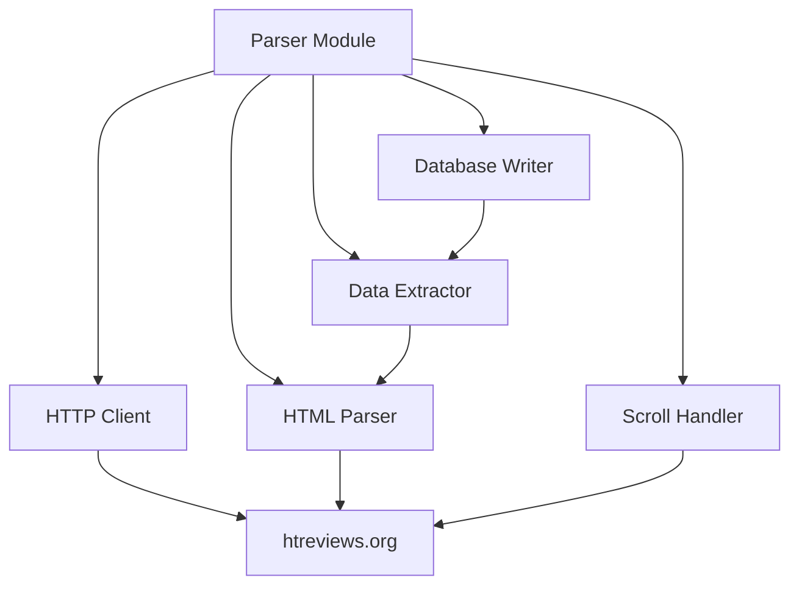

# Parser Module Documentation

## Overview

The parser module (`packages/parser`) is responsible for fetching and parsing tobacco data from htreviews.org. It handles HTML parsing, infinite scroll, data extraction, and database storage.

## Architecture



## Components

### 1. HTTP Client

The HTTP client module provides a robust interface for fetching HTML content from htreviews.org with built-in resilience features.

**Implementation**: [`packages/parser/src/http/client.ts`](packages/parser/src/http/client.ts:1)

**Key Components**:

- **[`HttpClient`](packages/parser/src/http/client.ts:118)**: Main HTTP client class wrapping the `got` library
- **[`RateLimiter`](packages/parser/src/http/client.ts:85)**: Sliding window rate limiter for request throttling
- **[`calculateRetryDelay()`](packages/parser/src/http/client.ts:251)**: Exponential backoff calculation for retries

**Features**:

1. **Retry Logic with Exponential Backoff**
   - Automatic retry mechanism for failed requests
   - Exponential backoff: 1s, 2s, 4s, 8s, etc. (capped at 30s max)
   - Configurable maximum retry attempts (default: 3, from `PARSER_MAX_RETRIES`)
   - Handles retryable HTTP status codes: 429, 500, 502, 503, 504
   - Handles network errors: ETIMEDOUT, ECONNRESET, EADDRINUSE, ECONNREFUSED, EPIPE, ENOTFOUND, ENETUNREACH, EAI_AGAIN

2. **Rate Limiting**
   - Sliding window algorithm for request throttling
   - Configurable delay between requests (default: 1000ms, from `PARSER_SCROLL_DELAY_MS`)
   - Respects HTTP 429 (Too Many Requests) responses
   - Automatic delay calculation before each request

3. **Timeout Handling**
   - Connection timeout: 10 seconds
   - Request timeout: 30 seconds (from `PARSER_TIMEOUT_MS`)
   - Response timeout: 30 seconds (from `PARSER_TIMEOUT_MS`)
   - Graceful timeout error handling with proper error classification

4. **Error Handling**
   - Custom [`HttpClientError`](packages/parser/src/http/client.ts:20) class with error type classification
   - Distinguishes between network, HTTP, timeout, parse, and rate limit errors
   - Comprehensive error logging based on log level configuration

**Usage Example**:

```typescript
import { httpClient } from '@hookah-db/parser';

// Fetch a page
const response = await httpClient.get('/tobaccos/brands');
const html = response.body;

// Fetch with custom options
const response = await httpClient.get('/tobaccos/sarma', {
  searchParams: { page: 1 }
});
```

**Configuration**:

All configuration is read from environment variables via the shared config module:

- `PARSER_BASE_URL` - htreviews.org URL (default: https://htreviews.org)
- `PARSER_CONCURRENT_REQUESTS` - Concurrent requests limit (default: 3)
- `PARSER_SCROLL_DELAY_MS` - Delay between requests (default: 1000ms)
- `PARSER_MAX_RETRIES` - Retry attempts (default: 3)
- `PARSER_TIMEOUT_MS` - Request timeout (default: 30000ms)
- `LOG_LEVEL` - Controls logging verbosity (error, warn, info, debug)

---

### 2. HTML Parser (`src/parser.ts`)

Parses HTML using Cheerio (jQuery-like syntax).

```typescript
import * as cheerio from 'cheerio';
import { fetchPage } from './http';

export interface Brand {
  name: string;
  slug: string;
  description?: string;
  imageUrl?: string;
}

export interface Tobacco {
  brandSlug: string;
  name: string;
  slug: string;
  description?: string;
  imageUrl?: string;
}

export class HtReviewsParser {
  private baseUrl: string;
  
  constructor(baseUrl: string) {
    this.baseUrl = baseUrl;
  }
  
  /**
   * Parse brands listing page
   */
  async parseBrandsList(): Promise<string[]> {
    const url = `${this.baseUrl}/tobaccos/brands?r=position&s=rating&d=desc`;
    const html = await fetchPage(url);
    const $ = cheerio.load(html);
    
    const brandSlugs: string[] = [];
    
    // Find brand links
    $('a[href^="/tobaccos/"]').each((_, element) => {
      const href = $(element).attr('href');
      if (href && href.match(/^\/tobaccos\/[^\/]+$/)) {
        const slug = href.replace('/tobaccos/', '');
        if (slug && !brandSlugs.includes(slug)) {
          brandSlugs.push(slug);
        }
      }
    });
    
    return brandSlugs;
  }
  
  /**
   * Parse brand detail page
   */
  async parseBrand(brandSlug: string): Promise<Brand> {
    const url = `${this.baseUrl}/tobaccos/${brandSlug}?r=position&s=rating&d=desc`;
    const html = await fetchPage(url);
    const $ = cheerio.load(html);
    
    // Extract brand name
    const name = $('h1').first().text().trim() || brandSlug;
    
    // Extract brand description
    const description = $('.brand-description').text().trim() || undefined;
    
    // Extract brand image
    const imageUrl = $('img.brand-logo').first().attr('src') || 
                     $('img').first().attr('src') || undefined;
    
    // Make image URL absolute if relative
    const absoluteImageUrl = imageUrl && imageUrl.startsWith('/')
      ? `${this.baseUrl}${imageUrl}`
      : imageUrl;
    
    return {
      name,
      slug: brandSlug,
      description,
      imageUrl: absoluteImageUrl,
    };
  }
  
  /**
   * Parse tobacco list from brand page
   */
  async parseTobaccoList(brandSlug: string): Promise<string[]> {
    const url = `${this.baseUrl}/tobaccos/${brandSlug}?r=position&s=rating&d=desc`;
    const tobaccoSlugs: string[] = [];
    let offset = 0;
    let hasMore = true;
    
    while (hasMore) {
      const html = await fetchPage(`${url}&offset=${offset}`);
      const $ = cheerio.load(html);
      
      // Find tobacco links
      const links = $('a[href^="/tobaccos/"]');
      const foundNewItems = false;
      
      links.each((_, element) => {
        const href = $(element).attr('href');
        if (href && href.match(/^\/tobaccos\/[^\/]+\/[^\/]+$/)) {
          const parts = href.split('/');
          const tobaccoSlug = parts[parts.length - 1];
          
          if (tobaccoSlug && !tobaccoSlugs.includes(tobaccoSlug)) {
            tobaccoSlugs.push(tobaccoSlug);
            foundNewItems = true;
          }
        }
      });
      
      // Check if there are more items
      const loadMoreButton = $('.load-more').length > 0;
      hasMore = loadMoreButton && foundNewItems;
      
      if (hasMore) {
        offset += 20; // Default page size
        await new Promise(resolve => setTimeout(resolve, config.scrollDelayMs));
      }
    }
    
    return tobaccoSlugs;
  }
  
  /**
   * Parse tobacco detail page
   */
  async parseTobacco(brandSlug: string, tobaccoSlug: string): Promise<Tobacco> {
    const url = `${this.baseUrl}/tobaccos/${brandSlug}/${tobaccoSlug}?r=position&s=created&d=desc`;
    const html = await fetchPage(url);
    const $ = cheerio.load(html);
    
    // Extract tobacco name
    const name = $('h1').first().text().trim() || tobaccoSlug;
    
    // Extract tobacco description
    const description = $('.tobacco-description').text().trim() || undefined;
    
    // Extract tobacco image
    const imageUrl = $('img.tobacco-image').first().attr('src') || 
                     $('img').first().attr('src') || undefined;
    
    // Make image URL absolute if relative
    const absoluteImageUrl = imageUrl && imageUrl.startsWith('/')
      ? `${this.baseUrl}${imageUrl}`
      : imageUrl;
    
    return {
      brandSlug,
      name,
      slug: tobaccoSlug,
      description,
      imageUrl: absoluteImageUrl,
    };
  }
}
```

---

### 3. Scroll Handler (`src/scroll.ts`)

Handles infinite scroll on htreviews.org pages.

```typescript
import * as cheerio from 'cheerio';
import { fetchPage } from './http';
import { config } from './http';

export interface ScrollOptions {
  baseUrl: string;
  path: string;
  initialOffset?: number;
  pageSize?: number;
}

export interface ScrollResult {
  items: string[];
  totalItems: number;
  hasMore: boolean;
}

export async function scrollPage(options: ScrollOptions): Promise<ScrollResult> {
  const {
    baseUrl,
    path,
    initialOffset = 0,
    pageSize = 20,
  } = options;
  
  const items: string[] = [];
  let offset = initialOffset;
  let hasMore = true;
  let lastCount = 0;
  
  while (hasMore) {
    const url = `${baseUrl}${path}?offset=${offset}`;
    const html = await fetchPage(url);
    const $ = cheerio.load(html);
    
    // Extract items from current page
    const pageItems: string[] = [];
    
    // Example: Extract brand/tobacco slugs
    $('a[href^="/tobaccos/"]').each((_, element) => {
      const href = $(element).attr('href');
      if (href) {
        const slug = href.split('/').pop();
        if (slug && !items.includes(slug) && !pageItems.includes(slug)) {
          pageItems.push(slug);
        }
      }
    });
    
    // Add new items
    items.push(...pageItems);
    
    // Check if we got new items
    const newItemsCount = pageItems.length;
    hasMore = newItemsCount > 0 && newItemsCount === pageSize;
    
    if (hasMore) {
      offset += pageSize;
      await new Promise(resolve => setTimeout(resolve, config.scrollDelayMs));
    }
    
    // Safety check: prevent infinite loop
    if (lastCount === items.length) {
      hasMore = false;
    }
    lastCount = items.length;
  }
  
  return {
    items,
    totalItems: items.length,
    hasMore: false,
  };
}
```

---

### 4. Data Extractor (`src/extractor.ts`)

Extracts structured data from parsed HTML.

```typescript
import * as cheerio from 'cheerio';

export interface ExtractedBrand {
  name: string;
  slug: string;
  description?: string;
  imageUrl?: string;
}

export interface ExtractedTobacco {
  brandSlug: string;
  name: string;
  slug: string;
  description?: string;
  imageUrl?: string;
}

export class DataExtractor {
  /**
   * Extract brand data from HTML
   */
  static extractBrand(html: string, brandSlug: string): ExtractedBrand {
    const $ = cheerio.load(html);
    
    // Try multiple selectors for brand name
    const name = 
      $('h1').first().text().trim() ||
      $('.brand-name').text().trim() ||
      $('.title').first().text().trim() ||
      brandSlug;
    
    // Try multiple selectors for description
    const description = 
      $('.brand-description').text().trim() ||
      $('.description').text().trim() ||
      undefined;
    
    // Try multiple selectors for image
    const imageUrl = 
      $('img.brand-logo').first().attr('src') ||
      $('img.logo').first().attr('src') ||
      $('img').first().attr('src') ||
      undefined;
    
    return {
      name,
      slug: brandSlug,
      description,
      imageUrl,
    };
  }
  
  /**
   * Extract tobacco data from HTML
   */
  static extractTobacco(html: string, brandSlug: string, tobaccoSlug: string): ExtractedTobacco {
    const $ = cheerio.load(html);
    
    // Try multiple selectors for tobacco name
    const name = 
      $('h1').first().text().trim() ||
      $('.tobacco-name').text().trim() ||
      $('.title').first().text().trim() ||
      tobaccoSlug;
    
    // Try multiple selectors for description
    const description = 
      $('.tobacco-description').text().trim() ||
      $('.description').text().trim() ||
      undefined;
    
    // Try multiple selectors for image
    const imageUrl = 
      $('img.tobacco-image').first().attr('src') ||
      $('img.product-image').first().attr('src') ||
      $('img').first().attr('src') ||
      undefined;
    
    return {
      brandSlug,
      name,
      slug: tobaccoSlug,
      description,
      imageUrl,
    };
  }
  
  /**
   * Extract slugs from listing page
   */
  static extractSlugs(html: string, pattern: RegExp): string[] {
    const $ = cheerio.load(html);
    const slugs: string[] = [];
    
    $('a[href]').each((_, element) => {
      const href = $(element).attr('href');
      if (href) {
        const match = href.match(pattern);
        if (match && match[1]) {
          const slug = match[1];
          if (!slugs.includes(slug)) {
            slugs.push(slug);
          }
        }
      }
    });
    
    return slugs;
  }
}
```

---

### 5. Database Writer (`src/writer.ts`)

Writes parsed data to database.

```typescript
import { upsertBrand, upsertTobacco } from '@hookah-db/database';
import { ExtractedBrand, ExtractedTobacco } from './extractor';

export class DatabaseWriter {
  /**
   * Write brand to database
   */
  static async writeBrand(brand: ExtractedBrand): Promise<void> {
    await upsertBrand({
      name: brand.name,
      slug: brand.slug,
      description: brand.description,
      imageUrl: brand.imageUrl,
    });
    
    console.log(`✓ Brand saved: ${brand.name} (${brand.slug})`);
  }
  
  /**
   * Write tobacco to database
   */
  static async writeTobacco(tobacco: ExtractedTobacco): Promise<void> {
    // First, find the brand ID
    const { getBrandBySlug } = await import('@hookah-db/database');
    const brand = await getBrandBySlug(tobacco.brandSlug);
    
    if (!brand) {
      throw new Error(`Brand not found: ${tobacco.brandSlug}`);
    }
    
    await upsertTobacco({
      brandId: brand.id,
      name: tobacco.name,
      slug: tobacco.slug,
      description: tobacco.description,
      imageUrl: tobacco.imageUrl,
    });
    
    console.log(`✓ Tobacco saved: ${tobacco.name} (${tobacco.slug})`);
  }
  
  /**
   * Write multiple brands in batch
   */
  static async writeBrandsBatch(brands: ExtractedBrand[]): Promise<void> {
    console.log(`Writing ${brands.length} brands...`);
    
    for (const brand of brands) {
      await this.writeBrand(brand);
    }
    
    console.log(`✓ All brands saved`);
  }
  
  /**
   * Write multiple tobaccos in batch
   */
  static async writeTobaccosBatch(tobaccos: ExtractedTobacco[]): Promise<void> {
    console.log(`Writing ${tobaccos.length} tobaccos...`);
    
    for (const tobacco of tobaccos) {
      await this.writeTobacco(tobacco);
    }
    
    console.log(`✓ All tobaccos saved`);
  }
}
```

---

### 6. Main Parser (`src/index.ts`)

Orchestrates the parsing process.

```typescript
import { HtReviewsParser } from './parser';
import { DatabaseWriter } from './writer';
import { config } from './http';

export class Parser {
  private parser: HtReviewsParser;
  
  constructor() {
    this.parser = new HtReviewsParser(config.baseUrl);
  }
  
  /**
   * Parse all brands and their tobaccos
   */
  async parseAll(): Promise<void> {
    console.log('Starting full parse...');
    
    // Step 1: Get all brand slugs
    console.log('Fetching brand list...');
    const brandSlugs = await this.parser.parseBrandsList();
    console.log(`Found ${brandSlugs.length} brands`);
    
    // Step 2: Parse each brand
    for (const brandSlug of brandSlugs) {
      try {
        console.log(`\nParsing brand: ${brandSlug}`);
        
        // Parse brand details
        const brand = await this.parser.parseBrand(brandSlug);
        await DatabaseWriter.writeBrand(brand);
        
        // Parse tobacco list for this brand
        const tobaccoSlugs = await this.parser.parseTobaccoList(brandSlug);
        console.log(`Found ${tobaccoSlugs.length} tobaccos`);
        
        // Parse each tobacco
        for (const tobaccoSlug of tobaccoSlugs) {
          try {
            const tobacco = await this.parser.parseTobacco(brandSlug, tobaccoSlug);
            await DatabaseWriter.writeTobacco(tobacco);
          } catch (error) {
            console.error(`✗ Failed to parse tobacco ${tobaccoSlug}:`, error);
          }
        }
      } catch (error) {
        console.error(`✗ Failed to parse brand ${brandSlug}:`, error);
      }
    }
    
    console.log('\n✓ Full parse completed');
  }
  
  /**
   * Parse a single brand
   */
  async parseBrand(brandSlug: string): Promise<void> {
    console.log(`Parsing brand: ${brandSlug}`);
    
    const brand = await this.parser.parseBrand(brandSlug);
    await DatabaseWriter.writeBrand(brand);
    
    const tobaccoSlugs = await this.parser.parseTobaccoList(brandSlug);
    console.log(`Found ${tobaccoSlugs.length} tobaccos`);
    
    for (const tobaccoSlug of tobaccoSlugs) {
      try {
        const tobacco = await this.parser.parseTobacco(brandSlug, tobaccoSlug);
        await DatabaseWriter.writeTobacco(tobacco);
      } catch (error) {
        console.error(`✗ Failed to parse tobacco ${tobaccoSlug}:`, error);
      }
    }
    
    console.log(`✓ Brand ${brandSlug} parsed`);
  }
  
  /**
   * Parse a single tobacco
   */
  async parseTobacco(brandSlug: string, tobaccoSlug: string): Promise<void> {
    console.log(`Parsing tobacco: ${brandSlug}/${tobaccoSlug}`);
    
    const tobacco = await this.parser.parseTobacco(brandSlug, tobaccoSlug);
    await DatabaseWriter.writeTobacco(tobacco);
    
    console.log(`✓ Tobacco ${tobaccoSlug} parsed`);
  }
}
```

---

## Testing

### Unit Tests

Test individual parsing functions:

```typescript
import { describe, it, expect } from 'vitest';
import { DataExtractor } from './extractor';
import * as fs from 'fs';

describe('DataExtractor', () => {
  describe('extractBrand', () => {
    it('should extract brand data from HTML', () => {
      const html = fs.readFileSync(
        '../../examples/htreviews.org_tobaccos_sarma.html',
        'utf-8'
      );
      
      const brand = DataExtractor.extractBrand(html, 'sarma');
      
      expect(brand.name).toBeDefined();
      expect(brand.slug).toBe('sarma');
      expect(brand.description).toBeDefined();
      expect(brand.imageUrl).toBeDefined();
    });
  });
  
  describe('extractTobacco', () => {
    it('should extract tobacco data from HTML', () => {
      const html = fs.readFileSync(
        '../../examples/htreviews.org_tobaccos_sarma_klassicheskaya_zima.html',
        'utf-8'
      );
      
      const tobacco = DataExtractor.extractTobacco(html, 'sarma', 'klassicheskaya-zima');
      
      expect(tobacco.name).toBeDefined();
      expect(tobacco.slug).toBe('klassicheskaya-zima');
      expect(tobacco.brandSlug).toBe('sarma');
      expect(tobacco.description).toBeDefined();
      expect(tobacco.imageUrl).toBeDefined();
    });
  });
  
  describe('extractSlugs', () => {
    it('should extract brand slugs from listing page', () => {
      const html = fs.readFileSync(
        '../../examples/htreviews.org_tobaccos_brands.html',
        'utf-8'
      );
      
      const slugs = DataExtractor.extractSlugs(html, /^\/tobaccos\/([^\/]+)$/);
      
      expect(Array.isArray(slugs)).toBe(true);
      expect(slugs.length).toBeGreaterThan(0);
      expect(slugs.every(slug => typeof slug === 'string')).toBe(true);
    });
  });
});
```

### Integration Tests

Test full parsing flow:

```typescript
import { describe, it, expect, beforeAll, afterAll } from 'vitest';
import { Parser } from './index';
import { client, schema } from '@hookah-db/database';
import { eq } from 'drizzle-orm';

describe('Parser Integration', () => {
  let parser: Parser;
  
  beforeAll(async () => {
    parser = new Parser();
  });
  
  afterAll(async () => {
    // Clean up test data
    await client.delete(schema.brands).where(eq(schema.brands.slug, 'test-brand'));
  });
  
  it('should parse a brand and its tobaccos', async () => {
    // Use a real brand slug for testing
    await parser.parseBrand('sarma');
    
    // Verify brand was saved
    const { getBrandBySlug } = await import('@hookah-db/database');
    const brand = await getBrandBySlug('sarma');
    
    expect(brand).not.toBeNull();
    expect(brand.name).toBeDefined();
    
    // Verify tobaccos were saved
    const { getAllTobaccos } = await import('@hookah-db/database');
    const result = await getAllTobaccos({ brandSlug: 'sarma' });
    
    expect(result.data.length).toBeGreaterThan(0);
  });
});
```

---

## Configuration

### Environment Variables

```env
PARSER_BASE_URL=https://htreviews.org
PARSER_CONCURRENT_REQUESTS=3
PARSER_SCROLL_DELAY_MS=1000
PARSER_MAX_RETRIES=3
PARSER_TIMEOUT_MS=30000
```

### Config File

```typescript
// packages/parser/src/config.ts
export const parserConfig = {
  baseUrl: process.env.PARSER_BASE_URL || 'https://htreviews.org',
  concurrentRequests: parseInt(process.env.PARSER_CONCURRENT_REQUESTS || '3'),
  scrollDelayMs: parseInt(process.env.PARSER_SCROLL_DELAY_MS || '1000'),
  maxRetries: parseInt(process.env.PARSER_MAX_RETRIES || '3'),
  timeoutMs: parseInt(process.env.PARSER_TIMEOUT_MS || '30000'),
};
```

---

## Error Handling

### Retry Logic

```typescript
export async function fetchWithRetry(
  url: string,
  retries: number = 3
): Promise<string> {
  try {
    return await fetchPage(url);
  } catch (error) {
    if (retries > 0) {
      console.warn(`Retrying ${url}, attempts left: ${retries}`);
      await new Promise(resolve => setTimeout(resolve, 1000));
      return fetchWithRetry(url, retries - 1);
    }
    throw error;
  }
}
```

### Error Types

```typescript
export class ParserError extends Error {
  constructor(
    message: string,
    public url?: string,
    public cause?: Error
  ) {
    super(message);
    this.name = 'ParserError';
  }
}

export class NetworkError extends ParserError {
  constructor(url: string, cause: Error) {
    super(`Network error fetching ${url}`, url, cause);
    this.name = 'NetworkError';
  }
}

export class ParseError extends ParserError {
  constructor(url: string, cause: Error) {
    super(`Failed to parse ${url}`, url, cause);
    this.name = 'ParseError';
  }
}
```

---

## Performance Considerations

### Concurrent Requests

Limit concurrent requests to avoid overwhelming htreviews.org:

```typescript
import pLimit from 'p-limit';

const limit = pLimit(config.concurrentRequests);

async function parseMultiple(items: string[]) {
  const promises = items.map(item => 
    limit(() => parseItem(item))
  );
  
  return Promise.all(promises);
}
```

### Rate Limiting

Add delays between requests:

```typescript
async function parseWithDelay(items: string[]) {
  for (const item of items) {
    await parseItem(item);
    await new Promise(resolve => setTimeout(resolve, config.scrollDelayMs));
  }
}
```

### Caching

Cache parsed HTML to reduce requests:

```typescript
const cache = new Map<string, string>();

async function fetchPageWithCache(url: string): Promise<string> {
  if (cache.has(url)) {
    return cache.get(url)!;
  }
  
  const html = await fetchPage(url);
  cache.set(url, html);
  
  return html;
}
```

---

## CLI Usage

```typescript
// packages/parser/src/cli.ts
import { Parser } from './index';

async function main() {
  const args = process.argv.slice(2);
  const command = args[0];
  
  const parser = new Parser();
  
  switch (command) {
    case 'all':
      await parser.parseAll();
      break;
    case 'brand':
      const brandSlug = args[1];
      if (!brandSlug) {
        console.error('Brand slug is required');
        process.exit(1);
      }
      await parser.parseBrand(brandSlug);
      break;
    case 'tobacco':
      const [bSlug, tSlug] = args.slice(1);
      if (!bSlug || !tSlug) {
        console.error('Brand slug and tobacco slug are required');
        process.exit(1);
      }
      await parser.parseTobacco(bSlug, tSlug);
      break;
    default:
      console.log('Usage:');
      console.log('  pnpm parse all           - Parse all brands and tobaccos');
      console.log('  pnpm parse brand <slug>  - Parse a single brand');
      console.log('  pnpm parse tobacco <brand> <tobacco> - Parse a single tobacco');
      process.exit(1);
  }
}

main().catch(console.error);
```

---

## Dependencies

**Dependencies**:
- **got** v14.6.3 - HTTP client library with retry, timeout, and hooks support
- **cheerio** - HTML parsing with jQuery-like syntax
- **@hookah-db/database** - Database module for data storage
- **@hookah-db/shared** - Shared configuration module

---

## Summary

The parser module provides:

- **HTTP Client**: Fetches HTML from htreviews.org with retry logic, rate limiting, and timeout handling
- **HTML Parser**: Parses HTML using Cheerio
- **Scroll Handler**: Handles infinite scroll on listing pages
- **Data Extractor**: Extracts structured data from HTML
- **Database Writer**: Writes parsed data to database
- **CLI**: Command-line interface for running parser

For API module documentation, see [`api.md`](api.md).
For database module documentation, see [`database.md`](database.md).
