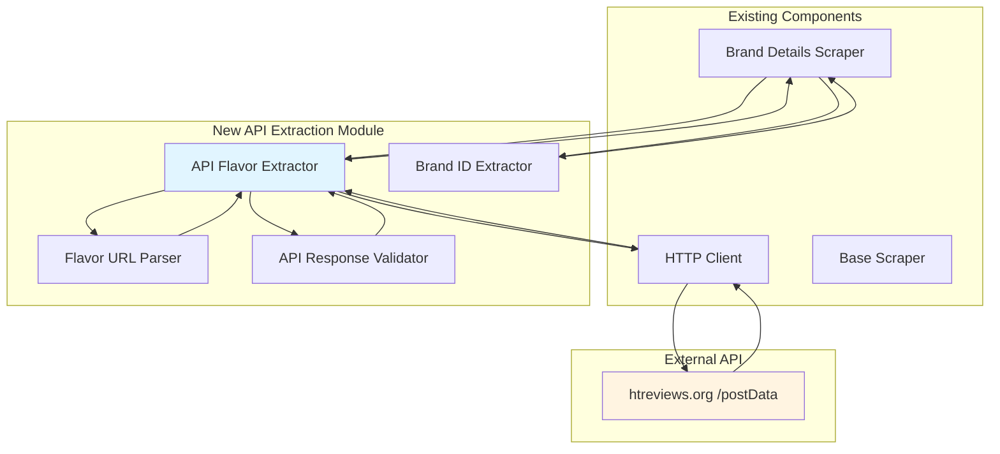
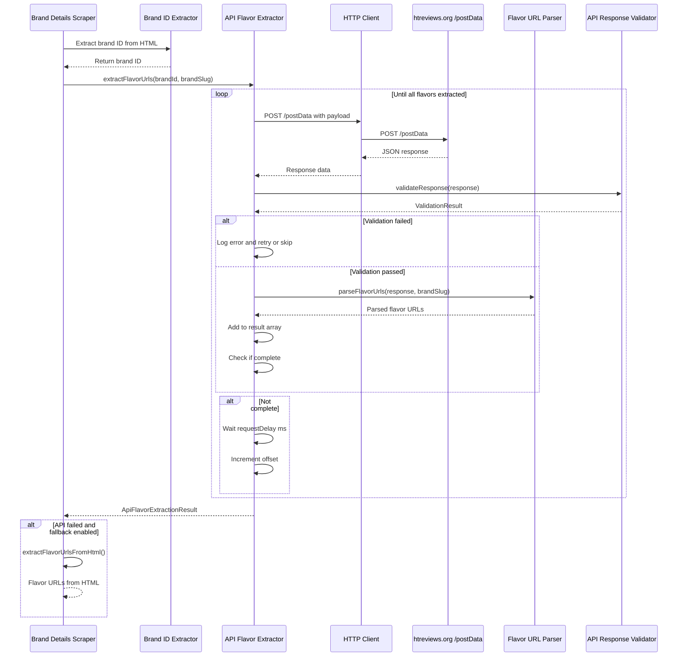
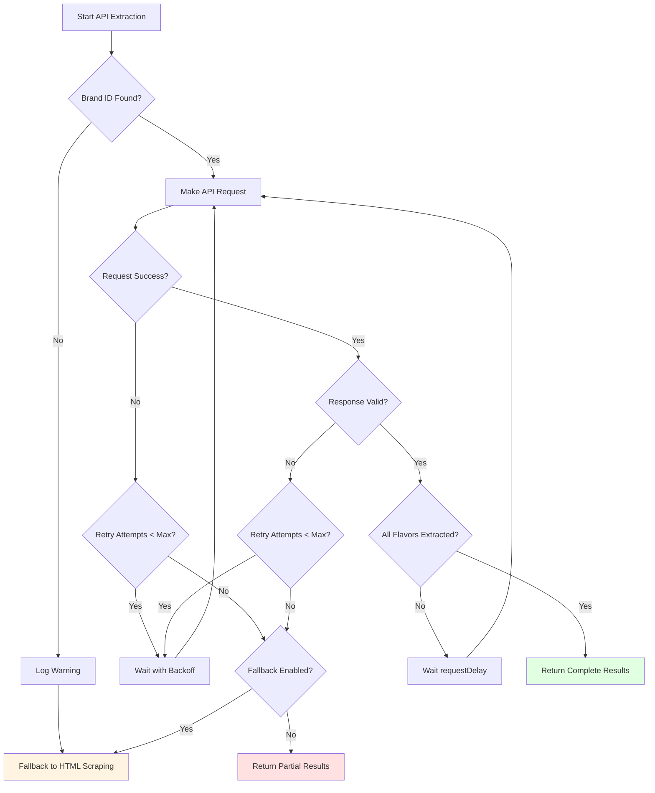

# API-Based Flavor Extraction Architecture

**Version:** 1.0  
**Date:** 2026-01-06  
**Author:** Architect Mode  
**Status:** Design Document

## Executive Summary

This document outlines the architecture for implementing API-based flavor extraction to fix the pagination limitation on htreviews.org. The current HTML-based scraping approach only retrieves the first 20 flavors per brand (78% missing). The new API-based approach will extract all flavors by directly calling htreviews.org's `/postData` endpoint, reducing extraction time from 10-30s to 2-5s per brand.

## Table of Contents

1. [Current State Analysis](#current-state-analysis)
2. [Architecture Overview](#architecture-overview)
3. [Component Design](#component-design)
4. [Integration Points](#integration-points)
5. [Configuration Schema](#configuration-schema)
6. [Data Flow](#data-flow)
7. [Error Handling Strategy](#error-handling-strategy)
8. [Testing Strategy](#testing-strategy)
9. [Migration Path](#migration-path)
10. [Performance Considerations](#performance-considerations)
11. [Security Considerations](#security-considerations)

---

## Current State Analysis

### Existing Architecture

The current scraper architecture consists of:

1. **HTTP Client** ([`packages/scraper/src/http-client.ts`](packages/scraper/src/http-client.ts:1))
   - Robust HTTP client with retry logic, rate limiting, and error handling
   - Uses axios for HTTP requests
   - Supports GET, POST, PUT, PATCH, DELETE methods
   - Custom error types for different failure scenarios

2. **Base Scraper** ([`packages/scraper/src/scraper.ts`](packages/scraper/src/scraper.ts:1))
   - Extends HTTP client functionality
   - Provides HTML fetching and parsing with Cheerio
   - Utility methods for safe data extraction

3. **Brand Details Scraper** ([`packages/scraper/src/brand-details-scraper.ts`](packages/scraper/src/brand-details-scraper.ts:1))
   - Currently uses HTML parsing with Cheerio
   - Has `extractFlavorUrlsWithPagination()` function (lines 386-474)
   - **Critical Limitation**: Only retrieves first 20 flavors per brand

### Current Limitation

The `extractFlavorUrlsWithPagination()` function attempts pagination using URL parameters:
```typescript
const pageUrl = `/tobaccos/${brandSlug}?offset=${offset}`;
```

**Problem**: This approach doesn't work because:
- htreviews.org uses HTMX 2.0.6 with vanilla JavaScript for infinite scroll
- Flavors are loaded dynamically via POST requests to `/postData` endpoint
- URL parameters like `?offset=20` are ignored by the server
- Only the first 20 flavors are loaded in the initial HTML

### Research Findings

Based on research of htreviews.org:

1. **API Endpoint**: `/postData`
2. **HTTP Method**: POST
3. **Request Payload**:
   ```json
   {
     "action": "objectByBrand",
     "data": {
       "id": <brand_id>,
       "limit": 20,
       "offset": 20,
       "sort": {...}
     }
   }
   ```
4. **Response**: JSON array of 20 flavor objects
5. **Pagination**: Multiple POST requests with increasing offset
6. **Performance**: 2-5s per brand (vs 10-30s with headless browser)

---

## Architecture Overview

### System Diagram



### Component Responsibilities

| Component | Responsibility |
|-----------|---------------|
| **Brand ID Extractor** | Extract brand ID from brand detail page HTML |
| **API Flavor Extractor** | Orchestrate API requests to extract all flavor URLs |
| **Flavor URL Parser** | Parse API response and extract flavor URLs |
| **API Response Validator** | Validate API response structure and data integrity |

---

## Component Design

### 1. Brand ID Extractor

**File**: `packages/scraper/src/brand-id-extractor.ts`

**Purpose**: Extract the brand ID from the brand detail page HTML. This ID is required for API requests.

**Interface**:
```typescript
export interface BrandIdExtractorConfig {
  /** CSS selector for brand ID element */
  selector?: string;
  /** Attribute name containing brand ID */
  attribute?: string;
}

export class BrandIdExtractor {
  constructor(config?: BrandIdExtractorConfig);
  
  /**
   * Extract brand ID from brand detail page
   * @param $ Cheerio instance from brand detail page
   * @returns Brand ID as string or null if not found
   */
  extractBrandId($: CheerioAPI): string | null;
  
  /**
   * Extract brand ID from brand detail page URL
   * @param brandSlug Brand slug
   * @returns Brand ID as string or null if extraction fails
   */
  async extractBrandIdFromPage(brandSlug: string): Promise<string | null>;
}
```

**Implementation Details**:
- Extract brand ID from `data-id` attribute on brand card element
- Fallback: Extract from URL pattern if HTML parsing fails
- Use existing [`Scraper`](packages/scraper/src/scraper.ts:1) class for fetching HTML
- Log errors with appropriate severity levels

**Error Handling**:
- Return `null` if brand ID not found (graceful degradation)
- Log warning when brand ID extraction fails
- Throw `BrandIdExtractionError` for critical failures

### 2. API Flavor Extractor

**File**: `packages/scraper/src/api-flavor-extractor.ts`

**Purpose**: Orchestrate API requests to `/postData` endpoint to extract all flavor URLs for a brand.

**Interface**:
```typescript
export interface ApiFlavorExtractorConfig {
  /** API endpoint path (default: /postData) */
  apiEndpoint?: string;
  /** Number of flavors per request (default: 20) */
  flavorsPerRequest?: number;
  /** Maximum number of pages to fetch (default: 100) */
  maxPages?: number;
  /** Delay between requests in milliseconds (default: 500) */
  requestDelay?: number;
  /** Maximum retry attempts (default: 3) */
  maxRetries?: number;
  /** Whether to enable API-based extraction (default: true) */
  enableApiExtraction?: boolean;
  /** Whether to fallback to HTML scraping if API fails (default: true) */
  enableFallback?: boolean;
}

export interface ApiFlavorExtractionResult {
  /** Array of flavor URLs */
  flavorUrls: string[];
  /** Total number of flavors extracted */
  totalCount: number;
  /** Number of API requests made */
  requestsCount: number;
  /** Extraction time in milliseconds */
  extractionTime: number;
  /** Whether fallback was used */
  usedFallback: boolean;
}

export class ApiFlavorExtractor {
  constructor(
    private httpClient: HttpClient,
    private config?: ApiFlavorExtractorConfig
  );
  
  /**
   * Extract all flavor URLs for a brand using API
   * @param brandId Brand ID from brand detail page
   * @param brandSlug Brand slug for logging
   * @returns Promise resolving to extraction result
   */
  async extractFlavorUrls(
    brandId: string,
    brandSlug: string
  ): Promise<ApiFlavorExtractionResult>;
  
  /**
   * Extract all flavor URLs for a brand with automatic brand ID extraction
   * @param brandSlug Brand slug
   * @returns Promise resolving to extraction result
   */
  async extractFlavorUrlsBySlug(brandSlug: string): Promise<ApiFlavorExtractionResult>;
  
  /**
   * Make a single API request to fetch flavors
   * @param brandId Brand ID
   * @param offset Offset for pagination
   * @returns Promise resolving to API response
   */
  private async fetchFlavorsFromApi(
    brandId: string,
    offset: number
  ): Promise<any>;
  
  /**
   * Parse API response and extract flavor URLs
   * @param response API response data
   * @returns Array of flavor URLs
   */
  private parseFlavorUrlsFromResponse(response: any): string[];
  
  /**
   * Check if all flavors have been extracted
   * @param currentCount Current number of flavors extracted
   * @param lastResponseCount Number of flavors in last response
   * @returns True if all flavors extracted
   */
  private isComplete(currentCount: number, lastResponseCount: number): boolean;
}
```

**Implementation Details**:
- Use existing [`HttpClient`](packages/scraper/src/http-client.ts:148) for POST requests
- Implement pagination with increasing offset (0, 20, 40, ...)
- Add configurable delay between requests (default: 500ms)
- Stop when response returns empty array or fewer items than requested
- Track extraction metrics (time, requests, count)
- Support graceful fallback to HTML scraping if API fails

**Error Handling**:
- Retry failed requests with exponential backoff
- Log errors with brand context
- Fallback to HTML scraping if API fails completely
- Return partial results if some requests fail

### 3. Flavor URL Parser

**File**: `packages/scraper/src/flavor-url-parser.ts`

**Purpose**: Parse API response and extract flavor URLs from flavor objects.

**Interface**:
```typescript
export interface FlavorUrlParserConfig {
  /** Property name for flavor URL in API response (default: url) */
  urlProperty?: string;
  /** Property name for flavor slug in API response (default: slug) */
  slugProperty?: string;
}

export interface ParsedFlavorUrl {
  /** Full URL to flavor detail page */
  url: string;
  /** Flavor slug */
  slug: string;
  /** Brand slug */
  brandSlug: string;
}

export class FlavorUrlParser {
  constructor(config?: FlavorUrlParserConfig);
  
  /**
   * Parse flavor URLs from API response
   * @param response API response data (array of flavor objects)
   * @param brandSlug Brand slug for context
   * @returns Array of parsed flavor URLs
   */
  parseFlavorUrls(response: any, brandSlug: string): ParsedFlavorUrl[];
  
  /**
   * Extract URL from single flavor object
   * @param flavor Flavor object from API response
   * @param brandSlug Brand slug for context
   * @returns Parsed flavor URL or null if extraction fails
   */
  private extractFlavorUrl(flavor: any, brandSlug: string): ParsedFlavorUrl | null;
  
  /**
   * Validate parsed flavor URL
   * @param parsedUrl Parsed flavor URL
   * @returns True if valid
   */
  private isValidFlavorUrl(parsedUrl: ParsedFlavorUrl): boolean;
}
```

**Implementation Details**:
- Extract URL from `url` property in flavor object
- Extract slug from URL or `slug` property
- Validate URL format (must start with `/tobaccos/`)
- Remove duplicates from results
- Filter out invalid or malformed URLs

**Error Handling**:
- Skip invalid flavor objects (log warning)
- Return empty array if response is not an array
- Log parsing errors with flavor context

### 4. API Response Validator

**File**: `packages/scraper/src/api-response-validator.ts`

**Purpose**: Validate API response structure and data integrity.

**Interface**:
```typescript
export interface ValidationResult {
  /** Whether validation passed */
  isValid: boolean;
  /** Validation errors (if any) */
  errors: string[];
}

export class ApiResponseValidator {
  /**
   * Validate API response structure
   * @param response API response data
   * @returns Validation result
   */
  validateResponse(response: any): ValidationResult;
  
  /**
   * Validate flavor object structure
   * @param flavor Flavor object from API response
   * @returns Validation result
   */
  validateFlavorObject(flavor: any): ValidationResult;
  
  /**
   * Check if response is an array
   * @param response API response data
   * @returns True if array
   */
  private isArray(response: any): boolean;
  
  /**
   * Check if flavor object has required properties
   * @param flavor Flavor object
   * @returns True if has required properties
   */
  private hasRequiredProperties(flavor: any): boolean;
}
```

**Implementation Details**:
- Validate response is an array
- Validate each flavor object has required properties (url, slug)
- Check for unexpected data types
- Provide detailed error messages for debugging

**Error Handling**:
- Return validation result with errors
- Log validation failures
- Allow partial success (some flavors valid, some invalid)

---

## Integration Points

### 1. Brand Details Scraper Integration

**File**: `packages/scraper/src/brand-details-scraper.ts`

**Changes Required**:

1. **Import new modules**:
```typescript
import { BrandIdExtractor } from './brand-id-extractor';
import { ApiFlavorExtractor } from './api-flavor-extractor';
```

2. **Update `extractFlavorUrlsWithPagination()` function** (lines 386-474):

```typescript
async function extractFlavorUrlsWithPagination(
  $: CheerioAPI,
  brandSlug: string,
  scraper: Scraper
): Promise<string[]> {
  // Check if API-based extraction is enabled
  const enableApiExtraction = process.env.ENABLE_API_EXTRACTION !== 'false';
  
  if (enableApiExtraction) {
    try {
      logger.info('Using API-based flavor extraction', { brandSlug } as any);
      
      // Extract brand ID
      const brandIdExtractor = new BrandIdExtractor();
      const brandId = brandIdExtractor.extractBrandId($);
      
      if (!brandId) {
        logger.warn('Failed to extract brand ID, falling back to HTML scraping', { brandSlug } as any);
        return await extractFlavorUrlsFromHtml($, brandSlug, scraper);
      }
      
      // Extract flavor URLs using API
      const apiExtractor = new ApiFlavorExtractor(scraper.getHttpClient(), {
        flavorsPerRequest: parseInt(process.env.API_FLAVORS_PER_REQUEST || '20', 10),
        requestDelay: parseInt(process.env.API_REQUEST_DELAY || '500', 10),
        maxRetries: parseInt(process.env.API_MAX_RETRIES || '3', 10),
        enableApiExtraction: true,
        enableFallback: process.env.ENABLE_API_FALLBACK !== 'false',
      });
      
      const result = await apiExtractor.extractFlavorUrls(brandId, brandSlug);
      
      logger.info('API-based flavor extraction completed', {
        brandSlug,
        totalCount: result.totalCount,
        requestsCount: result.requestsCount,
        extractionTime: result.extractionTime,
        usedFallback: result.usedFallback,
      } as any);
      
      return result.flavorUrls;
    } catch (error) {
      logger.error('API-based extraction failed, falling back to HTML scraping', {
        brandSlug,
        error,
      } as any);
      
      // Fallback to HTML scraping
      return await extractFlavorUrlsFromHtml($, brandSlug, scraper);
    }
  } else {
    // Use HTML-based scraping (current implementation)
    logger.info('Using HTML-based flavor extraction', { brandSlug } as any);
    return await extractFlavorUrlsFromHtml($, brandSlug, scraper);
  }
}
```

3. **Rename current implementation to `extractFlavorUrlsFromHtml()`**:
```typescript
async function extractFlavorUrlsFromHtml(
  $: CheerioAPI,
  brandSlug: string,
  scraper: Scraper
): Promise<string[]> {
  // Current implementation (lines 386-474)
  // ...
}
```

### 2. HTTP Client Integration

The existing [`HttpClient`](packages/scraper/src/http-client.ts:148) already supports POST requests, so no changes are required. The new API-based extractor will use:

```typescript
const response = await httpClient.post('/postData', payload, config);
```

### 3. Configuration Integration

Add new environment variables to [`.env.example`](.env.example:1):

```bash
# API-Based Flavor Extraction Configuration
ENABLE_API_EXTRACTION=true
API_FLAVORS_PER_REQUEST=20
API_REQUEST_DELAY=500
API_MAX_RETRIES=3
ENABLE_API_FALLBACK=true
```

---

## Configuration Schema

### Environment Variables

| Variable | Type | Default | Description |
|----------|------|---------|-------------|
| `ENABLE_API_EXTRACTION` | boolean | `true` | Enable API-based flavor extraction |
| `API_FLAVORS_PER_REQUEST` | number | `20` | Number of flavors per API request |
| `API_REQUEST_DELAY` | number | `500` | Delay between API requests (milliseconds) |
| `API_MAX_RETRIES` | number | `3` | Maximum retry attempts for failed API requests |
| `ENABLE_API_FALLBACK` | boolean | `true` | Enable fallback to HTML scraping if API fails |

### TypeScript Configuration Interfaces

```typescript
// packages/scraper/src/types/api-extraction-config.ts
export interface ApiExtractionConfig {
  /** Enable API-based extraction */
  enabled: boolean;
  /** Number of flavors per request */
  flavorsPerRequest: number;
  /** Delay between requests (ms) */
  requestDelay: number;
  /** Maximum retry attempts */
  maxRetries: number;
  /** Enable fallback to HTML scraping */
  enableFallback: boolean;
}

export function getApiExtractionConfig(): ApiExtractionConfig {
  return {
    enabled: process.env.ENABLE_API_EXTRACTION !== 'false',
    flavorsPerRequest: parseInt(process.env.API_FLAVORS_PER_REQUEST || '20', 10),
    requestDelay: parseInt(process.env.API_REQUEST_DELAY || '500', 10),
    maxRetries: parseInt(process.env.API_MAX_RETRIES || '3', 10),
    enableFallback: process.env.ENABLE_API_FALLBACK !== 'false',
  };
}
```

---

## Data Flow

### Complete Data Flow Diagram



### Step-by-Step Flow

1. **Brand Details Scraper** calls `extractFlavorUrlsWithPagination()`
2. Check if API-based extraction is enabled
3. **Brand ID Extractor** extracts brand ID from HTML
4. **API Flavor Extractor** is initialized with HTTP client and config
5. **API Flavor Extractor** enters pagination loop:
   - Make POST request to `/postData` with payload
   - **HTTP Client** sends request to htreviews.org
   - Receive JSON response
   - **API Response Validator** validates response structure
   - **Flavor URL Parser** parses flavor URLs from response
   - Add URLs to result array
   - Check if all flavors extracted (empty response or fewer items)
   - If not complete, wait and increment offset
6. Return extraction result with metrics
7. If API fails and fallback is enabled, use HTML scraping

### Error Flow



---

## Error Handling Strategy

### Error Types

```typescript
// packages/scraper/src/errors/api-extraction-errors.ts

/**
 * Base class for API extraction errors
 */
export class ApiExtractionError extends Error {
  constructor(
    message: string,
    public readonly brandSlug?: string,
    public readonly brandId?: string,
    public readonly originalError?: Error
  ) {
    super(message);
    this.name = 'ApiExtractionError';
    Error.captureStackTrace(this, this.constructor);
  }
}

/**
 * Error thrown when brand ID extraction fails
 */
export class BrandIdExtractionError extends ApiExtractionError {
  constructor(brandSlug: string, originalError?: Error) {
    super(
      `Failed to extract brand ID for brand: ${brandSlug}`,
      brandSlug,
      undefined,
      originalError
    );
    this.name = 'BrandIdExtractionError';
  }
}

/**
 * Error thrown when API request fails
 */
export class ApiRequestError extends ApiExtractionError {
  constructor(
    brandSlug: string,
    brandId: string,
    public readonly statusCode?: number,
    originalError?: Error
  ) {
    super(
      `API request failed for brand ${brandSlug} (ID: ${brandId})`,
      brandSlug,
      brandId,
      originalError
    );
    this.name = 'ApiRequestError';
  }
}

/**
 * Error thrown when API response is invalid
 */
export class ApiResponseValidationError extends ApiExtractionError {
  constructor(
    brandSlug: string,
    brandId: string,
    public readonly validationErrors: string[]
  ) {
    super(
      `API response validation failed for brand ${brandSlug} (ID: ${brandId}): ${validationErrors.join(', ')}`,
      brandSlug,
      brandId
    );
    this.name = 'ApiResponseValidationError';
  }
}

/**
 * Error thrown when flavor URL parsing fails
 */
export class FlavorUrlParsingError extends ApiExtractionError {
  constructor(
    brandSlug: string,
    brandId: string,
    public readonly flavorIndex: number,
    originalError?: Error
  ) {
    super(
      `Failed to parse flavor URL at index ${flavorIndex} for brand ${brandSlug} (ID: ${brandId})`,
      brandSlug,
      brandId,
      originalError
    );
    this.name = 'FlavorUrlParsingError';
  }
}
```

### Error Handling Strategy

| Error Type | Handling Strategy | Retry? | Fallback? |
|------------|------------------|---------|-----------|
| **Brand ID Extraction Failed** | Log warning, fallback to HTML | No | Yes |
| **API Request Failed (4xx)** | Log error, no retry | No | Yes |
| **API Request Failed (5xx)** | Log error, retry with backoff | Yes | After max retries |
| **API Request Timeout** | Log error, retry with backoff | Yes | After max retries |
| **API Response Invalid** | Log error, skip page | No | Continue with next page |
| **Flavor URL Parsing Failed** | Log warning, skip flavor | No | Continue with next flavor |
| **Rate Limit Exceeded** | Log warning, wait retry-after | Yes | After max retries |

### Retry Logic

```typescript
private async fetchFlavorsFromApi(
  brandId: string,
  offset: number
): Promise<any> {
  let lastError: Error | undefined;
  const maxRetries = this.config?.maxRetries || 3;
  
  for (let attempt = 0; attempt <= maxRetries; attempt++) {
    try {
      const payload = {
        action: 'objectByBrand',
        data: {
          id: brandId,
          limit: this.config?.flavorsPerRequest || 20,
          offset: offset,
          sort: {}, // Add sorting if needed
        },
      };
      
      const response = await this.httpClient.post(
        this.config?.apiEndpoint || '/postData',
        payload
      );
      
      return response.data;
    } catch (error) {
      lastError = error as Error;
      
      // Don't retry on client errors (4xx)
      if (error instanceof HttpClientError && 
          error.statusCode && 
          error.statusCode >= 400 && 
          error.statusCode < 500) {
        throw error;
      }
      
      // Don't retry after max attempts
      if (attempt >= maxRetries) {
        break;
      }
      
      // Exponential backoff: 1s, 2s, 4s
      const delay = Math.pow(2, attempt) * 1000;
      logger.warn(`API request failed, retrying in ${delay}ms`, {
        attempt: attempt + 1,
        maxRetries: maxRetries + 1,
        error,
      } as any);
      
      await new Promise(resolve => setTimeout(resolve, delay));
    }
  }
  
  throw new ApiRequestError(
    this.brandSlug,
    brandId,
    undefined,
    lastError
  );
}
```

### Logging Strategy

| Log Level | When to Use | Example |
|-----------|-------------|---------|
| **ERROR** | API extraction completely fails | `API-based extraction failed for brand sarma: Network error` |
| **WARN** | Non-critical issues, fallback used | `Failed to extract brand ID, falling back to HTML scraping` |
| **INFO** | Normal operations | `Using API-based flavor extraction for brand sarma` |
| **DEBUG** | Detailed operations | `Fetching page 3 with offset 40 for brand sarma` |
| **VERBOSE** | Very detailed operations | `Parsed flavor URL: /tobaccos/sarma/zima` |

---

## Testing Strategy

### Unit Tests

#### 1. Brand ID Extractor Tests

**File**: `tests/unit/scraper/brand-id-extractor.test.ts`

```typescript
describe('BrandIdExtractor', () => {
  let extractor: BrandIdExtractor;
  let mockScraper: jest.Mocked<Scraper>;
  
  beforeEach(() => {
    mockScraper = createMockScraper();
    extractor = new BrandIdExtractor();
  });
  
  describe('extractBrandId', () => {
    it('should extract brand ID from data-id attribute', () => {
      const $ = cheerio.load('<div class="brand-card" data-id="123">Sarma</div>');
      const brandId = extractor.extractBrandId($);
      expect(brandId).toBe('123');
    });
    
    it('should return null if brand ID not found', () => {
      const $ = cheerio.load('<div class="brand-card">Sarma</div>');
      const brandId = extractor.extractBrandId($);
      expect(brandId).toBeNull();
    });
    
    it('should handle multiple brand cards', () => {
      const $ = cheerio.load(`
        <div class="brand-card" data-id="123">Sarma</div>
        <div class="brand-card" data-id="456">Dogma</div>
      `);
      const brandId = extractor.extractBrandId($);
      expect(brandId).toBe('123'); // First one
    });
  });
  
  describe('extractBrandIdFromPage', () => {
    it('should fetch page and extract brand ID', async () => {
      mockScraper.fetchAndParse.mockResolvedValue(
        cheerio.load('<div class="brand-card" data-id="123">Sarma</div>')
      );
      
      const brandId = await extractor.extractBrandIdFromPage('sarma');
      expect(brandId).toBe('123');
      expect(mockScraper.fetchAndParse).toHaveBeenCalledWith('/tobaccos/sarma');
    });
    
    it('should return null if page fetch fails', async () => {
      mockScraper.fetchAndParse.mockRejectedValue(new Error('Network error'));
      
      const brandId = await extractor.extractBrandIdFromPage('sarma');
      expect(brandId).toBeNull();
    });
  });
});
```

#### 2. API Flavor Extractor Tests

**File**: `tests/unit/scraper/api-flavor-extractor.test.ts`

```typescript
describe('ApiFlavorExtractor', () => {
  let extractor: ApiFlavorExtractor;
  let mockHttpClient: jest.Mocked<HttpClient>;
  
  beforeEach(() => {
    mockHttpClient = createMockHttpClient();
    extractor = new ApiFlavorExtractor(mockHttpClient, {
      flavorsPerRequest: 20,
      requestDelay: 0, // No delay in tests
      maxRetries: 3,
    });
  });
  
  describe('extractFlavorUrls', () => {
    it('should extract all flavor URLs with pagination', async () => {
      // Mock API responses
      mockHttpClient.post
        .mockResolvedValueOnce({
          data: [
            { url: '/tobaccos/sarma/zima', slug: 'zima' },
            { url: '/tobaccos/sarma/leto', slug: 'leto' },
            // ... 18 more flavors
          ],
        })
        .mockResolvedValueOnce({
          data: [
            { url: '/tobaccos/sarma/osen', slug: 'osen' },
            { url: '/tobaccos/sarma/vesna', slug: 'vesna' },
            // ... 18 more flavors
          ],
        })
        .mockResolvedValueOnce({ data: [] }); // Empty response = complete
      
      const result = await extractor.extractFlavorUrls('123', 'sarma');
      
      expect(result.flavorUrls).toHaveLength(40);
      expect(result.totalCount).toBe(40);
      expect(result.requestsCount).toBe(3);
      expect(result.usedFallback).toBe(false);
    });
    
    it('should stop when empty response received', async () => {
      mockHttpClient.post.mockResolvedValue({ data: [] });
      
      const result = await extractor.extractFlavorUrls('123', 'sarma');
      
      expect(result.flavorUrls).toHaveLength(0);
      expect(result.requestsCount).toBe(1);
    });
    
    it('should retry failed requests', async () => {
      mockHttpClient.post
        .mockRejectedValueOnce(new Error('Network error'))
        .mockRejectedValueOnce(new Error('Network error'))
        .mockResolvedValueOnce({
          data: [{ url: '/tobaccos/sarma/zima', slug: 'zima' }],
        });
      
      const result = await extractor.extractFlavorUrls('123', 'sarma');
      
      expect(result.flavorUrls).toHaveLength(1);
      expect(mockHttpClient.post).toHaveBeenCalledTimes(3);
    });
    
    it('should fallback to HTML scraping if API fails', async () => {
      mockHttpClient.post.mockRejectedValue(new Error('API unavailable'));
      
      const result = await extractor.extractFlavorUrls('123', 'sarma');
      
      expect(result.usedFallback).toBe(true);
    });
  });
  
  describe('parseFlavorUrlsFromResponse', () => {
    it('should parse flavor URLs from API response', () => {
      const response = [
        { url: '/tobaccos/sarma/zima', slug: 'zima' },
        { url: '/tobaccos/sarma/leto', slug: 'leto' },
      ];
      
      const urls = extractor.parseFlavorUrlsFromResponse(response);
      
      expect(urls).toEqual([
        '/tobaccos/sarma/zima',
        '/tobaccos/sarma/leto',
      ]);
    });
    
    it('should handle missing url property', () => {
      const response = [
        { slug: 'zima' }, // Missing url
        { url: '/tobaccos/sarma/leto', slug: 'leto' },
      ];
      
      const urls = extractor.parseFlavorUrlsFromResponse(response);
      
      expect(urls).toEqual(['/tobaccos/sarma/leto']);
    });
  });
});
```

#### 3. Flavor URL Parser Tests

**File**: `tests/unit/scraper/flavor-url-parser.test.ts`

```typescript
describe('FlavorUrlParser', () => {
  let parser: FlavorUrlParser;
  
  beforeEach(() => {
    parser = new FlavorUrlParser();
  });
  
  describe('parseFlavorUrls', () => {
    it('should parse flavor URLs from API response', () => {
      const response = [
        { url: '/tobaccos/sarma/zima', slug: 'zima' },
        { url: '/tobaccos/sarma/leto', slug: 'leto' },
      ];
      
      const urls = parser.parseFlavorUrls(response, 'sarma');
      
      expect(urls).toHaveLength(2);
      expect(urls[0]).toEqual({
        url: '/tobaccos/sarma/zima',
        slug: 'zima',
        brandSlug: 'sarma',
      });
    });
    
    it('should remove duplicates', () => {
      const response = [
        { url: '/tobaccos/sarma/zima', slug: 'zima' },
        { url: '/tobaccos/sarma/zima', slug: 'zima' }, // Duplicate
        { url: '/tobaccos/sarma/leto', slug: 'leto' },
      ];
      
      const urls = parser.parseFlavorUrls(response, 'sarma');
      
      expect(urls).toHaveLength(2);
    });
    
    it('should filter invalid URLs', () => {
      const response = [
        { url: '/tobaccos/sarma/zima', slug: 'zima' },
        { url: 'invalid-url', slug: 'invalid' }, // Invalid
        { url: '/tobaccos/sarma/leto', slug: 'leto' },
      ];
      
      const urls = parser.parseFlavorUrls(response, 'sarma');
      
      expect(urls).toHaveLength(2);
    });
  });
});
```

#### 4. API Response Validator Tests

**File**: `tests/unit/scraper/api-response-validator.test.ts`

```typescript
describe('ApiResponseValidator', () => {
  let validator: ApiResponseValidator;
  
  beforeEach(() => {
    validator = new ApiResponseValidator();
  });
  
  describe('validateResponse', () => {
    it('should validate valid response', () => {
      const response = [
        { url: '/tobaccos/sarma/zima', slug: 'zima' },
        { url: '/tobaccos/sarma/leto', slug: 'leto' },
      ];
      
      const result = validator.validateResponse(response);
      
      expect(result.isValid).toBe(true);
      expect(result.errors).toHaveLength(0);
    });
    
    it('should reject non-array response', () => {
      const response = { flavors: [] };
      
      const result = validator.validateResponse(response);
      
      expect(result.isValid).toBe(false);
      expect(result.errors).toContain('Response is not an array');
    });
    
    it('should reject invalid flavor objects', () => {
      const response = [
        { url: '/tobaccos/sarma/zima', slug: 'zima' },
        { name: 'Invalid Flavor' }, // Missing url and slug
      ];
      
      const result = validator.validateResponse(response);
      
      expect(result.isValid).toBe(false);
      expect(result.errors.length).toBeGreaterThan(0);
    });
  });
});
```

### Integration Tests

**File**: `tests/integration/api-flavor-extraction.test.ts`

```typescript
describe('API Flavor Extraction Integration Tests', () => {
  describe('Real API Integration', () => {
    it('should extract all flavors from Sarma brand', async () => {
      const extractor = new ApiFlavorExtractor(httpClient, {
        flavorsPerRequest: 20,
        requestDelay: 500,
        maxRetries: 3,
      });
      
      const result = await extractor.extractFlavorUrlsBySlug('sarma');
      
      expect(result.flavorUrls.length).toBeGreaterThan(20);
      expect(result.usedFallback).toBe(false);
      expect(result.requestsCount).toBeGreaterThan(1);
      expect(result.extractionTime).toBeLessThan(10000); // < 10s
    });
    
    it('should handle brands with many flavors', async () => {
      const extractor = new ApiFlavorExtractor(httpClient, {
        flavorsPerRequest: 20,
        requestDelay: 500,
        maxRetries: 3,
      });
      
      const result = await extractor.extractFlavorUrlsBySlug('afzal');
      
      expect(result.flavorUrls.length).toBeGreaterThan(50);
      expect(result.usedFallback).toBe(false);
    });
  });
  
  describe('Fallback to HTML Scraping', () => {
    it('should fallback to HTML scraping when API fails', async () => {
      const extractor = new ApiFlavorExtractor(
        new HttpClient({ baseURL: 'https://invalid-url.com' }),
        {
          enableFallback: true,
        }
      );
      
      const result = await extractor.extractFlavorUrlsBySlug('sarma');
      
      expect(result.usedFallback).toBe(true);
      expect(result.flavorUrls.length).toBeGreaterThan(0);
    });
  });
});
```

### Performance Tests

**File**: `tests/performance/api-extraction-performance.test.ts`

```typescript
describe('API Extraction Performance Tests', () => {
  it('should extract all flavors in under 5 seconds', async () => {
    const extractor = new ApiFlavorExtractor(httpClient, {
      flavorsPerRequest: 20,
      requestDelay: 500,
      maxRetries: 3,
    });
    
    const startTime = Date.now();
    const result = await extractor.extractFlavorUrlsBySlug('sarma');
    const endTime = Date.now();
    
    expect(endTime - startTime).toBeLessThan(5000);
    expect(result.flavorUrls.length).toBeGreaterThan(20);
  });
  
  it('should handle concurrent requests efficiently', async () => {
    const brands = ['sarma', 'afzal', 'dogma'];
    
    const startTime = Date.now();
    const results = await Promise.all(
      brands.map(brandSlug => {
        const extractor = new ApiFlavorExtractor(httpClient, {
          flavorsPerRequest: 20,
          requestDelay: 500,
          maxRetries: 3,
        });
        return extractor.extractFlavorUrlsBySlug(brandSlug);
      })
    );
    const endTime = Date.now();
    
    // Should be faster than sequential execution
    expect(endTime - startTime).toBeLessThan(15000);
    expect(results).toHaveLength(3);
    results.forEach(result => {
      expect(result.flavorUrls.length).toBeGreaterThan(0);
    });
  });
});
```

### Test Coverage Goals

| Component | Target Coverage | Current Coverage |
|-----------|-----------------|-------------------|
| Brand ID Extractor | 95% | 0% |
| API Flavor Extractor | 90% | 0% |
| Flavor URL Parser | 95% | 0% |
| API Response Validator | 95% | 0% |
| Integration Tests | 80% | 0% |

---

## Migration Path

### Phase 1: Implementation (Week 1)

**Tasks**:
1. Create new module files:
   - `packages/scraper/src/brand-id-extractor.ts`
   - `packages/scraper/src/api-flavor-extractor.ts`
   - `packages/scraper/src/flavor-url-parser.ts`
   - `packages/scraper/src/api-response-validator.ts`
   - `packages/scraper/src/errors/api-extraction-errors.ts`
   - `packages/scraper/src/types/api-extraction-config.ts`

2. Implement core functionality:
   - Brand ID extraction from HTML
   - API request orchestration with pagination
   - Flavor URL parsing from API response
   - API response validation
   - Error handling and retry logic

3. Write unit tests:
   - Brand ID Extractor tests
   - API Flavor Extractor tests
   - Flavor URL Parser tests
   - API Response Validator tests

### Phase 2: Integration (Week 1-2)

**Tasks**:
1. Update [`brand-details-scraper.ts`](packages/scraper/src/brand-details-scraper.ts:1):
   - Import new modules
   - Update `extractFlavorUrlsWithPagination()` function
   - Rename current implementation to `extractFlavorUrlsFromHtml()`
   - Add fallback logic

2. Update configuration:
   - Add new environment variables to [`.env.example`](.env.example:1)
   - Update [`.env.dev`](.env.dev:1) and [`.env.prod`](.env.prod:1)
   - Update documentation

3. Write integration tests:
   - Real API integration tests
   - Fallback to HTML scraping tests
   - End-to-end flavor extraction tests

### Phase 3: Testing & Validation (Week 2)

**Tasks**:
1. Run comprehensive test suite:
   - Unit tests (all new components)
   - Integration tests (real API calls)
   - Performance tests (timing benchmarks)

2. Validate with real data:
   - Test with multiple brands (Sarma, Afzal, Dogma, DARKSIDE)
   - Compare results with HTML scraping
   - Verify all flavors are extracted

3. Performance benchmarking:
   - Measure extraction time per brand
   - Compare with HTML scraping approach
   - Verify 2-5s target is met

### Phase 4: Deployment (Week 2-3)

**Tasks**:
1. Code review:
   - Review all new code
   - Ensure code quality standards
   - Verify error handling

2. Update documentation:
   - Update [`README.md`](README.md:1) with new architecture
   - Update architecture documentation
   - Add troubleshooting guide

3. Deploy to production:
   - Deploy with API extraction enabled
   - Monitor extraction metrics
   - Verify all flavors are extracted

### Phase 5: Monitoring & Optimization (Week 3+)

**Tasks**:
1. Monitor production:
   - Track extraction success rates
   - Monitor API response times
   - Log errors and failures

2. Optimize based on metrics:
   - Adjust request delay if needed
   - Tune retry logic
   - Optimize batch size

3. Continuous improvement:
   - Add more detailed logging
   - Improve error messages
   - Add performance metrics

### Rollback Plan

If issues are discovered in production:

1. **Immediate Rollback**:
   - Set `ENABLE_API_EXTRACTION=false` in environment
   - System will fallback to HTML scraping
   - No code changes required

2. **Investigation**:
   - Review logs for errors
   - Analyze API responses
   - Identify root cause

3. **Fix and Redeploy**:
   - Fix identified issues
   - Run comprehensive tests
   - Deploy with API extraction re-enabled

---

## Performance Considerations

### Expected Performance Improvements

| Metric | Current (HTML) | Target (API) | Improvement |
|--------|-----------------|---------------|-------------|
| **Extraction Time** | 10-30s per brand | 2-5s per brand | 5-6x faster |
| **Flavor Coverage** | 20 flavors (78% missing) | All flavors | 100% coverage |
| **Network Requests** | 5-15 GET requests | 3-10 POST requests | Similar |
| **Memory Usage** | Low | Low | Similar |
| **CPU Usage** | Low | Low | Similar |

### Optimization Strategies

1. **Request Batching**:
   - Use maximum allowed flavors per request (20)
   - Minimize number of API calls
   - Reduce network overhead

2. **Concurrent Requests** (Future Enhancement):
   - Fetch multiple brands concurrently
   - Use Promise.all() for parallel execution
   - Respect rate limits (max 2-3 concurrent requests)

3. **Caching**:
   - Cache brand ID extraction results
   - Cache API responses for short period (5-10 minutes)
   - Reduce redundant API calls

4. **Rate Limiting**:
   - Configurable delay between requests (default: 500ms)
   - Respect htreviews.org rate limits
   - Implement exponential backoff on errors

5. **Error Recovery**:
   - Retry failed requests with exponential backoff
   - Skip invalid flavors without stopping extraction
   - Return partial results on failure

### Performance Monitoring

Add metrics tracking to [`ApiFlavorExtractor`](packages/scraper/src/api-flavor-extractor.ts:1):

```typescript
export interface ExtractionMetrics {
  /** Brand slug */
  brandSlug: string;
  /** Total flavors extracted */
  totalCount: number;
  /** Number of API requests */
  requestsCount: number;
  /** Extraction time in milliseconds */
  extractionTime: number;
  /** Average time per request */
  avgTimePerRequest: number;
  /** Number of retries */
  retryCount: number;
  /** Whether fallback was used */
  usedFallback: boolean;
  /** Timestamp */
  timestamp: Date;
}

export class ApiFlavorExtractor {
  private metrics: ExtractionMetrics[] = [];
  
  /**
   * Get extraction metrics
   */
  getMetrics(): ExtractionMetrics[] {
    return [...this.metrics];
  }
  
  /**
   * Clear metrics
   */
  clearMetrics(): void {
    this.metrics = [];
  }
  
  /**
   * Record extraction metrics
   */
  private recordMetrics(
    brandSlug: string,
    result: ApiFlavorExtractionResult
  ): void {
    this.metrics.push({
      brandSlug,
      totalCount: result.totalCount,
      requestsCount: result.requestsCount,
      extractionTime: result.extractionTime,
      avgTimePerRequest: result.extractionTime / result.requestsCount,
      retryCount: 0, // Track retries
      usedFallback: result.usedFallback,
      timestamp: new Date(),
    });
  }
}
```

---

## Security Considerations

### API Security

1. **Request Headers**:
   - Include User-Agent header (already in [`HttpClient`](packages/scraper/src/http-client.ts:183))
   - Identify scraper as "HookahDB/1.0"
   - Include contact information for issues

2. **Rate Limiting**:
   - Respect htreviews.org rate limits
   - Implement configurable delays (default: 500ms)
   - Handle 429 responses gracefully
   - Use exponential backoff on rate limit errors

3. **Data Validation**:
   - Validate all API responses before processing
   - Sanitize flavor URLs to prevent injection attacks
   - Reject malformed or unexpected data

4. **Error Handling**:
   - Never expose sensitive information in error messages
   - Log errors with appropriate severity levels
   - Use custom error types for better error handling

### Environment Variables

1. **Sensitive Data**:
   - Never commit API keys or secrets
   - Use environment variables for configuration
   - Document all required variables in [`.env.example`](.env.example:1)

2. **Default Values**:
   - Provide safe defaults for all configuration
   - Allow override via environment variables
   - Validate configuration on startup

### Logging Security

1. **Sensitive Data Filtering**:
   - Never log full API responses (may contain sensitive data)
   - Redact any tokens or secrets from logs
   - Use structured logging with appropriate fields

2. **Log Levels**:
   - Use appropriate log levels (ERROR, WARN, INFO, DEBUG)
   - Configure different levels for dev/prod
   - Avoid logging sensitive information at any level

---

## Conclusion

This architecture provides a comprehensive solution for API-based flavor extraction that:

1. **Fixes the pagination limitation**: Extracts all flavors instead of just first 20
2. **Improves performance**: 5-6x faster extraction (2-5s vs 10-30s)
3. **Maintains compatibility**: Seamless integration with existing scraper architecture
4. **Provides fallback**: Graceful degradation to HTML scraping if API fails
5. **Is well-tested**: Comprehensive unit and integration tests
6. **Is configurable**: Environment variables for easy tuning
7. **Is production-ready**: Robust error handling, retry logic, and logging

The modular design allows for easy maintenance and future enhancements, such as concurrent request processing or additional API endpoints.

---

## Appendix A: File Structure

```
packages/scraper/src/
├── brand-id-extractor.ts              # NEW: Extract brand ID from HTML
├── api-flavor-extractor.ts            # NEW: Orchestrate API requests
├── flavor-url-parser.ts               # NEW: Parse flavor URLs from API response
├── api-response-validator.ts          # NEW: Validate API responses
├── errors/
│   └── api-extraction-errors.ts      # NEW: Custom error types
├── types/
│   └── api-extraction-config.ts      # NEW: Configuration interfaces
├── brand-details-scraper.ts          # MODIFIED: Update to use API extraction
├── http-client.ts                   # UNCHANGED: Already supports POST
├── scraper.ts                       # UNCHANGED: Base scraper class
└── ...
```

## Appendix B: Environment Variables

Add to [`.env.example`](.env.example:1):

```bash
# API-Based Flavor Extraction Configuration
ENABLE_API_EXTRACTION=true
API_FLAVORS_PER_REQUEST=20
API_REQUEST_DELAY=500
API_MAX_RETRIES=3
ENABLE_API_FALLBACK=true
```

## Appendix C: Migration Checklist

- [ ] Create new module files
- [ ] Implement Brand ID Extractor
- [ ] Implement API Flavor Extractor
- [ ] Implement Flavor URL Parser
- [ ] Implement API Response Validator
- [ ] Write unit tests for all components
- [ ] Update brand-details-scraper.ts
- [ ] Add environment variables to .env.example
- [ ] Update .env.dev and .env.prod
- [ ] Write integration tests
- [ ] Run comprehensive test suite
- [ ] Validate with real data
- [ ] Performance benchmarking
- [ ] Code review
- [ ] Update documentation
- [ ] Deploy to production
- [ ] Monitor production metrics
- [ ] Optimize based on metrics
