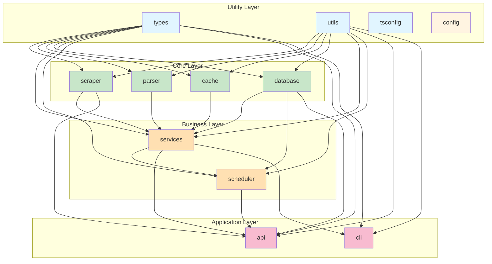

# Monorepo Architecture Analysis Report

**Date**: 2026-01-07  
**Project**: hookah-db  
**Analysis Tool**: monorepo-management skill

---

## Executive Summary

The hookah-db monorepo is well-structured with clear separation of concerns, but has several architectural issues that should be addressed to improve maintainability, performance, and developer experience. The most critical issues are potential circular dependencies, missing shared configurations, and incomplete Turborepo optimization.

**Overall Assessment**: ⚠️ **NEEDS IMPROVEMENT** (7/10)

---

## Architecture Overview

### Current Structure

```
hookah-db/
├── apps/
│   ├── api/              # REST API server
│   └── cli/              # CLI application
├── packages/
│   ├── types/            # TypeScript types (utility layer)
│   ├── utils/            # Utility functions (utility layer)
│   ├── tsconfig/         # Shared TypeScript configs
│   ├── config/           # Shared configurations (EMPTY)
│   ├── scraper/          # Web scraper (core layer)
│   ├── parser/           # Data parser (core layer)
│   ├── cache/            # In-memory cache (core layer)
│   ├── database/         # SQLite database (core layer)
│   ├── services/         # Business logic (business layer)
│   └── scheduler/        # Cron scheduler (business layer)
```

### Dependency Graph

```
Utility Layer (no dependencies)
├── @hookah-db/types
├── @hookah-db/utils
├── @hookah-db/tsconfig
└── @hookah-db/config (empty)

Core Layer (depends on utility)
├── @hookah-db/scraper → types, utils
├── @hookah-db/parser → types, utils
├── @hookah-db/cache → types, utils
└── @hookah-db/database → types, utils

Business Layer (depends on core)
├── @hookah-db/services → types, utils, scraper, parser, database
└── @hookah-db/scheduler → types, utils, database, services, config

Application Layer (depends on business)
├── @hookah-db/api → types, utils, database, scheduler, scraper, services
└── @hookah-db/cli → types, utils, services
```

---

## Critical Issues

### 1. ⚠️ Circular Dependency Risk

**Severity**: HIGH  
**Location**: [`packages/scheduler/package.json`](packages/scheduler/package.json:1)

**Problem**:
```json
{
  "dependencies": {
    "@hookah-db/database": "workspace:*",
    "@hookah-db/services": "workspace:*",
    ...
  }
}
```

The scheduler depends on services, and services depends on database. While not strictly circular yet, this creates tight coupling that could lead to circular dependencies if services need to use scheduler in the future.

**Impact**:
- Difficult to test in isolation
- Potential for circular dependency errors
- Tight coupling between components

**Recommendation**:
- Extract scheduler interface to `@hookah-db/types`
- Have scheduler implement the interface
- Services depend on interface, not implementation
- Use dependency injection pattern

---

### 2. ❌ Empty Config Package

**Severity**: HIGH  
**Location**: [`packages/config/package.json`](packages/config/package.json:1)

**Problem**:
The `@hookah-db/config` package is referenced by scheduler but contains no actual configuration files:
```json
{
  "files": [
    "eslint",
    "jest"
  ],
  "scripts": {
    "build": "echo 'No build needed for config package'",
    ...
  }
}
```

However, the directories `eslint` and `jest` don't exist in the package.

**Impact**:
- Scheduler has a dependency on non-existent package
- No shared ESLint/Prettier configurations
- Inconsistent linting across packages
- Missing shared Jest configurations

**Recommendation**:
- Populate `@hookah-db/config` with actual configuration files:
  - `eslint/index.js` - Shared ESLint preset
  - `jest/preset.js` - Shared Jest configuration
  - `prettier/index.js` - Shared Prettier configuration
- Or remove the package if not needed

---

### 3. ⚠️ Inconsistent TypeScript Configuration

**Severity**: MEDIUM  
**Location**: Multiple package.json files

**Problem**:
Not all packages extend from the shared `@hookah-db/tsconfig` package:

**Extends shared config**:
- ✅ [`packages/types/tsconfig.json`](packages/types/tsconfig.json:1)
- ✅ [`packages/scraper/tsconfig.json`](packages/scraper/tsconfig.json:1)
- ✅ [`packages/cache/tsconfig.json`](packages/cache/tsconfig.json:1)
- ✅ [`packages/scheduler/tsconfig.json`](packages/scheduler/tsconfig.json:1)
- ✅ [`packages/utils/tsconfig.json`](packages/utils/tsconfig.json:1)

**Does NOT extend shared config**:
- ❌ [`packages/database/tsconfig.json`](packages/database/tsconfig.json:1)
- ❌ [`packages/services/tsconfig.json`](packages/services/tsconfig.json:1)
- ❌ [`packages/parser/tsconfig.json`](packages/parser/tsconfig.json:1)
- ❌ [`apps/api/tsconfig.json`](apps/api/tsconfig.json:1)
- ❌ [`apps/cli/tsconfig.json`](apps/cli/tsconfig.json:1)

**Impact**:
- Inconsistent compiler options across packages
- Potential type safety issues
- Harder to maintain consistency
- Duplicated configuration

**Recommendation**:
- Ensure all packages extend from `@hookah-db/tsconfig/base.json` or `@hookah-db/tsconfig/node.json`
- Create app-specific configs if needed (e.g., `@hookah-db/tsconfig/express.json`)

---

## Medium Priority Issues

### 4. ⚠️ Duplicate Dependencies in Root

**Severity**: MEDIUM  
**Location**: [`package.json`](package.json:1)

**Problem**:
Root package.json contains dependencies that should only be in specific packages:

```json
{
  "dependencies": {
    "axios": "^1.13.2",      // Should only be in scraper
    "cheerio": "^1.1.2",     // Should only be in scraper/parser
    "express": "^5.2.1",     // Should only be in api
    "tslib": "^2.8.1",       // Should be in all packages that need it
    "winston": "^3.19.0",    // Should only be in utils
    "winston-daily-rotate-file": "^5.0.0" // Should only be in utils
  }
}
```

**Impact**:
- Increased node_modules size
- Potential version conflicts
- Unclear dependency ownership

**Recommendation**:
- Move all runtime dependencies to their respective packages
- Keep only devDependencies in root (typescript, turbo, jest, etc.)
- Use `pnpm add -Dw` for root dev dependencies

---

### 5. ⚠️ Turborepo Configuration Issues

**Severity**: MEDIUM  
**Location**: [`turbo.json`](turbo.json:1)

**Problem 1**: Test task depends on build
```json
{
  "test": {
    "dependsOn": ["build"],
    "outputs": ["coverage/**"]
  }
}
```

But some packages (config, tsconfig) don't have build steps, causing unnecessary dependencies.

**Problem 2**: Missing cache optimization
```json
{
  "build": {
    "dependsOn": ["^build"],
    "outputs": ["dist/**", ".next/**", "!.next/cache/**"],
    "inputs": ["src/**/*", "tsconfig.json", "package.json"],
    "env": ["NODE_ENV"]
  }
}
```

- Missing environment-specific cache keys
- No remote caching configured
- Inputs don't include all relevant files (e.g., .npmrc, pnpm-workspace.yaml)

**Problem 3**: Missing tasks
- No `format` task (Prettier)
- No `lint:fix` task
- No `test:watch` task

**Impact**:
- Slower builds
- Inefficient caching
- Missing common development tasks

**Recommendation**:
```json
{
  "tasks": {
    "build": {
      "dependsOn": ["^build"],
      "outputs": ["dist/**", ".next/**", "!.next/cache/**"],
      "inputs": ["src/**/*", "tsconfig.json", "package.json", ".npmrc"],
      "env": ["NODE_ENV", "CI"]
    },
    "test": {
      "dependsOn": ["build"],
      "outputs": ["coverage/**"],
      "inputs": ["src/**/*", "test/**/*", "jest.config.js", "tsconfig.json"]
    },
    "test:watch": {
      "cache": false,
      "persistent": true
    },
    "lint": {
      "outputs": [],
      "inputs": ["src/**/*", ".eslintrc.js", ".eslintignore"]
    },
    "lint:fix": {
      "outputs": []
    },
    "format": {
      "outputs": [],
      "inputs": ["**/*.{ts,tsx,js,jsx,json,md}", ".prettierrc", ".prettierignore"]
    },
    "format:check": {
      "outputs": [],
      "inputs": ["**/*.{ts,tsx,js,jsx,json,md}", ".prettierrc", ".prettierignore"]
    },
    "dev": {
      "cache": false,
      "persistent": true
    },
    "type-check": {
      "dependsOn": ["^build"],
      "outputs": [],
      "inputs": ["src/**/*", "tsconfig.json"]
    },
    "clean": {
      "cache": false
    }
  },
  "globalDependencies": ["**/.env.*local", ".npmrc", "pnpm-workspace.yaml"]
}
```

---

### 6. ⚠️ Dependency Hoisting Issues

**Severity**: MEDIUM  
**Location**: [`.npmrc`](.npmrc:1)

**Problem**:
```bash
shamefully-hoist=true
strict-peer-dependencies=false
```

**Issues**:
1. `shamefully-hoist=true` can cause phantom dependencies (packages accessing dependencies not in their package.json)
2. `strict-peer-dependencies=false` can lead to incompatible peer dependency versions

**Impact**:
- Phantom dependencies can break in production
- Potential security vulnerabilities
- Harder to debug dependency issues
- May fail in strict environments (CI/CD)

**Recommendation**:
```bash
# .npmrc
# Enable strict peer dependency checking
strict-peer-dependencies=true

# Don't use shamefully-hoist (let pnpm manage dependencies naturally)
# shamefully-hoist=false  # This is the default

# Performance optimizations
store-dir=~/.pnpm-store

# Ensure consistent installs
prefer-workspace-packages=true
```

---

### 7. ⚠️ Missing ESLint and Prettier

**Severity**: MEDIUM  
**Location**: Root and all packages

**Problem**:
No ESLint or Prettier configuration despite having a config package for it. All packages have placeholder lint scripts:
```json
{
  "scripts": {
    "lint": "echo 'No linting configured for types package'"
  }
}
```

**Impact**:
- No code quality enforcement
- Inconsistent code style
- Potential bugs from linting rules
- Harder code reviews

**Recommendation**:
1. Install ESLint and Prettier:
   ```bash
   pnpm add -Dw eslint prettier @typescript-eslint/parser @typescript-eslint/eslint-plugin eslint-config-prettier
   ```

2. Create shared ESLint config in `packages/config/eslint/index.js`:
   ```javascript
   module.exports = {
     extends: [
       'eslint:recommended',
       '@typescript-eslint/recommended',
       'prettier'
     ],
     parser: '@typescript-eslint/parser',
     parserOptions: {
       ecmaVersion: 2022,
       sourceType: 'module',
       project: './tsconfig.json'
     },
     rules: {
       '@typescript-eslint/no-unused-vars': ['error', { argsIgnorePattern: '^_' }],
       '@typescript-eslint/explicit-function-return-type': 'off',
       '@typescript-eslint/no-explicit-any': 'warn'
     }
   };
   ```

3. Create shared Prettier config in `packages/config/prettier/index.js`:
   ```javascript
   module.exports = {
     semi: true,
     trailingComma: 'es5',
     singleQuote: true,
     printWidth: 100,
     tabWidth: 2,
     useTabs: false
   };
   ```

4. Update package.json scripts:
   ```json
   {
     "scripts": {
       "lint": "eslint src --ext .ts",
       "lint:fix": "eslint src --ext .ts --fix",
       "format": "prettier --write \"src/**/*.ts\"",
       "format:check": "prettier --check \"src/**/*.ts\""
     }
   }
   ```

---

### 8. ⚠️ Services Layer Violation

**Severity**: MEDIUM  
**Location**: [`packages/services/src/data-service.ts`](packages/services/src/data-service.ts:1)

**Problem**:
DataService directly imports from scraper, bypassing the proper layer separation:

```typescript
import { scrapeBrandsList, scrapeBrandDetails, scrapeFlavorDetails, extractFlavorUrls } from '@hookah-db/scraper';
```

According to the architecture, services should only depend on:
- `@hookah-db/types`
- `@hookah-db/utils`
- `@hookah-db/database`
- `@hookah-db/cache`

**Impact**:
- Tight coupling between services and scraper
- Difficult to test services in isolation
- Violates layer separation principle
- Harder to swap scraper implementation

**Recommendation**:
- Extract scraper interface to `@hookah-db/types`:
  ```typescript
  // packages/types/src/scraper-interface.ts
  export interface IScraper {
    scrapeBrandsList(): Promise<BrandSummary[]>;
    scrapeBrandDetails(slug: string): Promise<Brand | null>;
    scrapeFlavorDetails(slug: string): Promise<Flavor | null>;
    extractFlavorUrls(brandSlug: string): Promise<string[]>;
  }
  ```

- Create scraper adapter in services or pass scraper as dependency
- Use dependency injection pattern

---

## Low Priority Issues

### 9. ⚠️ Inconsistent Package Scripts

**Severity**: LOW  
**Location**: Multiple package.json files

**Problem**:
Some packages have incomplete or inconsistent scripts:

**Missing scripts**:
- No `test:watch` script in any package
- No `lint:fix` script in any package
- No `format` or `format:check` scripts
- No `clean:all` script to clean all artifacts

**Inconsistent scripts**:
- Some packages have `dev` script with `tsc --watch`
- API has `dev` script with `nodemon --exec ts-node`
- CLI has `dev` script with `ts-node`

**Recommendation**:
Standardize scripts across all packages:

```json
{
  "scripts": {
    "build": "tsc",
    "dev": "tsc --watch",
    "test": "jest",
    "test:watch": "jest --watch",
    "test:coverage": "jest --coverage",
    "lint": "eslint src --ext .ts",
    "lint:fix": "eslint src --ext .ts --fix",
    "format": "prettier --write \"src/**/*.ts\"",
    "format:check": "prettier --check \"src/**/*.ts\"",
    "type-check": "tsc --noEmit",
    "clean": "rm -rf dist coverage"
  }
}
```

---

### 10. ⚠️ Missing Package READMEs

**Severity**: LOW  
**Location**: All packages

**Problem**:
No README files in any package directory. This makes it harder for developers to understand:
- What each package does
- How to use each package
- Dependencies and exports
- Examples and best practices

**Recommendation**:
Create README.md in each package with:
- Package description
- Installation instructions
- API documentation
- Examples
- Dependencies

---

### 11. ⚠️ Version Inconsistency

**Severity**: LOW  
**Location**: Multiple package.json files

**Problem**:
Different packages have different versions:
- `@hookah-db/scheduler`: version "0.1.0"
- All other packages: version "1.0.0"

**Impact**:
- Confusing version management
- Potential issues with changesets
- Inconsistent release process

**Recommendation**:
- Keep all packages at same version (1.0.0)
- Use changesets for version management
- Document versioning strategy

---

## Positive Aspects

Despite the issues identified, the monorepo has several strengths:

### ✅ Well-Structured Package Organization
- Clear separation between utility, core, business, and application layers
- Logical package naming convention (`@hookah-db/*`)
- Proper use of workspace dependencies

### ✅ Good Turborepo Foundation
- Proper task dependencies configured
- Cache outputs defined for build and test
- Environment variable awareness

### ✅ Comprehensive Testing
- 1,410+ unit tests across all packages
- Integration tests available
- High test coverage

### ✅ Proper TypeScript Setup
- Strict mode enabled
- Proper type exports
- Good use of TypeScript interfaces

### ✅ Docker Support
- Multi-stage Dockerfile
- Separate dev and prod configurations
- Proper volume mounts and networking

### ✅ Documentation
- Comprehensive logging documentation
- Detailed test reports
- Good README with setup instructions

---

## Recommendations Summary

### Immediate Actions (High Priority)

1. **Fix circular dependency risk**
   - Extract scheduler interface to types
   - Use dependency injection pattern
   - Decouple services from scheduler

2. **Populate or remove config package**
   - Add actual ESLint/Prettier configurations
   - Or remove the package if not needed

3. **Standardize TypeScript configuration**
   - Ensure all packages extend from shared config
   - Create app-specific configs if needed

### Short-term Actions (Medium Priority)

4. **Clean up root dependencies**
   - Move runtime dependencies to respective packages
   - Keep only devDependencies in root

5. **Improve Turborepo configuration**
   - Add missing tasks (format, lint:fix, test:watch)
   - Optimize cache inputs
   - Consider remote caching

6. **Fix .npmrc configuration**
   - Remove `shamefully-hoist=true`
   - Enable `strict-peer-dependencies=true`

7. **Add ESLint and Prettier**
   - Install and configure ESLint
   - Install and configure Prettier
   - Create shared configs

8. **Fix services layer violation**
   - Extract scraper interface
   - Use dependency injection
   - Maintain proper layer separation

### Long-term Actions (Low Priority)

9. **Standardize package scripts**
   - Ensure consistent scripts across all packages
   - Add missing scripts (test:watch, format, etc.)

10. **Add package READMEs**
    - Document each package
    - Provide usage examples
    - List dependencies and exports

11. **Fix version consistency**
    - Keep all packages at same version
    - Use changesets for versioning

12. **Add CI/CD configuration**
    - Create GitHub Actions workflow
    - Automate testing and builds
    - Add quality gates

---

## Architecture Diagram (Proposed)



**Note**: The dashed line from services to scraper represents the current violation that should be fixed with an interface.

---

## Conclusion

The hookah-db monorepo has a solid foundation with clear package organization and good testing coverage. However, several architectural issues need to be addressed to improve maintainability, performance, and developer experience.

The most critical issues are:
1. Circular dependency risk in scheduler
2. Empty config package
3. Inconsistent TypeScript configuration

Addressing these issues will significantly improve the monorepo's architecture and make it easier to maintain and scale in the future.

**Overall Score**: 7/10  
**Recommended Action**: Address high and medium priority issues before scaling the project further.
